# vdiff

**A vLLM-Compatible Server for Diffusion LLMs on Red Hat OpenShift AI**

[](LICENSE)
[](https://www.python.org/downloads/)

vdiff provides a vLLM-compatible serving framework for Diffusion Language Models (like LLaDA, Dream) optimized for **Red Hat OpenShift AI (RHOAI)**. It follows the same API patterns as vLLM, enabling seamless integration with existing RHOAI model serving infrastructure.

## Key Features

- **vLLM API Compatibility**: 100% compatible with vLLM's OpenAI-compatible API
- **RHOAI Integration**: Native ServingRuntime for OpenShift AI dashboard
- **APD (Adaptive Parallel Decoding)**: 2-4x faster inference through parallel token generation
- **Masked Diffusion Generation**: LLaDA-style iterative unmasking algorithm
- **Same Endpoint Structure**: `/v1/completions`, `/v1/chat/completions`, `/health`, `/metrics`
- **Prometheus Metrics**: Compatible with OpenShift monitoring stack

## RHOAI Deployment

### Prerequisites

- Red Hat OpenShift AI installed
- GPU nodes available (NVIDIA GPU Operator configured)
- KServe configured for RawDeployment mode

### Step 1: Create the ServingRuntime

```bash
oc apply -f deploy/kubernetes/kserve/serving-runtime.yaml
```

Verify it appears in the RHOAI dashboard under **Settings → Serving runtimes**.

### Step 2: Prepare Model Storage

Option A: Use a PVC with pre-downloaded model (recommended):
```bash
# Create PVC
oc apply -f deploy/kubernetes/kserve/inference-service.yaml

# Download model to PVC (use a Job or notebook)
python scripts/download_model.py GSAI-ML/LLaDA-8B-Instruct --output /mnt/models
```

Option B: Use HuggingFace model ID (downloads at startup):
```yaml
storageUri: "hf://GSAI-ML/LLaDA-8B-Instruct"
```

### Step 3: Deploy the InferenceService

```bash
oc apply -f deploy/kubernetes/kserve/inference-service.yaml
```

### Step 4: Get the Route

```bash
# Get the inference endpoint
oc get inferenceservice llada-8b-instruct -o jsonpath='{.status.url}'

# Or get the OpenShift route
oc get route
```

## Using the API

### With OpenAI Python SDK

```python
from openai import OpenAI

# Get route from: oc get route llada-8b-instruct -o jsonpath='{.spec.host}'
client = OpenAI(
    base_url="https://llada-8b-instruct-myproject.apps.cluster.example.com/v1",
    api_key="not-needed"  # Or use token if auth enabled
)

response = client.chat.completions.create(
    model="llada-8b-instruct",
    messages=[
        {"role": "user", "content": "Hello! How are you?"}
    ],
    max_tokens=100
)
print(response.choices[0].message.content)
```

### With curl

```bash
ROUTE=$(oc get route llada-8b-instruct -o jsonpath='{.spec.host}')

# Health check
curl https://${ROUTE}/health

# Chat completion
curl https://${ROUTE}/v1/chat/completions \
  -H "Content-Type: application/json" \
  -d '{
    "model": "llada-8b-instruct",
    "messages": [{"role": "user", "content": "Hello!"}],
    "max_tokens": 100
  }'
```

## CLI Usage (Local Development)

```bash
# Install
pip install -r requirements.txt && pip install -e .

# Run server with APD (default, faster inference)
python -m vdiff.entrypoints.openai.api_server \
    --model GSAI-ML/LLaDA-8B-Instruct \
    --port 8000 \
    --trust-remote-code

# Run without APD (standard diffusion)
python -m vdiff.entrypoints.openai.api_server \
    --model GSAI-ML/LLaDA-8B-Instruct \
    --port 8000 \
    --disable-apd \
    --trust-remote-code

# With custom APD settings
python -m vdiff.entrypoints.openai.api_server \
    --model GSAI-ML/LLaDA-8B-Instruct \
    --port 8000 \
    --apd-max-parallel 16 \
    --apd-threshold 0.2 \
    --trust-remote-code
```

## Diffusion Generation Algorithm

vdiff implements the **actual LLaDA generation algorithm** from [ML-GSAI/LLaDA](https://github.com/ML-GSAI/LLaDA):

```mermaid
flowchart LR
    subgraph Init["Initialize"]
        A["Prompt + [MASK] × N"]
    end
    
    subgraph Loop["For each step"]
        B["Forward pass → logits"]
        C["Compute confidence"]
        D["Select top-k confident"]
        E["Unmask selected tokens"]
    end
    
    subgraph Done["Complete"]
        F["Fully decoded text"]
    end
    
    Init --> Loop
    Loop -->|"Repeat"| Loop
    Loop -->|"All unmasked"| Done
```



### Key Features

| Feature | Description |
|---------|-------------|
| **Masked Diffusion** | Start with `[MASK]` tokens, iteratively unmask |
| **Confidence Remasking** | Unmask high-confidence tokens first |
| **Semi-Autoregressive** | Block-by-block generation for efficiency |
| **Gumbel Sampling** | Proper categorical sampling with noise |

### Parameters

```bash
python -m vdiff.entrypoints.openai.api_server \
    --model GSAI-ML/LLaDA-8B-Instruct \
    --diffusion-steps 64 \       # Number of diffusion steps
    --block-size 32 \            # Block size for semi-AR generation
    --enable-apd \               # Enable APD (default)
    --apd-max-parallel 8 \       # Max tokens per APD step
    --apd-threshold 0.3          # Acceptance threshold
```

### APD (Adaptive Parallel Decoding)

APD accelerates diffusion LLM inference by:
1. Generating multiple candidate tokens in parallel
2. Adaptively accepting high-confidence tokens
3. Providing 2-4x throughput improvement

Reference: [APD Paper](https://arxiv.org/abs/2506.00413)

## API Endpoints

| Endpoint | Method | Description |
|----------|--------|-------------|
| `/health` | GET | Health check (RHOAI readiness probe) |
| `/v1/models` | GET | List available models |
| `/v1/completions` | POST | Text completion |
| `/v1/chat/completions` | POST | Chat completion |
| `/metrics` | GET | Prometheus metrics |

## Prometheus Metrics

Metrics are exposed at `/metrics` and compatible with OpenShift monitoring:

```
vdiff_request_success_total
vdiff_request_latency_seconds
vdiff_prompt_tokens_total
vdiff_generation_tokens_total
vdiff_parallel_tokens_decoded_total  # vdiff specific
vdiff_kv_cache_hit_rate              # vdiff specific
```

## vLLM Compatibility

vdiff is designed as a drop-in replacement for vLLM when serving diffusion models:

| vLLM | vdiff | Notes |
|------|-------|-------|
| `vllm-runtime` | `vdiff-runtime` | Different ServingRuntime |
| LLaMA, Mistral | LLaDA, Dream | Different model types |
| Same API | Same API | 100% compatible |
| Same CLI args | Same CLI args | Plus vdiff extensions |

## Building the Container Image

```bash
# Build for OpenShift
podman build -t quay.io/rhoai/vdiff:latest -f deploy/docker/Dockerfile .

# Push to registry
podman push quay.io/rhoai/vdiff:latest
```

## Development

```bash
# Install dev dependencies
make dev

# Run tests
make test

# Lint
make lint
```

## Project Structure

```
vdiff/
├── vdiff/                   # Main package
│   ├── entrypoints/         # API server (OpenAI-compatible)
│   ├── engine/              # Inference engine + APD
│   │   ├── apd.py           # Adaptive Parallel Decoding
│   │   ├── diffusion_sampler.py  # LLaDA generation
│   │   └── vdiff_engine.py  # Core engine
│   └── metrics/             # Prometheus metrics
├── deploy/
│   ├── docker/              # Container images
│   └── kubernetes/
│       └── kserve/          # RHOAI manifests
├── tests/                   # Test suite
├── examples/                # Client examples
└── docs/                    # Documentation
```

## License

Apache License 2.0 - See [LICENSE](LICENSE) for details.

## Architecture

vdiff is a **standalone serving framework** for diffusion language models. It provides vLLM-compatible APIs for serving LLaDA, Dream, and other diffusion LLMs on enterprise platforms.

### Why vdiff? (vLLM vs vdiff)

```mermaid
flowchart TB
    subgraph Models["Model Types"]
        AR["🔤 Autoregressive LLMs<br/>LLaMA, Mistral, GPT"]
        DM["🎲 Diffusion LLMs<br/>LLaDA, Dream"]
    end

    subgraph Servers["Serving Frameworks"]
        VLLM["⚡ vLLM<br/>PagedAttention<br/>Sequential Generation"]
        VDIFF["🌀 vdiff<br/>Diffusion Inference<br/>Parallel Unmasking"]
    end

    AR --> VLLM
    DM --> VDIFF

    subgraph API["Same OpenAI-Compatible API"]
        EP1["/v1/chat/completions"]
        EP2["/v1/completions"]
        EP3["/v1/models"]
    end

    VLLM --> API
    VDIFF --> API

    style AR fill:#e1f5fe
    style DM fill:#f3e5f5
    style VLLM fill:#e8f5e9
    style VDIFF fill:#fff3e0
```



### Infrastructure Integration


### Generation: Autoregressive vs Diffusion


### Request Flow


### Component Architecture


Key components:
- **VDiffEngine**: Core inference engine with HuggingFace model loading
- **OpenAI-compatible API**: Drop-in replacement for vLLM endpoints
- **Prometheus Metrics**: Compatible with OpenShift monitoring

## Supported Models

| Model | Type | Example |
|-------|------|---------|
| LLaDA | Diffusion LLM | `GSAI-ML/LLaDA-8B-Instruct`, `GSAI-ML/LLaDA-8B-Base` |
| Dream | Diffusion LLM | `dream-org/dream-v1` |
| Any HF model | Autoregressive | Compatible with standard HuggingFace models |

## Acknowledgments

- [vLLM](https://github.com/vllm-project/vllm) for API design patterns
- [Red Hat OpenShift AI](https://www.redhat.com/en/technologies/cloud-computing/openshift/openshift-ai) for the serving platform
- [LLaDA](https://huggingface.co/GSAI-ML/LLaDA-8B-Instruct) and Dream for diffusion LLM models
