# vdiff

**Production-Ready vLLM-Compatible Server for Diffusion LLMs**

[](LICENSE)
[](https://www.python.org/downloads/)
[](https://github.com/your-org/vdiff)
[]()

vdiff is a **production-grade** serving framework for Diffusion Language Models (LLaDA, Dream) optimized for **Red Hat OpenShift AI (RHOAI)** and enterprise deployments. It provides vLLM-compatible APIs with enterprise features like rate limiting, health checks, and graceful shutdown.

## ✨ Key Features

### Production Features
- **Rate Limiting**: Configurable request throttling per client
- **Request Queue**: Concurrency control with backpressure
- **Health Checks**: Kubernetes-compatible liveness/readiness probes
- **Graceful Shutdown**: Request draining on termination
- **Structured Logging**: JSON-formatted logs for observability
- **API Key Auth**: Optional bearer token authentication
- **Memory Management**: OOM protection and GPU memory monitoring

### Inference Features
- **vLLM API Compatibility**: 100% compatible with OpenAI-style API
- **APD (Adaptive Parallel Decoding)**: 2-4x faster inference
- **Masked Diffusion Generation**: LLaDA-style iterative unmasking
- **Prometheus Metrics**: Compatible with OpenShift monitoring

## 🚀 Quick Start

### Installation

```bash
# Install from source
pip install -e .

# Or with development dependencies
pip install -e ".[dev]"
```

### Start Server

```bash
# Basic usage
vdiff --model GSAI-ML/LLaDA-8B-Instruct --trust-remote-code

# With production options
vdiff \
    --model GSAI-ML/LLaDA-8B-Instruct \
    --port 8000 \
    --max-concurrent-requests 8 \
    --rate-limit-requests 100 \
    --request-timeout 300 \
    --trust-remote-code

# With API key authentication
VDIFF_API_KEY=your-secret-key vdiff --model gpt2 --port 8000
```

### API Usage

```python
from openai import OpenAI

client = OpenAI(
    base_url="http://localhost:8000/v1",
    api_key="your-api-key"  # Or "not-needed" if auth disabled
)

response = client.chat.completions.create(
    model="llada-8b-instruct",
    messages=[{"role": "user", "content": "Hello! How are you?"}],
    max_tokens=100
)
print(response.choices[0].message.content)
```

## 📚 API Endpoints

| Endpoint | Method | Description |
|----------|--------|-------------|
| `/health` | GET | Detailed health status |
| `/health/live` | GET | Kubernetes liveness probe |
| `/health/ready` | GET | Kubernetes readiness probe |
| `/v1/models` | GET | List available models |
| `/v1/completions` | POST | Text completion |
| `/v1/chat/completions` | POST | Chat completion |
| `/metrics` | GET | Prometheus metrics |
| `/v1/engine/stats` | GET | Engine statistics |
| `/docs` | GET | Interactive API documentation |

## ⚙️ Configuration

### CLI Arguments

```bash
vdiff \
    # Model Options
    --model MODEL                    # Model name or path (required)
    --tokenizer TOKENIZER           # Tokenizer (defaults to model)
    --dtype auto|float16|bfloat16   # Data type for weights
    --trust-remote-code             # Trust HuggingFace remote code
    
    # Server Options
    --host 0.0.0.0                  # Bind host
    --port 8000                     # Bind port
    --api-key SECRET                # API key for authentication
    
    # Diffusion Options
    --diffusion-steps 64            # Number of diffusion steps
    --block-size 32                 # Block size for generation
    
    # APD Options
    --enable-apd                    # Enable APD (default)
    --disable-apd                   # Use standard diffusion
    --apd-max-parallel 8            # Max parallel tokens
    --apd-threshold 0.3             # Acceptance threshold
    
    # Production Options
    --max-concurrent-requests 4     # Max concurrent generations
    --max-queue-size 256            # Max pending requests
    --request-timeout 300           # Request timeout (seconds)
    --rate-limit-requests 100       # Max requests per minute
    
    # Performance Optimization
    --compile                       # Use torch.compile (default)
    --no-compile                    # Disable torch.compile
    --compile-mode MODE             # reduce-overhead|max-autotune
    --flash-attention               # Use Flash Attention 2 (default)
    --no-flash-attention            # Disable Flash Attention
    --quantization 8bit|4bit        # Enable quantization
```

### Environment Variables

```bash
VDIFF_MODEL=GSAI-ML/LLaDA-8B-Instruct
VDIFF_PORT=8000
VDIFF_API_KEY=your-secret-key
VDIFF_DIFFUSION_STEPS=64
VDIFF_ENABLE_APD=true
VDIFF_APD_MAX_PARALLEL=8
VDIFF_MAX_CONCURRENT=4
VDIFF_RATE_LIMIT_REQUESTS=100
VDIFF_REQUEST_TIMEOUT=300
```

## 🐳 Docker Deployment

### Build Images

```bash
# GPU image (default, with CUDA)
docker build -t vdiff .

# CPU-only image
docker build --build-arg USE_CUDA=0 -t vdiff:cpu .

# Specific CUDA version
docker build --build-arg CUDA_VERSION=12.1.0 -t vdiff:cuda12.1 .
```

### Run Container

```bash
# GPU (recommended for production)
docker run --gpus all -p 8000:8000 \
    -v ~/.cache/huggingface:/workspace/.cache/huggingface \
    vdiff \
    --model GSAI-ML/LLaDA-8B-Instruct --trust-remote-code

# CPU-only
docker run -p 8000:8000 \
    -v ~/.cache/huggingface:/workspace/.cache/huggingface \
    vdiff:cpu \
    --model gpt2
```

### Docker Compose

```bash
# Start with GPU
docker-compose up -d

# Start CPU-only
docker-compose --profile cpu up -d vdiff-cpu

# View logs
docker-compose logs -f

# Stop
docker-compose down
```

## ☸️ Kubernetes / RHOAI Deployment

### Deploy ServingRuntime

```bash
# Create the vdiff ServingRuntime
oc apply -f deploy/kubernetes/kserve/serving-runtime.yaml

# Verify in RHOAI dashboard: Settings → Serving runtimes
```

### Deploy InferenceService

```bash
# Deploy the model
oc apply -f deploy/kubernetes/kserve/inference-service.yaml

# Get endpoint
oc get inferenceservice llada-8b-instruct -o jsonpath='{.status.url}'
```

### Example InferenceService

```yaml
apiVersion: serving.kserve.io/v1beta1
kind: InferenceService
metadata:
  name: llada-8b-instruct
  annotations:
    serving.kserve.io/deploymentMode: RawDeployment
spec:
  predictor:
    model:
      modelFormat:
        name: vdiff
      runtime: vdiff-runtime
      storageUri: pvc://model-storage/llada-8b
      resources:
        requests:
          nvidia.com/gpu: "1"
          memory: "32Gi"
```

## 📊 Prometheus Metrics

```
# Request metrics
vdiff_request_success_total
vdiff_request_failure_total
vdiff_request_latency_seconds

# Token metrics
vdiff_prompt_tokens_total
vdiff_generation_tokens_total
vdiff_parallel_tokens_decoded_total

# Engine metrics
vdiff_queue_size
vdiff_active_requests
vdiff_gpu_memory_used_bytes
```

## 🏗️ Architecture

```mermaid
flowchart TB
    subgraph Client["Clients"]
        SDK["OpenAI SDK"]
        CURL["curl / HTTP"]
    end

    subgraph Server["vdiff API Server"]
        MW["Middleware<br/>Rate Limit · Auth · Logging"]
        API["/v1/chat/completions<br/>/v1/completions"]
    end

    subgraph Engine["VDiffEngine"]
        Q["Request Queue"]
        GEN["Generation<br/>Diffusion · APD"]
        MEM["Memory Manager"]
    end

    subgraph Backend["Model Backend"]
        HF["HuggingFace Model"]
        GPU["GPU / CPU"]
    end

    Client --> Server
    MW --> API
    API --> Q
    Q --> GEN
    GEN --> HF
    HF --> GPU
    MEM --> GPU

    style Server fill:#e3f2fd
    style Engine fill:#f3e5f5
    style Backend fill:#e8f5e9
```



### Diffusion Generation

```mermaid
flowchart LR
    subgraph Init["Initialize"]
        A["Prompt + [MASK] × N"]
    end
    
    subgraph Loop["Diffusion Loop"]
        B["Forward Pass"]
        C["Compute Confidence"]
        D["Unmask Top-K"]
    end
    
    subgraph Done["Complete"]
        E["Generated Text"]
    end
    
    Init --> Loop
    Loop -->|Iterate| Loop
    Loop -->|All Unmasked| Done
```



## 📈 Benchmarking

```bash
# Start server
vdiff --model gpt2 --port 8000

# Run benchmark
python benchmarks/run_benchmark.py \
    --url http://localhost:8000 \
    --requests 100 \
    --concurrency 10 \
    --max-tokens 64

# Save results to file
python benchmarks/run_benchmark.py \
    --url http://localhost:8000 \
    --output results.json
```

Example output:
```
============================================================
BENCHMARK RESULTS
============================================================
Requests/sec:       12.45
Tokens/sec:         798.32

Latency (ms)
  P50:                156.23
  P95:                312.45
  P99:                456.78
============================================================
```

## 🧪 Development

```bash
# Install dev dependencies
pip install -e ".[dev]"

# Run tests
pytest tests/ -v

# Run linting
ruff check vdiff/
black --check vdiff/

# Type checking
mypy vdiff/

# Run all checks
make check
```

## 📁 Project Structure

```
vdiff/
├── vdiff/                   # Main package
│   ├── config.py           # Configuration classes
│   ├── version.py          # Version info
│   ├── engine/             # Inference engine
│   │   ├── vdiff_engine.py # Production engine
│   │   ├── apd.py          # Adaptive Parallel Decoding
│   │   ├── diffusion_sampler.py  # Diffusion generation
│   │   └── sampling_params.py
│   ├── entrypoints/        # API server
│   │   └── openai/         # OpenAI-compatible endpoints
│   └── metrics/            # Prometheus metrics
├── deploy/
│   └── kubernetes/         # K8s manifests
│       └── kserve/         # RHOAI manifests
├── tests/                  # Test suite
├── examples/               # Usage examples
├── Dockerfile             # Multi-stage Dockerfile
└── pyproject.toml         # Project config
```

## 🤝 Compatibility

| Feature | vLLM | vdiff |
|---------|------|-------|
| API Format | OpenAI-compatible | OpenAI-compatible |
| Models | Autoregressive (LLaMA, Mistral) | Diffusion (LLaDA, Dream) |
| CLI Style | `--model`, `--port` | Same + diffusion options |
| Metrics | Prometheus | Prometheus |
| Health Check | `/health` | `/health`, `/health/live`, `/health/ready` |

## 🔄 Comparison with Competitors

| Framework | Best For | Diffusion Support |
|-----------|----------|-------------------|
| **vdiff** | Diffusion LLMs (LLaDA, Dream) | ✅ Yes |
| vLLM | High-throughput autoregressive | ❌ No |
| TGI | HuggingFace ecosystem | ❌ No |
| TensorRT-LLM | NVIDIA optimization | ❌ No |
| Ollama | Local development | ❌ No |
| llama.cpp | CPU/Edge deployment | ❌ No |

**vdiff is the only production-ready framework for Diffusion LLMs.**

See [docs/COMPARISON.md](docs/COMPARISON.md) for detailed comparison.

## 📜 License

Apache License 2.0 - See [LICENSE](LICENSE) for details.

## 🙏 Acknowledgments

- [vLLM](https://github.com/vllm-project/vllm) for API design patterns
- [LLaDA](https://github.com/ML-GSAI/LLaDA) for diffusion LLM algorithm
- [Red Hat OpenShift AI](https://www.redhat.com/en/technologies/cloud-computing/openshift/openshift-ai) for enterprise serving platform
