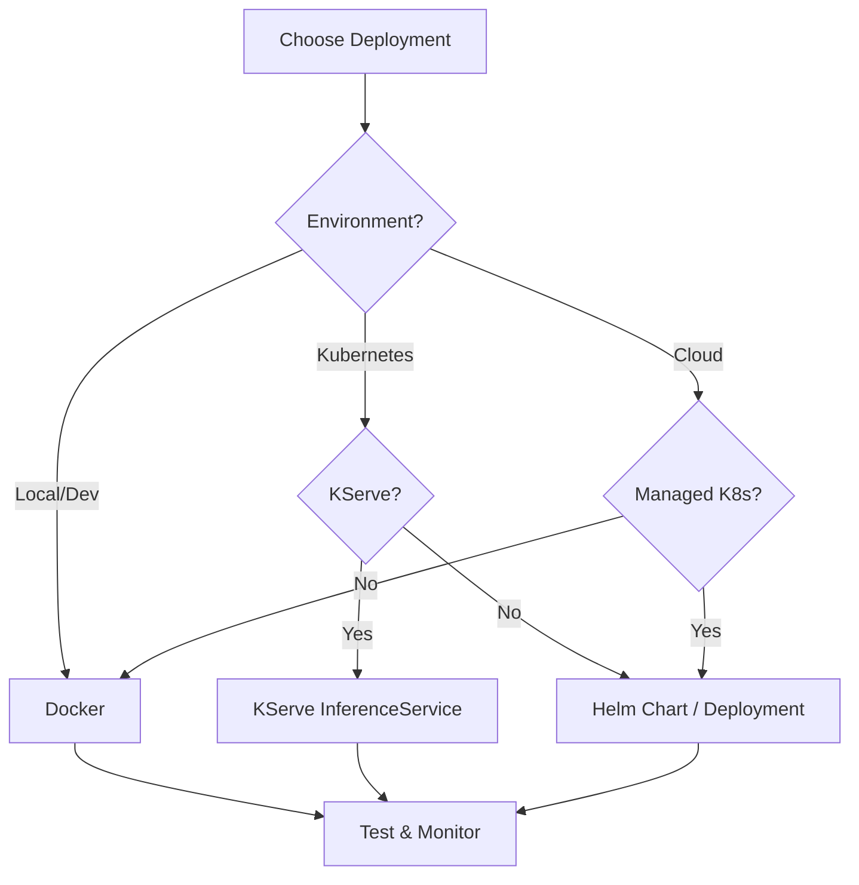
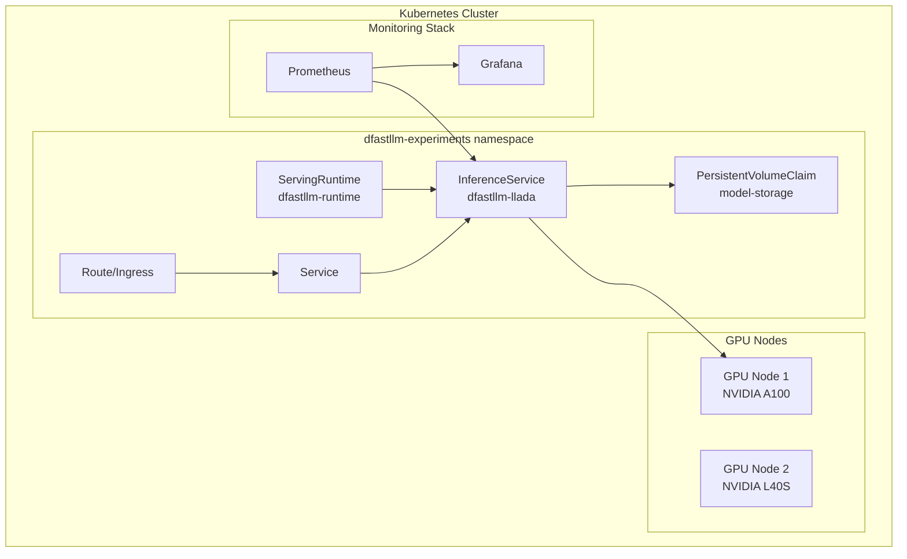
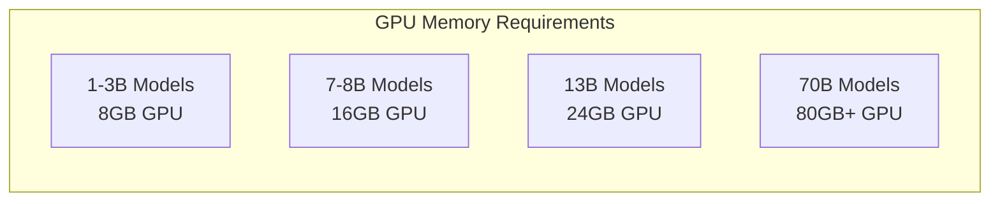
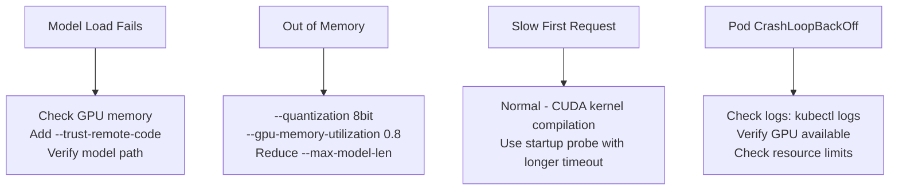

# dfastllm Deployment Guide

<div align="center">

**Production Deployment for Docker and Kubernetes**

*Complete guide to deploying dfastllm in production environments*

</div>

---

## Deployment Options



---

## Prerequisites

| Requirement | Version | Purpose |
|-------------|---------|---------|
| OpenShift/Kubernetes | 4.12+ / 1.25+ | Container orchestration |
| NVIDIA GPU Operator | Latest | GPU support |
| `oc` or `kubectl` | Latest | CLI access |
| Container Registry | - | Image storage |

---

## Option 1: Docker Deployment

### Basic Deployment

```bash
# Pull the image
docker pull quay.io/mwaykole/dfastllm:turbo-v9

# Run with GPU
docker run -d --gpus all \
  --name dfastllm \
  -p 8000:8000 \
  -v /path/to/models:/models \
  quay.io/mwaykole/dfastllm:turbo-v9 \
  --model /models/llada-8b-instruct \
  --enable-apd \
  --flash-attention \
  --trust-remote-code
```

### Docker Compose

```yaml
# docker-compose.yml
version: '3.8'

services:
  dfastllm:
    image: quay.io/mwaykole/dfastllm:turbo-v9
    ports:
      - "8000:8000"
    volumes:
      - ./models:/models
      - ./cache:/tmp/.cache
    environment:
      - HF_HOME=/tmp/.cache
      - CUDA_VISIBLE_DEVICES=0
    deploy:
      resources:
        reservations:
          devices:
            - driver: nvidia
              count: 1
              capabilities: [gpu]
    command: >
      --model /models/llada-8b-instruct
      --enable-apd
      --flash-attention
      --trust-remote-code
    healthcheck:
      test: ["CMD", "curl", "-f", "http://localhost:8000/health"]
      interval: 30s
      timeout: 10s
      retries: 3
      start_period: 120s
```

```bash
docker-compose up -d
```

---

## Option 2: Kubernetes / KServe

### Deployment Architecture



### Step 1: Create Namespace

```bash
oc new-project dfastllm-experiments
# or
kubectl create namespace dfastllm-experiments
```

### Step 2: Create PVC for Models

```yaml
# model-pvc.yaml
apiVersion: v1
kind: PersistentVolumeClaim
metadata:
  name: model-pvc
  namespace: dfastllm-experiments
spec:
  accessModes:
    - ReadWriteOnce
  resources:
    requests:
      storage: 50Gi
  storageClassName: gp3-csi  # Adjust for your cluster
```

```bash
kubectl apply -f model-pvc.yaml
```

### Step 3: Download Model

```yaml
# download-model-job.yaml
apiVersion: batch/v1
kind: Job
metadata:
  name: download-model
  namespace: dfastllm-experiments
spec:
  template:
    spec:
      securityContext:
        runAsNonRoot: true
        runAsUser: 1000
        seccompProfile:
          type: RuntimeDefault
      containers:
        - name: download
          image: registry.access.redhat.com/ubi9/python-311:latest
          securityContext:
            allowPrivilegeEscalation: false
            capabilities:
              drop: ["ALL"]
          command:
            - bash
            - -c
            - |
              pip install --user huggingface_hub
              python -c "
              from huggingface_hub import snapshot_download
              snapshot_download(
                  'GSAI-ML/LLaDA-8B-Instruct',
                  local_dir='/models/llada-8b-instruct'
              )
              "
          volumeMounts:
            - name: models
              mountPath: /models
          env:
            - name: HOME
              value: "/tmp"
      volumes:
        - name: models
          persistentVolumeClaim:
            claimName: model-pvc
      restartPolicy: Never
  backoffLimit: 3
```

```bash
kubectl apply -f download-model-job.yaml
kubectl wait --for=condition=complete job/download-model --timeout=30m
```

### Step 4: Deploy ServingRuntime

```yaml
# serving-runtime.yaml
apiVersion: serving.kserve.io/v1alpha1
kind: ServingRuntime
metadata:
  name: dfastllm-runtime
  namespace: dfastllm-experiments
  labels:
    opendatahub.io/dashboard: "true"
  annotations:
    opendatahub.io/template-display-name: "dfastllm - Diffusion LLM Runtime"
spec:
  multiModel: false
  supportedModelFormats:
    - name: diffusion-llm
      autoSelect: true
      version: "1"
    - name: dfastllm
      autoSelect: true
      version: "1"
    - name: llada
      version: "1"
    - name: pytorch
      version: "1"
  
  containers:
    - name: kserve-container
      image: quay.io/mwaykole/dfastllm:turbo-v9
      imagePullPolicy: IfNotPresent
      command:
        - python
        - -m
        - dfastllm.entrypoints.openai.api_server
      args:
        - "--model"
        - "/mnt/models"
        - "--port"
        - "8000"
        - "--host"
        - "0.0.0.0"
        - "--enable-apd"
        - "--apd-max-parallel"
        - "64"
        - "--flash-attention"
        - "--trust-remote-code"
      
      env:
        - name: HF_HOME
          value: "/tmp/hf_home"
        - name: TRANSFORMERS_CACHE
          value: "/tmp/hf_home"
        - name: HOME
          value: "/tmp"
      
      ports:
        - containerPort: 8000
          name: http
          protocol: TCP
      
      resources:
        requests:
          cpu: "4"
          memory: "16Gi"
        limits:
          cpu: "8"
          memory: "32Gi"
      
      livenessProbe:
        httpGet:
          path: /health
          port: 8000
        initialDelaySeconds: 60
        periodSeconds: 30
        timeoutSeconds: 10
        failureThreshold: 3
      
      readinessProbe:
        httpGet:
          path: /health
          port: 8000
        initialDelaySeconds: 30
        periodSeconds: 10
        timeoutSeconds: 5
        failureThreshold: 3
      
      startupProbe:
        httpGet:
          path: /health
          port: 8000
        initialDelaySeconds: 30
        periodSeconds: 10
        timeoutSeconds: 5
        failureThreshold: 60
      
      volumeMounts:
        - name: shm
          mountPath: /dev/shm
  
  volumes:
    - name: shm
      emptyDir:
        medium: Memory
        sizeLimit: 2Gi
  
  annotations:
    prometheus.io/scrape: "true"
    prometheus.io/port: "8000"
    prometheus.io/path: "/metrics"
```

```bash
kubectl apply -f serving-runtime.yaml
```

### Step 5: Deploy InferenceService

```yaml
# inference-service.yaml
apiVersion: serving.kserve.io/v1beta1
kind: InferenceService
metadata:
  name: dfastllm-llada
  namespace: dfastllm-experiments
  annotations:
    serving.kserve.io/deploymentMode: RawDeployment
spec:
  predictor:
    model:
      modelFormat:
        name: diffusion-llm
      runtime: dfastllm-runtime
      storageUri: pvc://model-pvc/llada-8b-instruct
      resources:
        requests:
          nvidia.com/gpu: "1"
          memory: "24Gi"
        limits:
          nvidia.com/gpu: "1"
          memory: "32Gi"
      env:
        - name: HF_HOME
          value: "/tmp/.cache"
        - name: TRANSFORMERS_CACHE
          value: "/tmp/.cache"
```

```bash
kubectl apply -f inference-service.yaml
```

### Step 6: Create Route (OpenShift)

```bash
# Create route
oc expose service dfastllm-llada-predictor --port=80

# Get route URL
ROUTE=$(oc get route dfastllm-llada-predictor -o jsonpath='{.spec.host}')
echo "dfastllm is available at: http://$ROUTE"
```

### Step 7: Test Deployment

```bash
# Health check
curl http://$ROUTE/health

# Test completion
curl -X POST http://$ROUTE/v1/completions \
  -H "Content-Type: application/json" \
  -d '{
    "model": "/mnt/models",
    "prompt": "Hello, how are you?",
    "max_tokens": 64
  }'
```

---

## Option 3: Helm Chart

### Installation

```bash
# Install from local chart
helm install dfastllm ./deploy/helm/dfastllm \
  --namespace dfastllm \
  --create-namespace \
  --set model.name="GSAI-ML/LLaDA-8B-Instruct" \
  --set resources.requests.gpu=1 \
  --set route.enabled=true

# Check status
helm status dfastllm -n dfastllm
kubectl get pods -n dfastllm
```

### Custom Values

```yaml
# custom-values.yaml
replicaCount: 1

model:
  name: "GSAI-ML/LLaDA-8B-Instruct"
  trustRemoteCode: true

image:
  repository: quay.io/mwaykole/dfastllm
  tag: turbo-v9
  pullPolicy: IfNotPresent

resources:
  requests:
    memory: "24Gi"
    cpu: "4"
    nvidia.com/gpu: "1"
  limits:
    memory: "32Gi"
    cpu: "8"
    nvidia.com/gpu: "1"

service:
  type: ClusterIP
  port: 8000

route:
  enabled: true  # OpenShift
  host: ""       # Auto-generate

ingress:
  enabled: false  # Standard Kubernetes

persistence:
  enabled: true
  size: 50Gi
  storageClass: ""

autoscaling:
  enabled: false
  minReplicas: 1
  maxReplicas: 4
  targetCPUUtilization: 70

monitoring:
  enabled: true
  serviceMonitor:
    enabled: true
```

```bash
helm install dfastllm ./deploy/helm/dfastllm -f custom-values.yaml -n dfastllm
```

---

## Configuration Reference

### Server Arguments

| Argument | Default | Description |
|----------|---------|-------------|
| `--model` | Required | Model path or HuggingFace name |
| `--port` | 8000 | Server port |
| `--host` | 0.0.0.0 | Server host |
| `--max-model-len` | 4096 | Maximum context length |
| `--enable-apd` | false | Enable Adaptive Parallel Decoding |
| `--apd-max-parallel` | 64 | Maximum parallel tokens |
| `--flash-attention` | false | Enable Flash Attention 2 |
| `--quantization` | none | `8bit` or `4bit` |
| `--trust-remote-code` | false | Trust custom model code |
| `--gpu-memory-utilization` | 0.9 | GPU memory fraction |

### Resource Recommendations



| Model Size | GPU Memory | CPU | RAM | Storage |
|------------|------------|-----|-----|---------|
| 1-3B | 8GB | 2 cores | 8Gi | 10Gi |
| 7-8B | 16GB | 4 cores | 24Gi | 30Gi |
| 13B | 24GB | 8 cores | 48Gi | 50Gi |
| 70B+ | 80GB+ | 16 cores | 128Gi | 200Gi |

---

## Monitoring

### Health Endpoints

```bash
# Liveness probe
curl http://$ROUTE/health

# Readiness probe  
curl http://$ROUTE/ready

# Prometheus metrics
curl http://$ROUTE/metrics
```

### Prometheus ServiceMonitor

```yaml
apiVersion: monitoring.coreos.com/v1
kind: ServiceMonitor
metadata:
  name: dfastllm-monitor
  namespace: dfastllm-experiments
spec:
  selector:
    matchLabels:
      app: dfastllm
  endpoints:
    - port: http
      path: /metrics
      interval: 30s
```

### Grafana Dashboard

Import the pre-built dashboard from `deploy/grafana/dfastllm-dashboard.json`.

---

## Troubleshooting

### Common Issues



### Debug Commands

```bash
# Check pod status
kubectl get pods -n dfastllm-experiments

# View logs
kubectl logs -f deployment/dfastllm-llada-predictor -n dfastllm-experiments

# Describe pod (for events)
kubectl describe pod -l app=dfastllm -n dfastllm-experiments

# Check GPU availability
kubectl get nodes -o json | jq '.items[].status.allocatable["nvidia.com/gpu"]'

# Exec into pod
kubectl exec -it deployment/dfastllm-llada-predictor -n dfastllm-experiments -- bash
```

---

## Security Considerations

1. **Use specific image tags** - Never use `latest` in production
2. **Set resource limits** - Prevent resource exhaustion
3. **Enable authentication** - Use `DFASTLLM_API_KEY`
4. **Network policies** - Restrict access to the service
5. **TLS termination** - Use HTTPS via Route/Ingress

---

*Last updated: December 2024*
