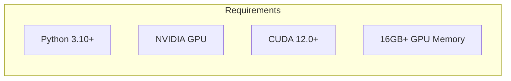
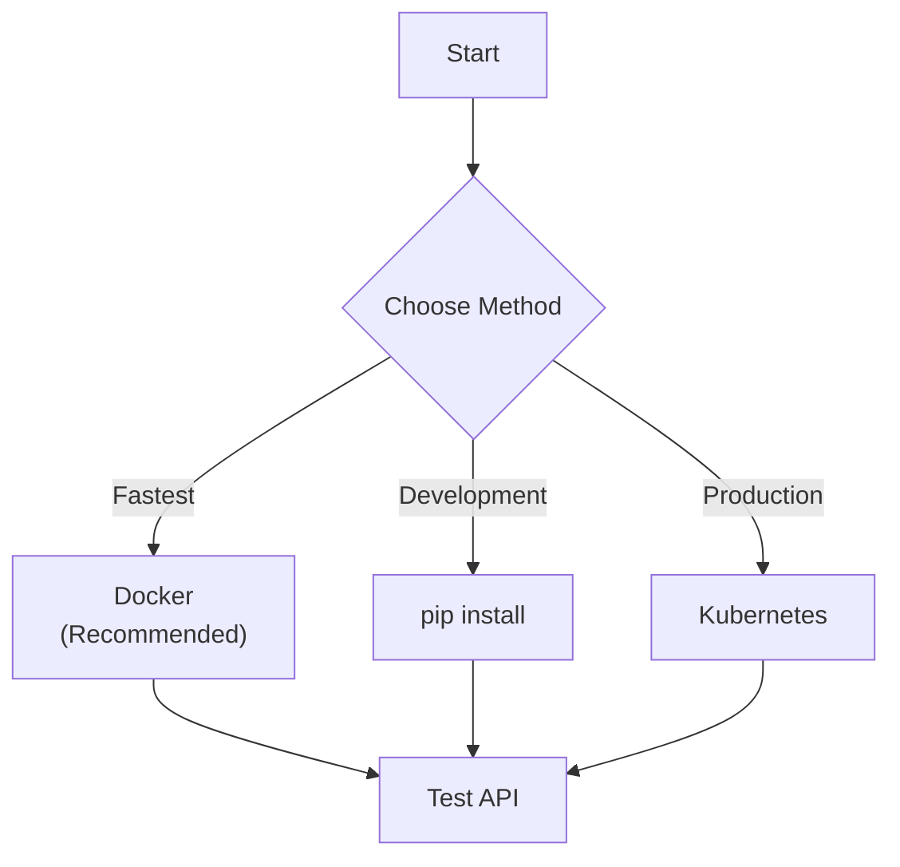
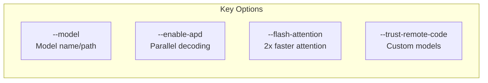

# dfastllm Quick Start Guide

<div align="center">

**Get Started with vdiff in 5 Minutes**

*High-performance Diffusion LLM serving made easy*

</div>

---

## Prerequisites

Before starting, ensure you have:



| Requirement | Minimum | Recommended |
|-------------|---------|-------------|
| Python | 3.10 | 3.11+ |
| GPU VRAM | 16GB | 24GB+ |
| CUDA | 12.0 | 12.4+ |
| RAM | 16GB | 32GB |

---

## Installation Options



### Option 1: Docker (Recommended)

```bash
# Pull and run
docker run -d --gpus all \
  -p 8000:8000 \
  --name vdiff \
  quay.io/mwaykole/vdiff:turbo-v9 \
  --model GSAI-ML/LLaDA-8B-Instruct \
  --trust-remote-code \
  --enable-apd

# Check logs
docker logs -f vdiff
```

### Option 2: pip Install

```bash
# Clone repository
git clone https://github.com/your-org/vdiff.git
cd vdiff

# Create virtual environment
python -m venv venv
source venv/bin/activate

# Install
pip install -e .

# Run server
python -m dfastllm.entrypoints.openai.api_server \
  --model GSAI-ML/LLaDA-8B-Instruct \
  --trust-remote-code \
  --enable-apd
```

---

## Test the Server

### Health Check

```bash
curl http://localhost:8000/health
```

**Expected Response:**
```json
{
  "status": "healthy",
  "model_loaded": true,
  "device": "cuda",
  "state": "ready"
}
```

### Text Completion

```bash
curl -X POST http://localhost:8000/v1/completions \
  -H "Content-Type: application/json" \
  -d '{
    "model": "llada",
    "prompt": "def fibonacci(n):",
    "max_tokens": 100,
    "temperature": 0.0
  }'
```

### Chat Completion

```bash
curl -X POST http://localhost:8000/v1/chat/completions \
  -H "Content-Type: application/json" \
  -d '{
    "model": "llada",
    "messages": [
      {"role": "user", "content": "Explain quantum computing in one paragraph."}
    ],
    "max_tokens": 200
  }'
```

### Streaming

```bash
curl -X POST http://localhost:8000/v1/chat/completions \
  -H "Content-Type: application/json" \
  -d '{
    "model": "llada",
    "messages": [{"role": "user", "content": "Write a haiku about coding."}],
    "max_tokens": 50,
    "stream": true
  }'
```

---

## Python Client

```python
from openai import OpenAI

# Connect to vdiff server
client = OpenAI(
    base_url="http://localhost:8000/v1",
    api_key="not-needed"  # Optional
)

# Text completion
response = client.completions.create(
    model="llada",
    prompt="Write a Python function to sort a list:",
    max_tokens=200,
    temperature=0.0
)
print(response.choices[0].text)

# Chat completion
response = client.chat.completions.create(
    model="llada",
    messages=[
        {"role": "system", "content": "You are a helpful assistant."},
        {"role": "user", "content": "What is machine learning?"}
    ],
    max_tokens=300
)
print(response.choices[0].message.content)

# Streaming
stream = client.completions.create(
    model="llada",
    prompt="Write a story about AI:",
    max_tokens=500,
    stream=True
)

for chunk in stream:
    print(chunk.choices[0].text, end="", flush=True)
```

---

## Configuration

### Essential Options



| Option | Default | Description |
|--------|---------|-------------|
| `--model` | Required | Model name or path |
| `--port` | 8000 | Server port |
| `--enable-apd` | false | Enable parallel decoding |
| `--flash-attention` | false | Enable Flash Attention 2 |
| `--trust-remote-code` | false | Trust custom model code |
| `--diffusion-steps` | 64 | Diffusion sampling steps |
| `--max-model-len` | 4096 | Maximum context length |

### Full Example

```bash
python -m dfastllm.entrypoints.openai.api_server \
  --model GSAI-ML/LLaDA-8B-Instruct \
  --port 8000 \
  --max-model-len 2048 \
  --diffusion-steps 32 \
  --enable-apd \
  --apd-max-parallel 64 \
  --flash-attention \
  --trust-remote-code
```

---

## Performance Tips

### For Long Outputs (500+ tokens)

vdiff excels here with parallel decoding:

```python
response = client.completions.create(
    model="llada",
    prompt="Write a detailed essay about...",
    max_tokens=1000,  # dfastllm is faster for long outputs
    temperature=0.7
)
```

### For Short Outputs

Use fewer diffusion steps:

```bash
python -m dfastllm.entrypoints.openai.api_server \
  --model llada \
  --diffusion-steps 16  # Fewer steps for faster short outputs
```

### Memory Optimization

```bash
# For limited GPU memory (16GB)
--quantization 8bit \
--gpu-memory-utilization 0.85
```

---

## Monitoring

```bash
# Health check
curl http://localhost:8000/health

# List models
curl http://localhost:8000/v1/models

# Prometheus metrics
curl http://localhost:8000/metrics
```

---

## Troubleshooting

| Issue | Solution |
|-------|----------|
| Out of memory | Add `--quantization 8bit` or `--gpu-memory-utilization 0.8` |
| Model load fails | Add `--trust-remote-code` |
| Slow first request | Normal - CUDA kernels compile on first run |
| Flash Attention error | `pip install flash-attn --no-build-isolation` |

---

## Next Steps

| Document | Description |
|----------|-------------|
| [User Guide](USER_GUIDE.md) | Complete documentation |
| [API Reference](API_REFERENCE.md) | Full API documentation |
| [Deployment Guide](DEPLOYMENT_GUIDE.md) | Production deployment |
| [Performance Tuning](PERFORMANCE_TUNING.md) | Optimization guide |

---

## Quick Reference Card

```
# Start server
dfastllm --model GSAI-ML/LLaDA-8B-Instruct --enable-apd --trust-remote-code

# Health check
curl http://localhost:8000/health

# Completion
curl -X POST http://localhost:8000/v1/completions \
  -H "Content-Type: application/json" \
  -d '{"model":"llada","prompt":"Hello","max_tokens":50}'

# Chat
curl -X POST http://localhost:8000/v1/chat/completions \
  -H "Content-Type: application/json" \
  -d '{"model":"llada","messages":[{"role":"user","content":"Hi"}],"max_tokens":50}'

# Metrics
curl http://localhost:8000/metrics
```

---

*Last updated: December 2024*
