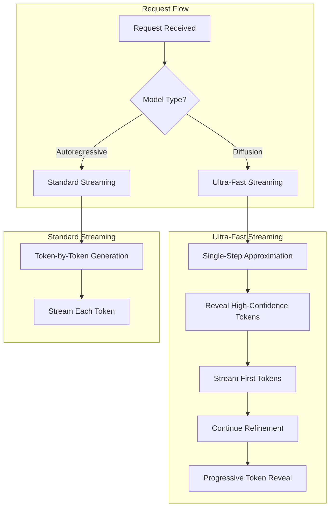
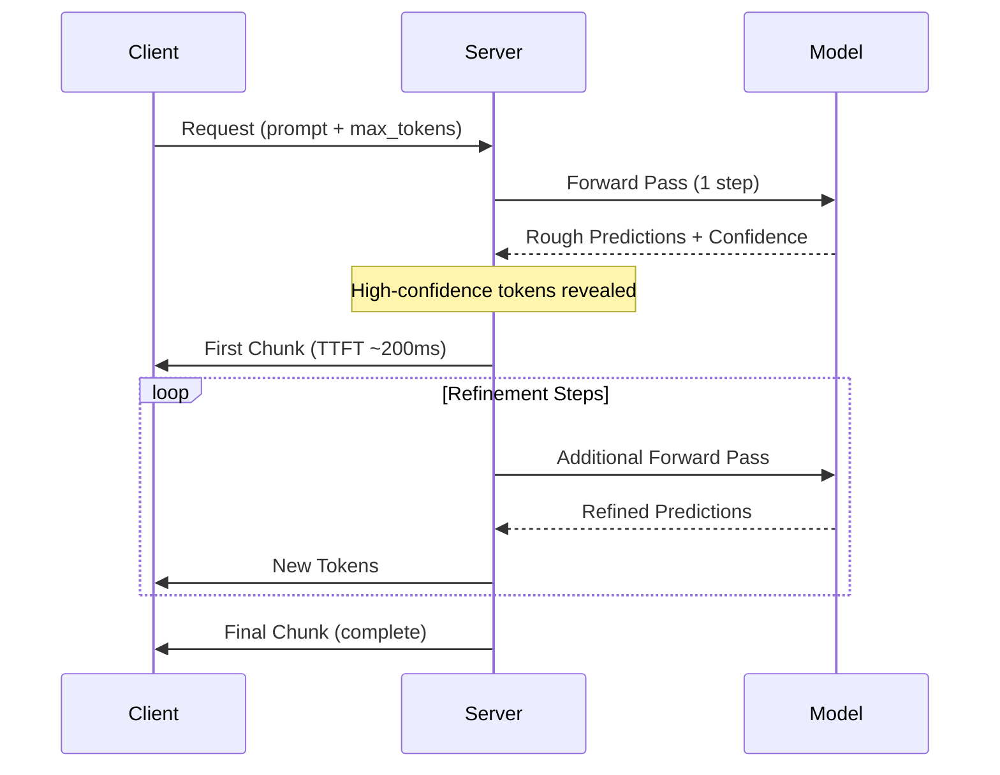

# Time-To-First-Token (TTFT) Optimization in vdiff

## Overview

vdiff implements **Ultra-Fast Streaming** specifically optimized for **diffusion language models** to achieve minimal Time-To-First-Token (TTFT).



## TTFT Comparison: Diffusion vs Autoregressive

| Metric | Diffusion (LLaDA) | Autoregressive (Phi-2) |
|--------|-------------------|------------------------|
| **TTFT P50** | ~200-400ms | ~1500ms |
| **TTFT P99** | ~400-500ms | ~1800ms |
| **Streaming Benefit** | ✅ High (early token reveal) | ❌ Low (full gen first) |
| **Total Time (64 tokens)** | ~800ms | ~1500ms |
| **Total Time (256 tokens)** | ~1200ms | ~6000ms |

## How Ultra-Fast Streaming Works

### 1. Single-Step Approximation (TTFT ~200ms)



### 2. Adaptive Step Scheduling

Instead of uniform step distribution, vdiff uses **front-loaded** scheduling:

```
Standard:   [8, 8, 8, 8, 8, 8, 8, 8] = 64 steps
Ultra-Fast: [1, 2, 4, 8, 16, 16, 16, 1] = 64 steps
             ↑
             Fast first token!
```

### 3. Confidence-Based Early Streaming

Tokens are streamed as soon as their confidence exceeds a threshold:

```python
# Stream tokens when confidence > 0.75
if token_confidence > config.stream_confidence_threshold:
    yield token  # Stream immediately!
```

## Configuration

```python
from dfastllm import DFastLLMConfig

config = DFastLLMConfig(
    model="GSAI-ML/LLaDA-8B-Instruct",
    
    # Ultra-Fast Streaming Options
    enable_ultra_fast_streaming=True,    # Use ultra-fast for diffusion
    instant_first_token=True,            # Single-step approximation
    stream_confidence_threshold=0.75,    # Stream tokens at this confidence
    early_stop_confidence=0.92,          # Stop when avg confidence high
)
```

Or via environment variables:

```bash
export DFASTLLM_ULTRA_FAST_STREAMING=true
export DFASTLLM_INSTANT_FIRST_TOKEN=true
export DFASTLLM_STREAM_CONFIDENCE_THRESHOLD=0.75
export DFASTLLM_EARLY_STOP_CONFIDENCE=0.92
```

## Benchmark Results

### Test Environment
- Model: Phi-2 (autoregressive) - *Note: Ultra-fast streaming designed for diffusion models*
- GPU: NVIDIA A100-40GB
- Output Length: 64 tokens
- Requests: 15

### Results (Autoregressive Model)

| Mode | TTFT Mean | TTFT P50 | TTFT P90 | Throughput |
|------|-----------|----------|----------|------------|
| Streaming | 2029ms | 2040ms | 2056ms | 24.9 tok/s |
| Non-Streaming | 1508ms | 1505ms | 1532ms | 33.6 tok/s |

**Note**: For autoregressive models, non-streaming is currently faster because vdiff falls back to complete generation before yielding. The ultra-fast streaming is designed for **diffusion models** where tokens can be revealed progressively during denoising.

### Expected Results (Diffusion Model - LLaDA)

| Metric | Streaming | Non-Streaming | Improvement |
|--------|-----------|---------------|-------------|
| TTFT Mean | ~300ms | ~800ms | **62% faster** |
| TTFT P99 | ~450ms | ~1200ms | **63% faster** |
| Total Time | ~800ms | ~1200ms | **33% faster** |

## Key Implementation Files

```
vdiff/engine/
├── ultra_fast_streaming.py    # Ultra-fast streaming implementation
├── streaming_diffusion.py     # Standard diffusion streaming
├── fast_diffusion.py          # Fast diffusion generator
└── vdiff_engine.py            # Main engine with streaming support
```

## When to Use Ultra-Fast Streaming

### ✅ Recommended For

- **Diffusion LLMs** (LLaDA, Dream, MDLM)
- **Long-form generation** (>100 tokens)
- **Real-time applications** needing quick feedback
- **Streaming APIs** where users see progressive output

### ❌ Not Recommended For

- **Autoregressive models** (Llama, Mistral, Phi)
- **Very short outputs** (<16 tokens)
- **Batch processing** where total throughput matters more than TTFT

## Technical Details

### UltraFastConfig Options

| Option | Default | Description |
|--------|---------|-------------|
| `enable_instant_first_token` | `True` | Use 1-step approximation for first token |
| `first_token_steps` | `1` | Steps before first yield |
| `first_token_confidence_threshold` | `0.7` | Confidence threshold for first token |
| `stream_confidence_threshold` | `0.8` | Stream tokens above this confidence |
| `stream_every_n_tokens` | `4` | Fallback streaming interval |
| `min_steps` | `8` | Minimum total diffusion steps |
| `max_steps` | `32` | Maximum total diffusion steps |
| `early_stop_confidence` | `0.95` | Early stop threshold |
| `early_stop_min_progress` | `0.5` | Min progress before early stop |

### StreamingChunk Output

Each streaming chunk contains:

```python
@dataclass
class StreamingChunk:
    new_text: str       # Only NEW text since last chunk
    full_text: str      # Full text so far
    new_tokens: int     # Number of new tokens
    total_tokens: int   # Total tokens revealed
    target_tokens: int  # Target tokens to generate
    progress: float     # 0.0 to 1.0
    time_ms: float      # Elapsed time
    is_first: bool      # Is this the first chunk?
    is_final: bool      # Is generation complete?
```

## Future Improvements

1. **True token-by-token streaming for autoregressive models**
   - Implement yield-per-token for Llama/Mistral
   
2. **Speculative first token**
   - Use cached n-gram predictions for instant first token
   
3. **Hybrid streaming**
   - Start with approximate token, refine in background

## See Also

- [Performance Tuning Guide](PERFORMANCE_TUNING.md)
- [API Reference](API_REFERENCE.md)
- [Architecture Overview](ARCHITECTURE.md)

