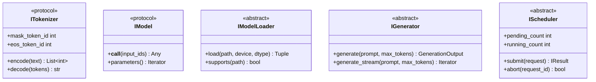

# dfastllm Low-Level Design (LLD)

**Document Version:** 2.0.0  
**Last Updated:** December 24, 2024  
**Author:** dfastllm Team  
**Status:** Approved

---

## Table of Contents

1. [Document Overview](#1-document-overview)
2. [Module Design](#2-module-design)
3. [Class Diagrams](#3-class-diagrams)
4. [Sequence Diagrams](#4-sequence-diagrams)
5. [State Diagrams](#5-state-diagrams)
6. [Data Structures](#6-data-structures)
7. [Algorithm Design](#7-algorithm-design)
8. [Error Handling](#8-error-handling)
9. [Configuration Design](#9-configuration-design)
10. [Testing Strategy](#10-testing-strategy)
11. [Coding Standards](#11-coding-standards)

---

## 1. Document Overview

### 1.1 Purpose
This Low-Level Design (LLD) document provides detailed technical specifications for implementing dfastllm components, including class designs, algorithms, data structures, and coding standards.

### 1.2 Scope
- Detailed class and interface designs
- Algorithm implementations
- Data structure specifications
- Error handling patterns
- Coding standards and conventions

### 1.3 Audience
- Software Engineers
- QA Engineers
- Code Reviewers

### 1.4 Prerequisites
- Understanding of HLD.md
- Python 3.10+ knowledge
- PyTorch fundamentals
- Diffusion model concepts

---

## 2. Module Design

### 2.1 Module Dependency Graph


### 2.2 Module Responsibilities

| Module | Single Responsibility |
|--------|----------------------|
| `api_server.py` | HTTP request handling and routing |
| `protocol.py` | Request/response data models |
| `serving_completion.py` | Completion request processing |
| `serving_chat.py` | Chat request processing |
| `dfastllm_engine.py` | Engine orchestration and lifecycle |
| `diffusion_generator.py` | Unified token generation |
| `scheduler.py` | Request scheduling and batching |
| `diffusion_sampler.py` | Core diffusion algorithm |
| `apd.py` | Adaptive parallel decoding |
| `model_loader.py` | Model detection and loading |
| `sampling_params.py` | Generation parameter handling |
| `outputs.py` | Output data structures |
| `tokenizer.py` | Tokenization wrapper |
| `config.py` | Configuration management |
| `prometheus.py` | Metrics collection |

---

## 3. Class Diagrams

### 3.1 Core Engine Classes


### 3.2 Unified Generation Classes (v2.0)


### 3.3 Unified Scheduler Classes (v2.0)


### 3.4 API Classes


---

## 4. Sequence Diagrams

### 4.1 Completion Request Flow


### 4.2 Streaming Flow


### 4.3 Model Loading Flow


---

## 5. State Diagrams

### 5.1 Engine State Machine


### 5.2 Request State Machine


---

## 6. Data Structures

### 6.1 Core Data Classes

```python
@dataclass
class SamplingParams:
    """Parameters for text generation."""
    n: int = 1
    max_tokens: int = 16
    temperature: float = 1.0
    top_p: float = 1.0
    top_k: int = -1
    stop: List[str] = field(default_factory=list)
    presence_penalty: float = 0.0
    frequency_penalty: float = 0.0
    logprobs: Optional[int] = None
    
    def __post_init__(self):
        # Ensure stop is always a list
        if isinstance(self.stop, str):
            self.stop = [self.stop]
        elif self.stop is None:
            self.stop = []
    
    @classmethod
    def from_openai_params(cls, **kwargs) -> "SamplingParams":
        """Create from OpenAI API parameters."""
        return cls(
            n=kwargs.get("n") if kwargs.get("n") is not None else 1,
            max_tokens=kwargs.get("max_tokens") if kwargs.get("max_tokens") is not None else 16,
            temperature=kwargs.get("temperature") if kwargs.get("temperature") is not None else 1.0,
            top_p=kwargs.get("top_p") if kwargs.get("top_p") is not None else 1.0,
            stop=kwargs.get("stop", []),
        )
```

```python
@dataclass
class CompletionOutput:
    """Single completion output."""
    index: int
    text: str
    token_ids: List[int] = field(default_factory=list)
    cumulative_logprob: Optional[float] = None
    logprobs: Optional[List[Dict]] = None
    finish_reason: Optional[str] = None
```

```python
@dataclass
class RequestOutput:
    """Complete request output."""
    request_id: str
    prompt: str
    prompt_token_ids: List[int]
    outputs: List[CompletionOutput]
    finished: bool
    metrics: Optional[RequestMetrics] = None
```

### 6.2 Queue Data Structures

```python
class PriorityQueue:
    """Thread-safe priority queue for request scheduling."""
    
    def __init__(self, maxsize: int = 0):
        self._queue: List[Tuple[float, Request]] = []
        self._lock = threading.Lock()
        self._maxsize = maxsize
    
    def put(self, request: Request, priority: float) -> bool:
        """Add request with priority (lower = higher priority)."""
        with self._lock:
            if self._maxsize > 0 and len(self._queue) >= self._maxsize:
                return False
            heapq.heappush(self._queue, (priority, request))
            return True
    
    def get(self) -> Optional[Request]:
        """Get highest priority request."""
        with self._lock:
            if self._queue:
                _, request = heapq.heappop(self._queue)
                return request
            return None
    
    def __len__(self) -> int:
        return len(self._queue)
```

---

## 7. Algorithm Design

### 7.1 Diffusion Generation Algorithm

```python
def diffusion_generate(
    model: nn.Module,
    prompt: Tensor,      # [B, prompt_len]
    gen_length: int,
    steps: int,
    temperature: float,
    mask_id: int,
    confidence_threshold: float = 0.5,
) -> Tensor:
    """
    Core diffusion generation algorithm.
    
    Time Complexity: O(steps * model_forward)
    Space Complexity: O(batch * total_length * vocab_size)
    """
    device = prompt.device
    batch_size = prompt.shape[0]
    total_length = prompt.shape[1] + gen_length
    
    # Initialize: prompt + masked tokens
    x = torch.full((batch_size, total_length), mask_id, device=device)
    x[:, :prompt.shape[1]] = prompt
    
    for step in range(steps):
        # Forward pass
        with torch.inference_mode():
            logits = model(x).logits  # [B, L, V]
        
        # Sample predictions
        if temperature > 0:
            probs = F.softmax(logits / temperature, dim=-1)
            x0 = torch.multinomial(probs.view(-1, probs.shape[-1]), 1)
            x0 = x0.view(batch_size, total_length)
        else:
            x0 = torch.argmax(logits, dim=-1)
        
        # Calculate confidence
        probs = F.softmax(logits, dim=-1)
        confidence = torch.gather(probs, -1, x0.unsqueeze(-1)).squeeze(-1)
        
        # Unmask high-confidence tokens
        mask_positions = (x == mask_id)
        high_conf = confidence > confidence_threshold
        unmask = mask_positions & high_conf
        
        x = torch.where(unmask, x0, x)
        
        # Early exit if all unmasked
        if not (x == mask_id).any():
            break
    
    return x[:, prompt.shape[1]:]  # Return generated tokens only
```

### 7.2 Adaptive Parallel Decoding (APD)

```python
def apd_generate(
    model: nn.Module,
    prompt: Tensor,
    gen_length: int,
    max_parallel: int = 8,
    accept_threshold: float = 0.5,
) -> Tensor:
    """
    APD: Decode multiple tokens per step based on confidence.
    
    Key Insight: High-confidence predictions can be accepted
    without verification, enabling parallel decoding.
    """
    x = prompt.clone()
    generated = []
    
    while len(generated) < gen_length:
        # Predict next `max_parallel` tokens
        with torch.inference_mode():
            logits = model(x).logits[:, -1:]  # Last position
        
        probs = F.softmax(logits, dim=-1)
        
        # Find tokens meeting threshold
        accepted_tokens = []
        for _ in range(max_parallel):
            top_prob, top_token = probs[0, -1].max(dim=-1)
            
            if top_prob < accept_threshold:
                break
            
            accepted_tokens.append(top_token.item())
            
            # Extend and predict next
            x = torch.cat([x, top_token.view(1, 1)], dim=1)
            with torch.inference_mode():
                logits = model(x).logits[:, -1:]
            probs = F.softmax(logits, dim=-1)
        
        if not accepted_tokens:
            # Fallback: accept top token regardless
            top_token = probs[0, -1].argmax()
            accepted_tokens = [top_token.item()]
            x = torch.cat([x, top_token.view(1, 1)], dim=1)
        
        generated.extend(accepted_tokens)
    
    return torch.tensor(generated[:gen_length])
```

### 7.3 Batch Formation Algorithm

```python
def form_batch(
    pending: List[Request],
    max_batch_size: int,
    max_tokens: int,
) -> Tuple[List[Request], List[Request]]:
    """
    Greedy batch formation with token limit.
    
    Strategy: Pack requests to maximize batch utilization
    while respecting token budget.
    """
    batch = []
    remaining = []
    current_tokens = 0
    
    # Sort by token count (smallest first for better packing)
    sorted_requests = sorted(pending, key=lambda r: r.token_count())
    
    for request in sorted_requests:
        req_tokens = request.token_count()
        
        if len(batch) < max_batch_size and current_tokens + req_tokens <= max_tokens:
            batch.append(request)
            current_tokens += req_tokens
        else:
            remaining.append(request)
    
    return batch, remaining
```

---

## 8. Error Handling

### 8.1 Exception Hierarchy


### 8.2 Error Handling Patterns

```python
# Pattern 1: Specific exception catching
async def create_completion(request: CompletionRequest):
    try:
        result = await engine.generate_async(request.prompt, params)
        return format_response(result)
    except ModelNotFoundError as e:
        return JSONResponse(
            status_code=404,
            content={"error": {"type": "model_not_found", "message": str(e)}}
        )
    except ValidationError as e:
        return JSONResponse(
            status_code=400,
            content={"error": {"type": "validation_error", "message": str(e)}}
        )
    except TimeoutError as e:
        return JSONResponse(
            status_code=504,
            content={"error": {"type": "timeout", "message": str(e)}}
        )
    except Exception as e:
        logger.exception("Unexpected error")
        return JSONResponse(
            status_code=500,
            content={"error": {"type": "internal_error", "message": "Internal error"}}
        )

# Pattern 2: Context manager for resource cleanup
@contextlib.asynccontextmanager
async def request_context(request_id: str):
    try:
        metrics.request_started(request_id)
        yield
    except Exception as e:
        metrics.request_failed(request_id, str(e))
        raise
    finally:
        metrics.request_completed(request_id)
```

### 8.3 Error Codes

| HTTP Code | Error Type | Description |
|-----------|------------|-------------|
| 400 | validation_error | Invalid request parameters |
| 401 | unauthorized | Missing/invalid API key |
| 404 | model_not_found | Requested model not available |
| 429 | rate_limit_exceeded | Too many requests |
| 500 | internal_error | Server-side error |
| 503 | service_unavailable | Engine not ready |
| 504 | timeout | Request timeout |

---

## 9. Configuration Design

### 9.1 Configuration Hierarchy


### 9.2 Configuration Classes

```python
@dataclass
class DFastLLMConfig:
    """Main configuration class."""
    
    # Model configuration
    model: str = "gpt2"
    tokenizer: Optional[str] = None
    dtype: str = "auto"
    trust_remote_code: bool = False
    
    # Server configuration
    host: str = "0.0.0.0"
    port: int = 8000
    api_key: Optional[str] = None
    
    # Generation configuration
    enable_apd: bool = True
    apd_max_parallel: int = 8
    diffusion_steps: int = 32
    
    # Production configuration
    max_concurrent_requests: int = 4
    rate_limit_requests: int = 100
    request_timeout: float = 300.0
    
    # Optimization configuration
    compile_model: bool = False
    enable_flash_attention: bool = True
    enable_quantization: bool = False
    quantization_bits: int = 8
    
    # Unified modules (v2.0)
    enable_ultra_fast_streaming: bool = True
    instant_first_token: bool = True
    stream_confidence_threshold: float = 0.75
    
    @classmethod
    def from_args(cls, args: argparse.Namespace) -> "DFastLLMConfig":
        """Create from CLI arguments."""
        return cls(**{k: v for k, v in vars(args).items() if v is not None})
```

---

## 10. Testing Strategy

### 10.1 Test Categories


### 10.2 Test Coverage Requirements

| Component | Minimum Coverage |
|-----------|-----------------|
| Engine | 80% |
| API Server | 85% |
| Generation | 75% |
| Scheduler | 80% |
| Protocol | 90% |

### 10.3 Test Patterns

```python
# Unit test pattern
class TestSamplingParams:
    def test_defaults(self):
        params = SamplingParams()
        assert params.temperature == 1.0
        assert params.max_tokens == 16
    
    def test_from_openai_params_temperature_zero(self):
        params = SamplingParams.from_openai_params(temperature=0)
        assert params.temperature == 0.0  # Not default!
    
    def test_stop_string_to_list(self):
        params = SamplingParams(stop="END")
        assert params.stop == ["END"]

# Integration test pattern
class TestCompletionAPI:
    @pytest.fixture
    def client(self):
        return TestClient(app)
    
    def test_completion_success(self, client):
        response = client.post("/v1/completions", json={
            "model": "test-model",
            "prompt": "Hello",
            "max_tokens": 10
        })
        assert response.status_code == 200
        assert "choices" in response.json()
    
    def test_invalid_model_returns_404(self, client):
        response = client.post("/v1/completions", json={
            "model": "nonexistent",
            "prompt": "Hello"
        })
        assert response.status_code == 404
        assert response.json()["error"]["type"] == "model_not_found"
```

---

## 11. SOLID Principles Implementation

### 11.1 Overview

dfastllm follows SOLID principles for maintainable, extensible code:


### 11.2 Single Responsibility Principle (SRP)

Each class has one reason to change:

| Class | Responsibility |
|-------|---------------|
| `DiffusionGenerator` | Token generation only |
| `Scheduler` | Request scheduling only |
| `ModelLoader` | Model loading only |
| `TokenizerWrapper` | Tokenization only |
| `DFastLLMEngine` | Orchestration only |

```python
# ✅ Good: Single responsibility
class DiffusionGenerator:
    """Generates tokens - that's it."""
    
    def generate(self, prompt, max_tokens): ...
    def generate_stream(self, prompt, max_tokens): ...


# ❌ Bad: Multiple responsibilities
class BadEngine:
    def load_model(self): ...      # Model loading
    def tokenize(self, text): ...  # Tokenization
    def generate(self, ...): ...   # Generation
    def get_health(self): ...      # Health checking
```

### 11.3 Open/Closed Principle (OCP)

Open for extension, closed for modification:

```python
# Extension via enum (no code modification)
class GenerationMode(Enum):
    STANDARD = auto()
    FAST = auto()
    STREAMING = auto()
    TURBO = auto()
    # Easy to add: ULTRA = auto()

# Extension via interface implementation
class IModelLoader(ABC):
    @abstractmethod
    def load(self, model_path: str) -> Tuple[IModel, ITokenizer]: ...

class HuggingFaceLoader(IModelLoader):
    def load(self, model_path): ...

class LocalLoader(IModelLoader):
    def load(self, model_path): ...

# New loaders extend, don't modify existing code
```

### 11.4 Liskov Substitution Principle (LSP)

Subtypes are substitutable for base types:

```python
# Any IGenerator works the same way
def process_request(generator: IGenerator, prompt):
    return generator.generate(prompt, max_tokens=100)

# All implementations satisfy the contract
generator1 = DiffusionGenerator(model, tokenizer)
generator2 = TurboGenerator(model, tokenizer)

# Both work interchangeably
result1 = process_request(generator1, prompt)
result2 = process_request(generator2, prompt)
```

### 11.5 Interface Segregation Principle (ISP)

Clients only depend on interfaces they use:


```python
# ✅ Good: Focused interfaces
class IHealthChecker(ABC):
    def get_health(self) -> HealthStatus: ...
    def is_ready(self) -> bool: ...

class IMetricsCollector(ABC):
    def record_request(self, ...): ...
    def get_metrics(self) -> Dict: ...


# ❌ Bad: Fat interface
class IBadEngine(ABC):
    def generate(self): ...
    def load_model(self): ...
    def get_health(self): ...
    def get_metrics(self): ...
    def shutdown(self): ...
```

### 11.6 Dependency Inversion Principle (DIP)

Depend on abstractions, not concretions:

```python
# ServiceContainer for dependency injection
container = ServiceContainer()
container.register(IModelLoader, HuggingFaceLoader())
container.register(IGenerator, DiffusionGenerator(model, tokenizer))

# Components depend on interfaces
class Engine:
    def __init__(
        self,
        loader: IModelLoader,      # Abstract
        generator: IGenerator,      # Abstract
        health: IHealthChecker,     # Abstract
    ):
        self.loader = loader
        self.generator = generator
        self.health = health

# Easy to test with mocks
class MockGenerator(IGenerator):
    def generate(self, prompt, max_tokens):
        return MockOutput("test")

engine = Engine(
    loader=MockLoader(),
    generator=MockGenerator(),
    health=MockHealthChecker(),
)
```

### 11.7 Interface Definitions

Located in `dfastllm/engine/interfaces.py`:



---

## 12. Coding Standards

### 11.1 Python Style Guide

| Rule | Standard |
|------|----------|
| Formatter | Black (line length 100) |
| Linter | Ruff |
| Type Hints | Required for public APIs |
| Docstrings | Google style |
| Import Order | isort (stdlib, third-party, local) |

### 11.2 Naming Conventions

| Element | Convention | Example |
|---------|------------|---------|
| Classes | PascalCase | `DiffusionGenerator` |
| Functions | snake_case | `generate_stream` |
| Constants | UPPER_SNAKE | `MAX_BATCH_SIZE` |
| Private | _prefix | `_load_model` |
| Protected | __prefix | `__internal_state` |

### 11.3 Documentation Standards

```python
def generate(
    self,
    prompt_ids: torch.Tensor,
    max_tokens: int = 128,
    temperature: float = 1.0,
) -> GenerationResult:
    """Generate text using diffusion decoding.
    
    This method performs iterative unmasking to generate tokens,
    using the configured generation mode (STANDARD, FAST, STREAMING, TURBO).
    
    Args:
        prompt_ids: Input token IDs of shape [batch_size, prompt_length].
        max_tokens: Maximum number of tokens to generate.
        temperature: Sampling temperature. 0 = greedy, higher = more random.
    
    Returns:
        GenerationResult containing generated text and metadata.
    
    Raises:
        ValueError: If prompt_ids is empty or invalid.
        RuntimeError: If model is not loaded.
    
    Example:
        >>> generator = DiffusionGenerator(model, tokenizer)
        >>> result = generator.generate(prompt_ids, max_tokens=100)
        >>> print(result.text)
    """
```

### 11.4 Code Review Checklist

- [ ] Follows naming conventions
- [ ] Has type hints
- [ ] Has docstrings
- [ ] Has unit tests
- [ ] Error handling is appropriate
- [ ] No hardcoded values (use config)
- [ ] Thread-safe if concurrent
- [ ] Memory efficient
- [ ] Logging at appropriate levels

---

## Appendix A: File Templates

### A.1 Module Template

```python
"""
Module description.

This module provides...
"""

from __future__ import annotations

import logging
from dataclasses import dataclass
from typing import Optional, List

logger = logging.getLogger(__name__)


@dataclass
class Config:
    """Configuration for this module."""
    param: str = "default"


class MainClass:
    """Main class description."""
    
    def __init__(self, config: Config):
        """Initialize with config."""
        self.config = config
    
    def method(self) -> None:
        """Method description."""
        pass
```

---

## Appendix B: Document History

| Version | Date | Author | Changes |
|---------|------|--------|---------|
| 1.0.0 | Dec 2024 | dfastllm Team | Initial version |
| 2.0.0 | Dec 2024 | dfastllm Team | Added unified modules, coding standards |

---

*Document Classification: Internal*

