# Basic Concepts

This document explains fundamental concepts you need to understand dfastllm. **No prior knowledge required.**

## What is an AI Language Model?

An AI Language Model is a computer program that can:
1. **Understand text** - Know what words mean
2. **Generate text** - Write new sentences


### Real Example

```
You type:    "Write a poem about cats"
AI responds: "Soft paws padding through the night,
              Whiskers twitching in moonlight..."
```

## How Does Text Become Numbers?

Computers don't understand text - they only understand numbers. So we need to convert:


### What is a Token?

A **token** is a piece of text. It can be:
- A whole word: `"hello"` → 1 token
- Part of a word: `"running"` → `["run", "ning"]` → 2 tokens
- A symbol: `"!"` → 1 token


Each token has a unique number (ID):
- `"I"` = 40
- `"love"` = 2751
- `"program"` = 4923
- `"ming"` = 1723
- `"!"` = 0

## Two Types of Language Models

### Type 1: Autoregressive Models (Traditional)

These generate text **one word at a time**, from left to right.


**Examples**: GPT-4, LLaMA, Mistral, Claude

**How it works**:
1. Look at all previous words
2. Predict the next word
3. Add that word
4. Repeat

### Type 2: Diffusion Models (New)

These generate text by **filling in blanks** simultaneously.


**Examples**: LLaDA, Dream

**How it works**:
1. Start with all `[MASK]` tokens (blanks)
2. Look at everything, predict what each blank should be
3. Fill in the most confident predictions
4. Repeat until no blanks left

## Why Diffusion Models?

```mermaid
flowchart TB
    subgraph Benefits["Diffusion Model Benefits"]
        B1["🚀 Can fill multiple blanks at once"]
        B2["🎯 Can change earlier words based on later context"]
        B3["📝 Better for some creative tasks"]
    end
```



| Aspect | Autoregressive | Diffusion |
|--------|---------------|-----------|
| Generation | One token at a time | Multiple tokens at once |
| Speed | Slower | Can be faster with APD |
| Flexibility | Can't go back | Can revise any position |
| Examples | GPT, LLaMA | LLaDA, Dream |

## What is a Server?

A **server** is a program that:
1. **Listens** for requests from other programs
2. **Processes** those requests
3. **Responds** with results


## What is an API?

**API** = Application Programming Interface

It's a set of rules for how programs talk to each other.


### Example API Call

**You send:**
```json
{
  "model": "llada-8b",
  "prompt": "Hello, how are",
  "max_tokens": 10
}
```

**Server responds:**
```json
{
  "choices": [
    {
      "text": " you doing today?"
    }
  ]
}
```

## What is OpenAI Compatibility?

OpenAI (creators of ChatGPT) defined a standard API format. Many tools use it:

```mermaid
flowchart TB
    subgraph Standard["OpenAI API Standard"]
        E1["/v1/completions"]
        E2["/v1/chat/completions"]
        E3["/v1/models"]
    end
    
    subgraph Servers["Servers that support it"]
        S1["OpenAI"]
        S2["vLLM"]
        S3["dfastllm ✓"]
        S4["TGI"]
    end
    
    Standard --> S1
    Standard --> S2
    Standard --> S3
    Standard --> S4
```



**Why it matters**: If your app works with OpenAI, it works with dfastllm!

## What is GPU vs CPU?


| | CPU | GPU |
|--|-----|-----|
| Speed for AI | Slow | Fast |
| Cost | Included | Extra hardware |
| Power | Low | High |
| dfastllm support | ✅ Yes | ✅ Yes |

## What is Kubernetes?

Kubernetes (K8s) is a system that manages containers (packaged applications):


**Why use it?**
- Automatic scaling
- Self-healing (restart crashed apps)
- Load balancing

## What is KServe?

**KServe** is a standard for serving ML models on Kubernetes.

It provides:
- **ServingRuntime**: Defines how to run inference servers
- **InferenceService**: Deploys a specific model


## Summary


## Next Steps

Now that you understand the basics, continue to:

👉 [02-architecture.md](02-architecture.md) - See how dfastllm is built

