# System Architecture

This document explains how dfastllm is built and how all the pieces fit together.

## High-Level Overview

dfastllm has **5 main layers**:


## Detailed Architecture


## Layer 1: Client Layer

The **Client Layer** is where requests come from.


### Python Example

```python
from openai import OpenAI

# Create client pointing to dfastllm server
client = OpenAI(
    base_url="http://localhost:8000/v1",
    api_key="not-needed"
)

# Make a request
response = client.chat.completions.create(
    model="llada-8b",
    messages=[{"role": "user", "content": "Hello!"}]
)

print(response.choices[0].message.content)
```

## Layer 2: API Server Layer

The **API Server** receives HTTP requests and returns responses.

```mermaid
flowchart TB
    subgraph Request["Incoming Request"]
        REQ["POST /v1/completions<br/>Body: {prompt: 'Hello'}"]
    end
    
    subgraph Pipeline["Processing Pipeline"]
        direction TB
        M1["1️⃣ Add Request ID"]
        M2["2️⃣ Log Request"]
        M3["3️⃣ Add Security Headers"]
        M4["4️⃣ Check CORS"]
        M5["5️⃣ Check Rate Limit"]
        M6["6️⃣ Verify API Key"]
        M7["7️⃣ Route to Handler"]
        M8["8️⃣ Process Request"]
        M9["9️⃣ Format Response"]
    end
    
    subgraph Response["Outgoing Response"]
        RES["200 OK<br/>Body: {text: '...'}"]
    end
    
    Request --> M1 --> M2 --> M3 --> M4 --> M5 --> M6 --> M7 --> M8 --> M9 --> Response
```



### Key Files

| File | Purpose |
|------|---------|
| `api_server.py` | Main FastAPI app, routes, middleware |
| `protocol.py` | Request/response data structures |
| `serving_completion.py` | Handles `/v1/completions` |
| `serving_chat.py` | Handles `/v1/chat/completions` |

### Middleware Explained


## Layer 3: Engine Layer

The **Engine** is the brain of dfastllm. It manages everything.


### Engine Lifecycle


### Key Methods


## Layer 4: Generation Layer

The **Generation Layer** actually produces the text.

### Diffusion Generation

```mermaid
flowchart TB
    subgraph Input["Input"]
        PROMPT["Prompt: 'Hello'"]
        MASKS["Masks: [M] [M] [M] [M]"]
    end
    
    subgraph Process["Diffusion Process"]
        COMBINE["Combine: 'Hello [M] [M] [M] [M]'"]
        
        subgraph Loop["For each step"]
            FORWARD["1. Forward pass → logits"]
            CONF["2. Calculate confidence"]
            SELECT["3. Select high confidence"]
            UNMASK["4. Unmask selected tokens"]
        end
        
        CHECK{"All<br/>unmasked?"}
    end
    
    subgraph Output["Output"]
        RESULT["'Hello how are you today'"]
    end
    
    PROMPT --> COMBINE
    MASKS --> COMBINE
    COMBINE --> FORWARD
    FORWARD --> CONF --> SELECT --> UNMASK
    UNMASK --> CHECK
    CHECK -->|No| FORWARD
    CHECK -->|Yes| RESULT
```



### APD (Adaptive Parallel Decoding)


## Layer 5: Model Layer

The **Model Layer** is the actual AI model from HuggingFace.


### Model Inference


## Data Flow Example

Let's trace a complete request:


## Component Interactions


## Error Handling Flow


## Summary


## Next Steps

👉 [03-project-structure.md](03-project-structure.md) - See the file organization

