# Project Structure

This document explains every file and folder in the vdiff codebase.

## Directory Tree

```
vdiff/
├── 📁 vdiff/                    # Main Python package
│   ├── 📄 __init__.py           # Package initialization
│   ├── 📄 version.py            # Version information
│   ├── 📄 config.py             # Configuration classes
│   │
│   ├── 📁 engine/               # Core inference engine
│   │   ├── 📄 __init__.py       # Engine exports
│   │   ├── 📄 vdiff_engine.py   # Main engine class
│   │   ├── 📄 diffusion_sampler.py  # Diffusion algorithm
│   │   ├── 📄 apd.py            # APD optimization
│   │   ├── 📄 sampling_params.py    # Generation parameters
│   │   ├── 📄 outputs.py        # Output data structures
│   │   ├── 📄 tokenizer.py      # Tokenizer wrapper
│   │   └── 📄 request_queue.py  # Request queue
│   │
│   ├── 📁 entrypoints/          # API server
│   │   ├── 📄 __init__.py
│   │   ├── 📄 launcher.py       # Server launcher
│   │   └── 📁 openai/           # OpenAI-compatible API
│   │       ├── 📄 __init__.py
│   │       ├── 📄 api_server.py     # FastAPI application
│   │       ├── 📄 protocol.py       # Request/response types
│   │       ├── 📄 serving_completion.py  # Completion handler
│   │       └── 📄 serving_chat.py   # Chat handler
│   │
│   └── 📁 metrics/              # Monitoring
│       ├── 📄 __init__.py
│       └── 📄 prometheus.py     # Prometheus metrics
│
├── 📁 deploy/                   # Deployment files
│   ├── 📁 docker/               # Docker files
│   └── 📁 kubernetes/           # K8s manifests
│       ├── 📁 kserve/           # KServe/RHOAI
│       ├── 📁 llmd/             # llm-d integration
│       └── 📁 standalone/       # Standalone K8s
│
├── 📁 tests/                    # Test suite
│   ├── 📁 unit/                 # Unit tests
│   ├── 📁 integration/          # Integration tests
│   └── 📁 compatibility/        # Compatibility tests
│
├── 📁 benchmarks/               # Performance benchmarks
│   └── 📄 run_benchmark.py
│
├── 📁 examples/                 # Usage examples
├── 📁 scripts/                  # Utility scripts
├── 📁 docs/                     # Documentation
│
├── 📄 Dockerfile                # Container build
├── 📄 docker-compose.yml        # Container orchestration
├── 📄 pyproject.toml            # Python package config
├── 📄 Makefile                  # Build automation
├── 📄 README.md                 # Project readme
├── 📄 LICENSE                   # Apache 2.0 license
├── 📄 CHANGELOG.md              # Version history
├── 📄 requirements.txt          # Dependencies
└── 📄 requirements-dev.txt      # Dev dependencies
```

## Visual Structure

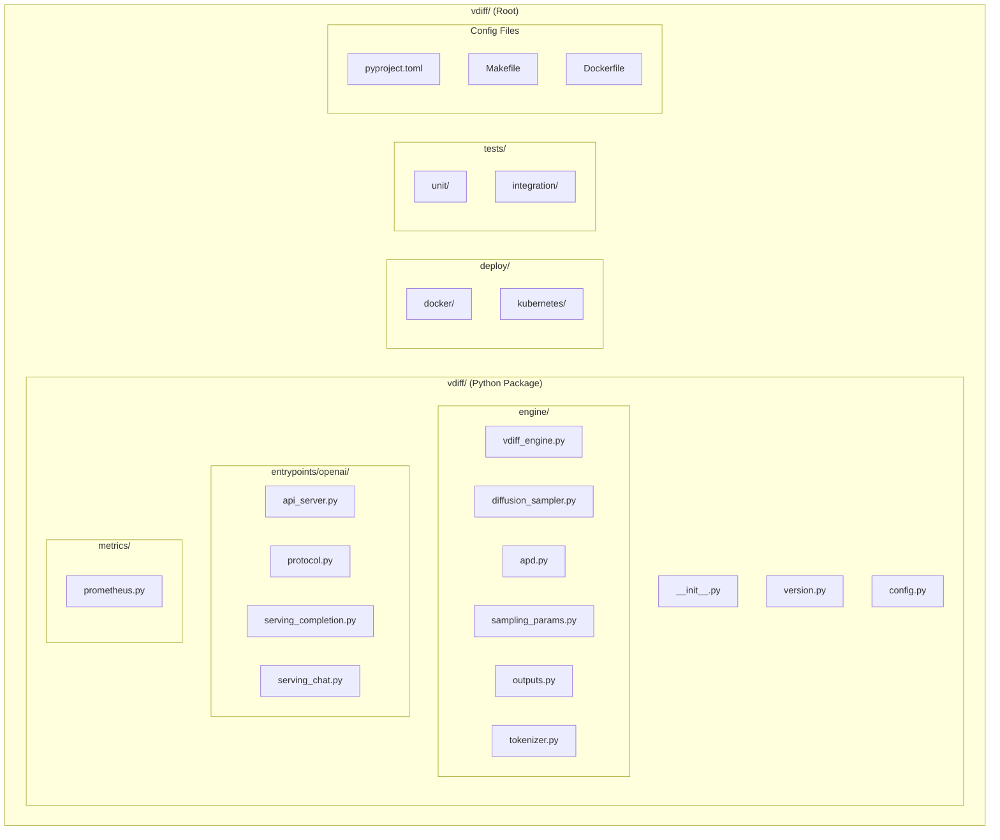

## File-by-File Explanation

### Root Files

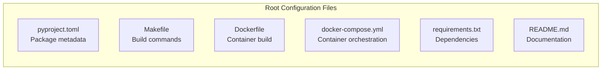

| File | Purpose |
|------|---------|
| `pyproject.toml` | Python package configuration (name, version, dependencies) |
| `Makefile` | Shortcuts for common commands (`make test`, `make lint`) |
| `Dockerfile` | Instructions to build Docker container |
| `docker-compose.yml` | Multi-container setup for development |
| `requirements.txt` | List of Python dependencies |
| `README.md` | Project documentation and quick start |

---

### vdiff/__init__.py

**Purpose**: Package initialization - what gets exported when you `import vdiff`

```python
# What it contains:
from vdiff.version import __version__
from vdiff.config import VDiffConfig, ModelConfig

__all__ = ["__version__", "VDiffConfig", "ModelConfig"]
```

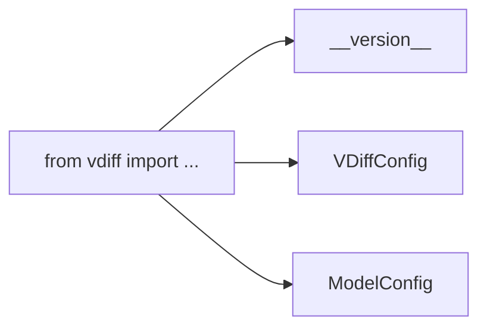

---

### vdiff/version.py

**Purpose**: Version information

```python
__version__ = "1.0.0"
__version_info__ = (1, 0, 0)
VLLM_COMPAT_VERSION = "0.4.0"  # Compatible vLLM version
```

---

### vdiff/config.py

**Purpose**: Configuration classes for the engine and server

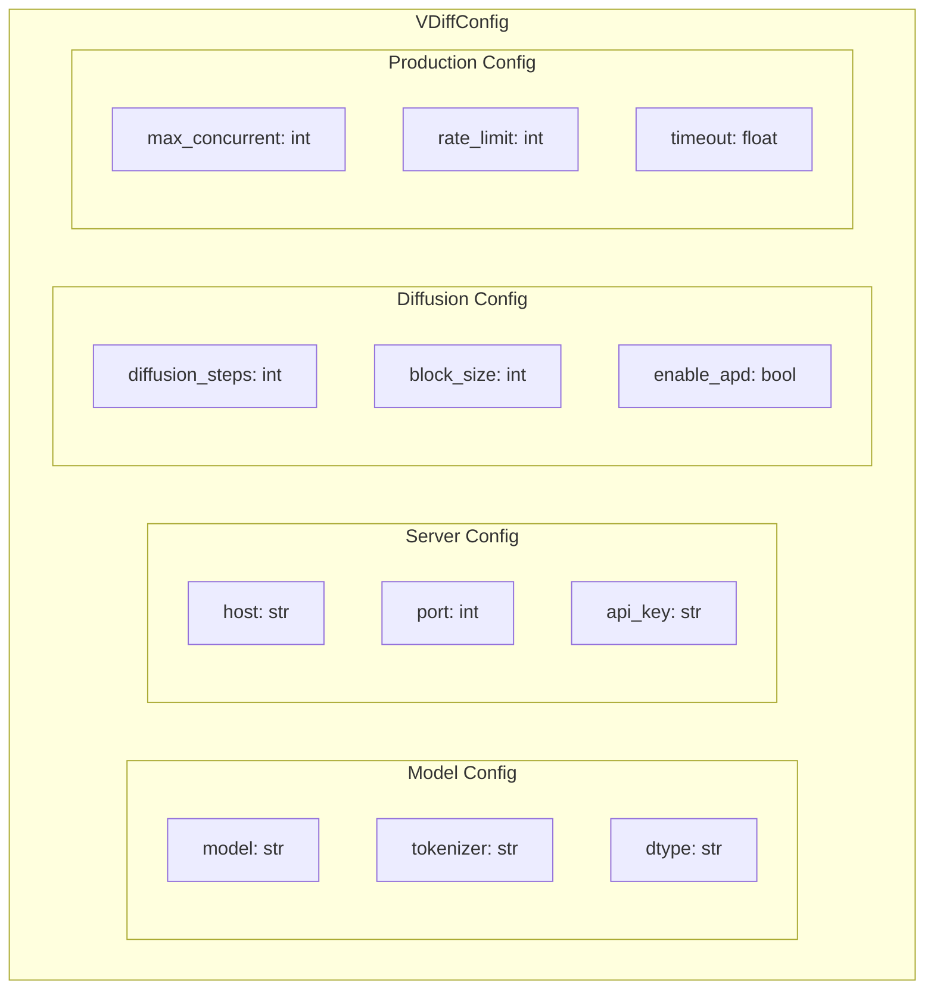

---

### vdiff/engine/__init__.py

**Purpose**: Export engine classes

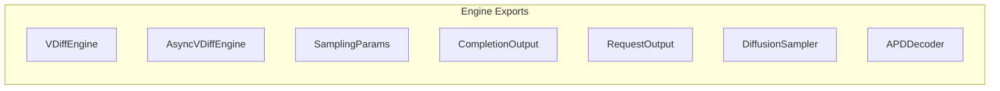

---

### vdiff/engine/vdiff_engine.py

**Purpose**: The main engine class - the brain of vdiff

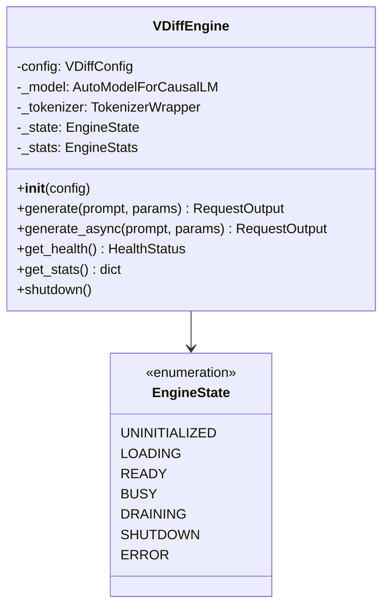

**Key Methods**:

| Method | Purpose |
|--------|---------|
| `__init__()` | Initialize engine, load model |
| `generate()` | Synchronous text generation |
| `generate_async()` | Async text generation |
| `get_health()` | Get health status |
| `shutdown()` | Graceful shutdown |

---

### vdiff/engine/diffusion_sampler.py

**Purpose**: Implements the diffusion generation algorithm

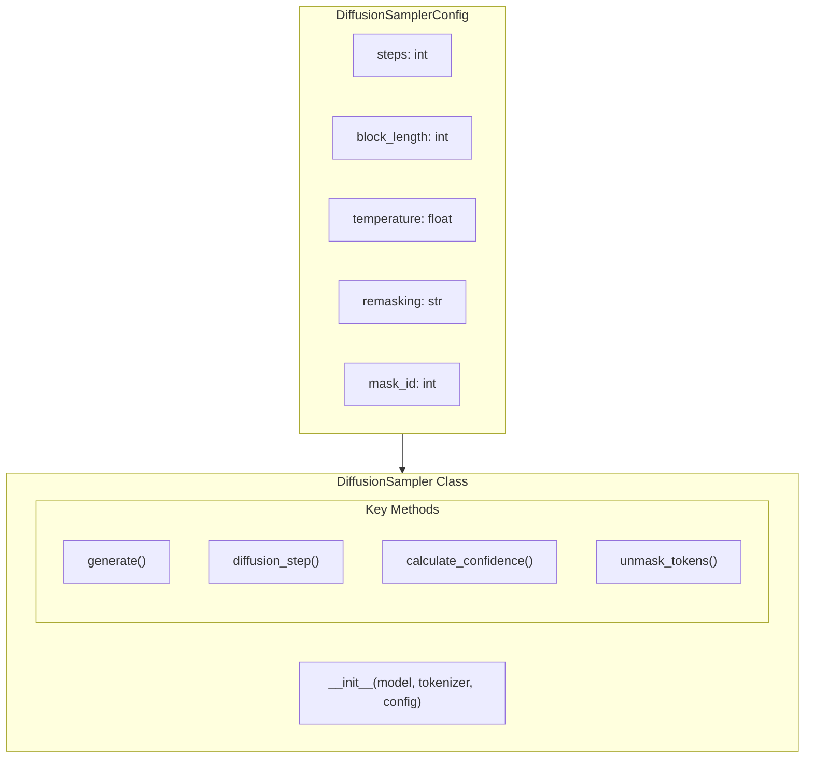

---

### vdiff/engine/apd.py

**Purpose**: Adaptive Parallel Decoding optimization

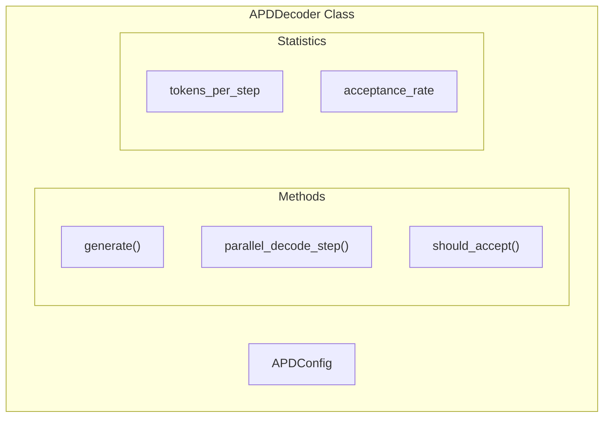

---

### vdiff/engine/sampling_params.py

**Purpose**: Parameters for text generation

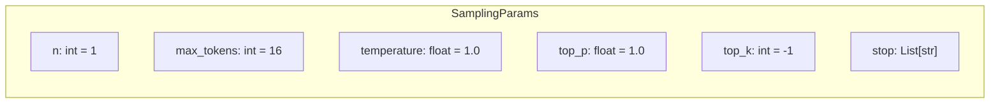

---

### vdiff/engine/outputs.py

**Purpose**: Output data structures

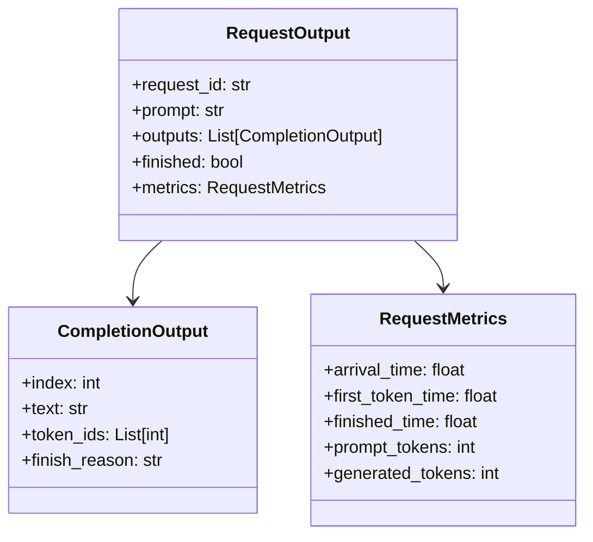

---

### vdiff/engine/tokenizer.py

**Purpose**: Wrapper around HuggingFace tokenizer

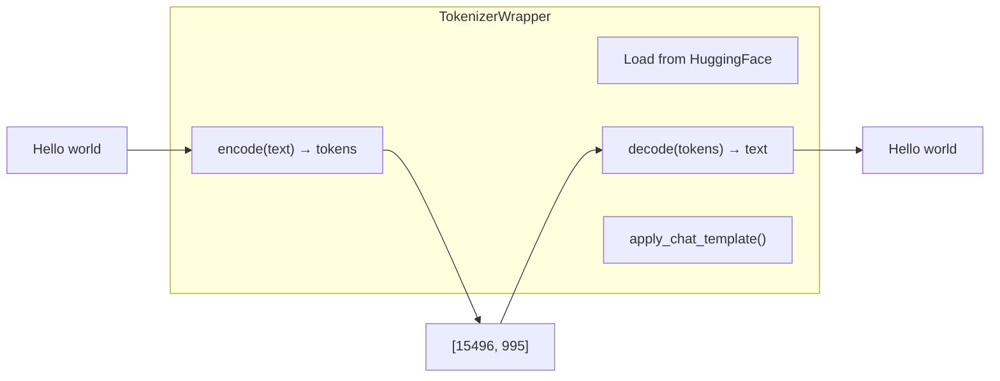

---

### vdiff/entrypoints/openai/api_server.py

**Purpose**: Main FastAPI application

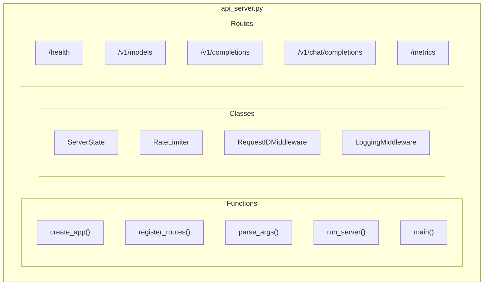

---

### vdiff/entrypoints/openai/protocol.py

**Purpose**: Request and response data types

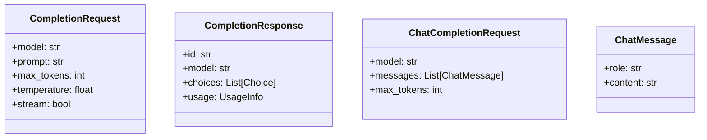

---

### vdiff/metrics/prometheus.py

**Purpose**: Prometheus metrics for monitoring

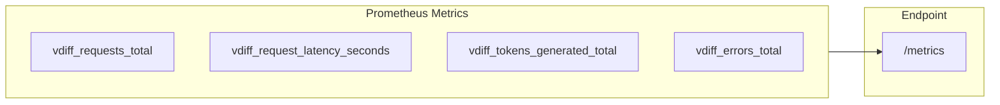

---

## Deployment Files

### deploy/kubernetes/kserve/

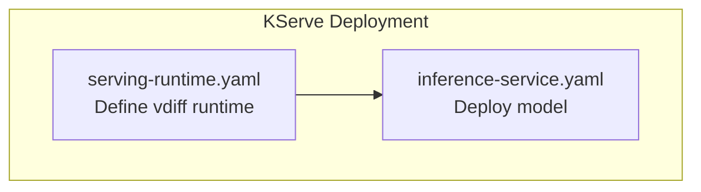

| File | Purpose |
|------|---------|
| `serving-runtime.yaml` | Defines vdiff as a ServingRuntime |
| `inference-service.yaml` | Deploys a model using vdiff |

---

## Test Files

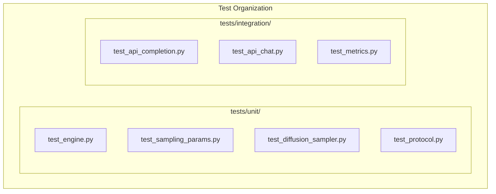

---

## Import Graph

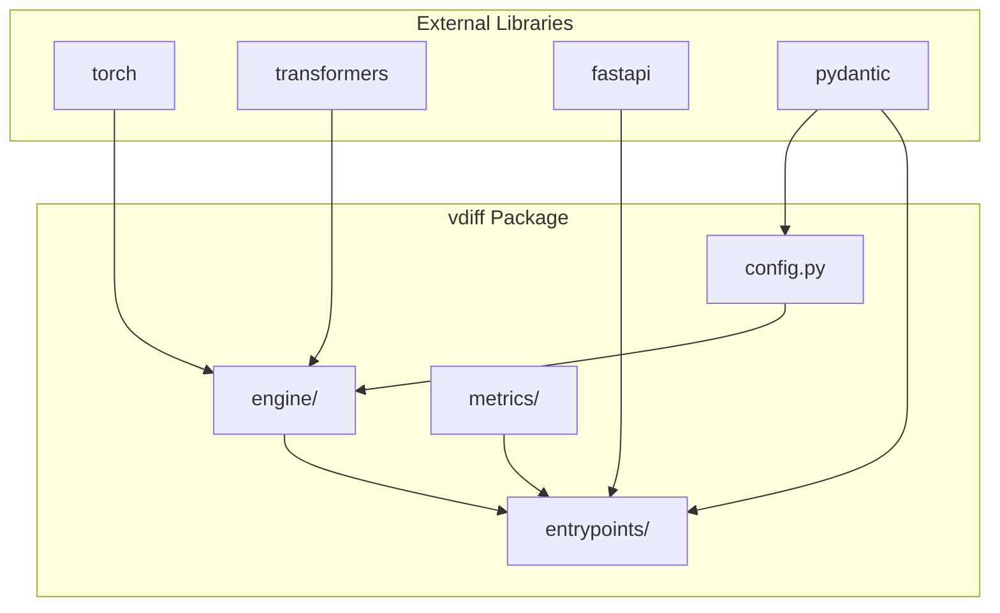

## Summary

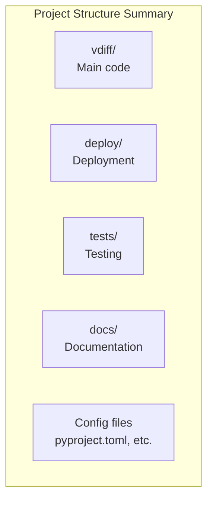

| Directory | Contains |
|-----------|----------|
| `vdiff/` | All Python source code |
| `deploy/` | Docker, Kubernetes files |
| `tests/` | Unit and integration tests |
| `docs/` | Documentation |
| `benchmarks/` | Performance tests |
| Root files | Configuration and metadata |

## Next Steps

👉 [04-engine.md](04-engine.md) - Deep dive into the engine

