# DFastLLMEngine Deep Dive

This document explains the `DFastLLMEngine` class - the heart of dfastllm.

## What is the Engine?

The **Engine** is the central component that:
1. Loads AI models
2. Manages requests
3. Generates text
4. Handles errors

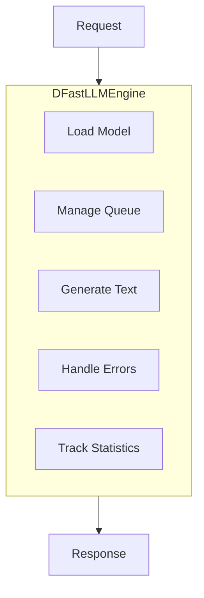

## Engine Class Overview

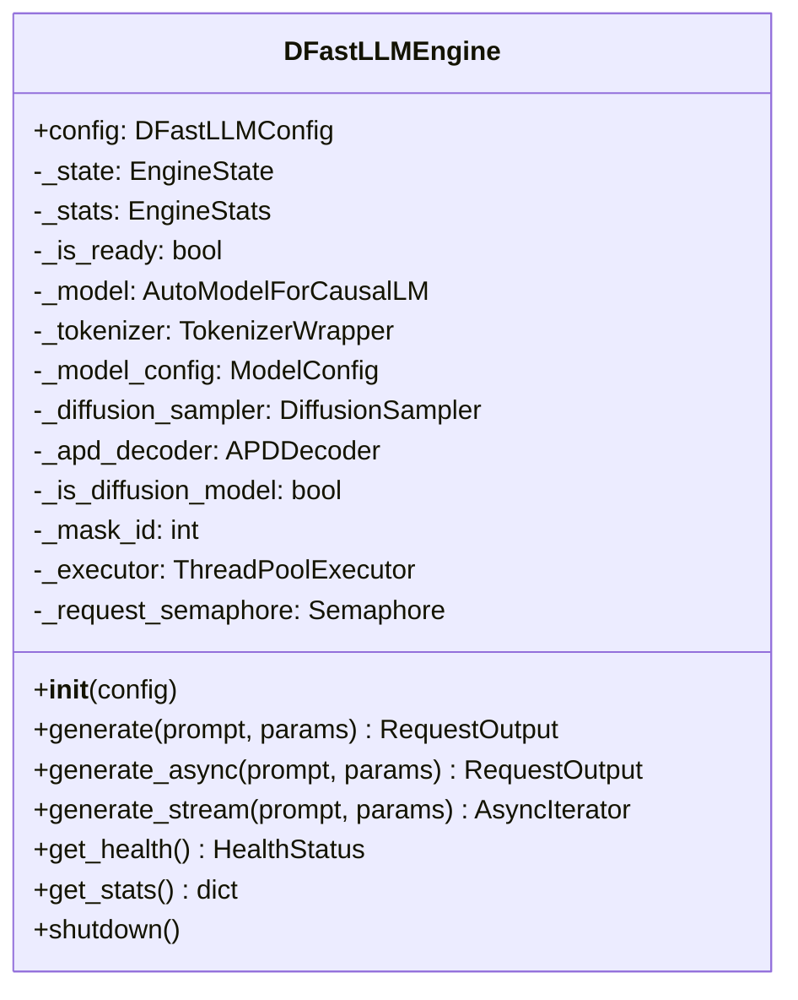

## Engine States

The engine goes through different **states** during its lifecycle:

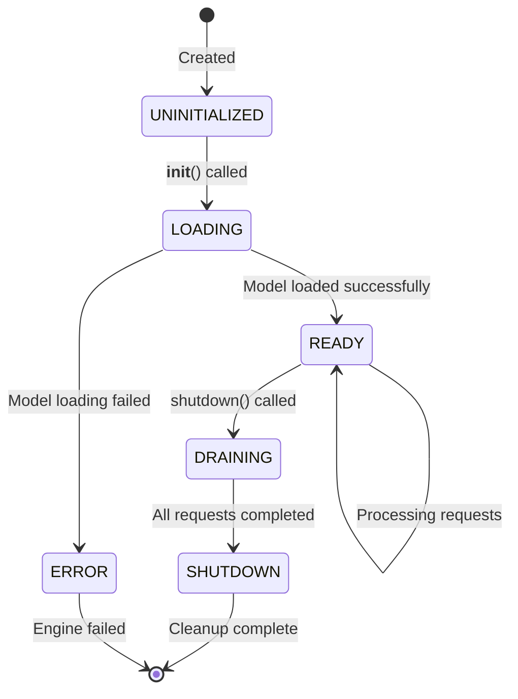

### State Meanings

| State | Meaning |
|-------|---------|
| `UNINITIALIZED` | Engine created but not started |
| `LOADING` | Loading model and tokenizer |
| `READY` | Ready to accept requests |
| `DRAINING` | Finishing pending requests before shutdown |
| `SHUTDOWN` | Engine has stopped |
| `ERROR` | Something went wrong |

## Initialization Flow

When you create an engine, here's what happens:

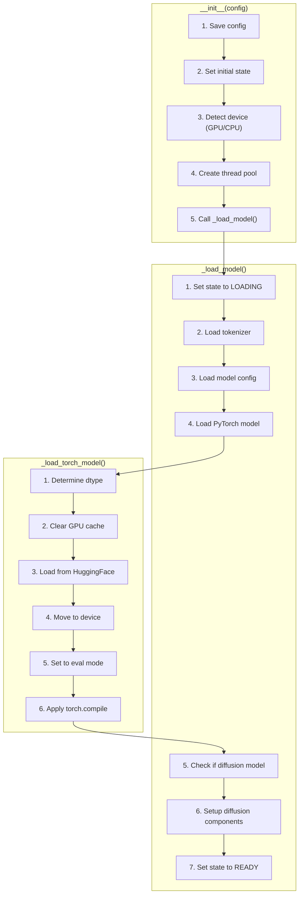

### Code Walkthrough: __init__

```python
def __init__(
    self,
    config: DFastLLMConfig,                    # Configuration object
    max_queue_size: Optional[int] = None,   # Max pending requests
    max_concurrent: Optional[int] = None,   # Max parallel generations
    default_timeout: Optional[float] = None, # Request timeout
):
    # 1. Save configuration
    self.config = config
    self._max_queue_size = max_queue_size or 256
    self._max_concurrent = max_concurrent or 4
    
    # 2. Set initial state
    self._state = EngineState.UNINITIALIZED
    
    # 3. Initialize components (empty for now)
    self._model = None
    self._tokenizer = None
    
    # 4. Detect device
    self._device = self._get_device()  # "cuda", "mps", or "cpu"
    
    # 5. Create thread pool for async
    self._executor = ThreadPoolExecutor(max_workers=self._max_concurrent)
    
    # 6. Load the model
    self._load_model()
```

## Device Detection

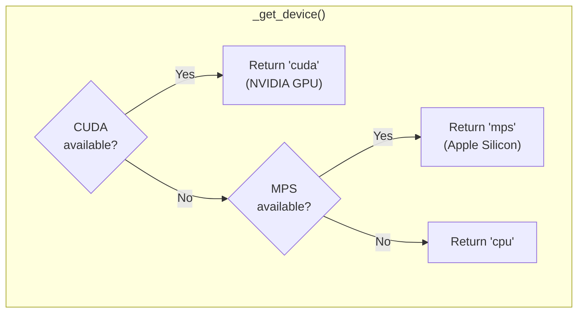

### Code

```python
def _get_device(self) -> str:
    if torch.cuda.is_available():
        return "cuda"
    elif hasattr(torch.backends, "mps") and torch.backends.mps.is_available():
        return "mps"
    return "cpu"
```

## Model Loading

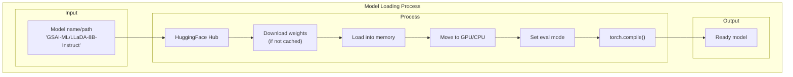

### Code Walkthrough: _load_torch_model

```python
def _load_torch_model(self) -> None:
    from transformers import AutoModelForCausalLM
    
    # 1. Determine data type
    if self.config.dtype == "auto":
        dtype = torch.float16 if self._device == "cuda" else torch.float32
    elif self.config.dtype == "float16":
        dtype = torch.float16
    # ...
    
    # 2. Clear GPU memory
    if torch.cuda.is_available():
        torch.cuda.empty_cache()
    
    # 3. Load model from HuggingFace
    self._model = AutoModelForCausalLM.from_pretrained(
        self.config.model,                    # Model name
        torch_dtype=dtype,                    # Data type
        device_map="auto" if cuda else None,  # Auto GPU placement
        trust_remote_code=True,               # Allow custom code
    )
    
    # 4. Move to device if needed
    if self._device != "cuda":
        self._model = self._model.to(self._device)
    
    # 5. Set to evaluation mode (no training)
    self._model.eval()
    
    # 6. Apply torch.compile for speed
    if self.config.compile_model and self._device == "cuda":
        self._model = torch.compile(self._model, mode="reduce-overhead")
```

## Generation Flow

This is the main function that generates text:

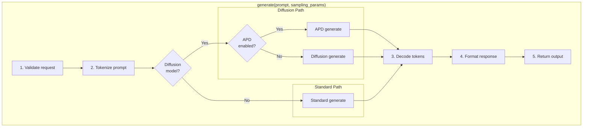

### Code Walkthrough: generate

```python
def generate(
    self,
    prompt: str,                      # Input text
    sampling_params: SamplingParams,  # Generation parameters
    request_id: Optional[str] = None, # Unique ID
    timeout: Optional[float] = None,  # Timeout in seconds
) -> RequestOutput:
    
    # 1. Check engine is ready
    if self._state != EngineState.READY:
        raise EngineError("Engine not ready")
    
    # 2. Validate input
    self._validate_request(prompt, sampling_params)
    
    # 3. Generate request ID if not provided
    request_id = request_id or str(uuid.uuid4())
    
    # 4. Track metrics
    metrics = RequestMetrics(arrival_time=time.time())
    
    # 5. Tokenize the prompt
    input_ids = self._tokenizer.encode(prompt, return_tensors="pt")
    input_ids = input_ids.to(self._device)
    
    # 6. Generate based on model type
    if self._is_diffusion_model:
        if self.config.enable_apd and self._apd_decoder:
            output_ids = self._apd_generate(input_ids, sampling_params)
        else:
            output_ids = self._diffusion_generate(input_ids, sampling_params)
    else:
        output_ids = self._standard_generate(input_ids, sampling_params)
    
    # 7. Decode output tokens to text
    generated_text = self._tokenizer.decode(output_ids)
    
    # 8. Remove prompt from output
    if generated_text.startswith(prompt):
        generated_text = generated_text[len(prompt):].strip()
    
    # 9. Build response
    output = RequestOutput(
        request_id=request_id,
        prompt=prompt,
        outputs=[CompletionOutput(text=generated_text, ...)],
        finished=True,
        metrics=metrics,
    )
    
    return output
```

## Async Generation

For handling multiple requests concurrently:

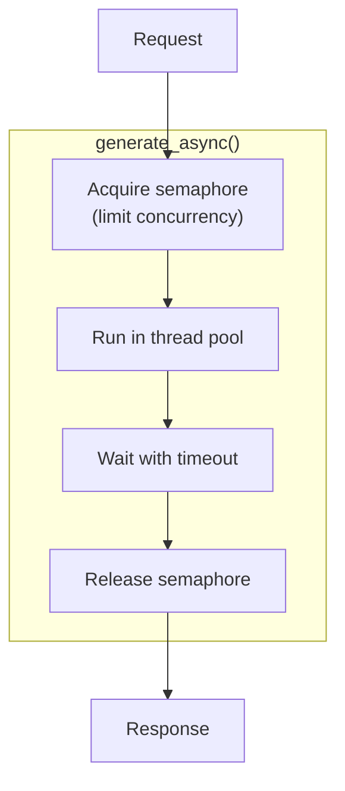

### Code

```python
async def generate_async(
    self,
    prompt: str,
    sampling_params: SamplingParams,
    request_id: Optional[str] = None,
    timeout: Optional[float] = None,
) -> RequestOutput:
    
    # Limit concurrent requests
    async with self._request_semaphore:
        # Run sync generate() in thread pool
        loop = asyncio.get_event_loop()
        result = await asyncio.wait_for(
            loop.run_in_executor(
                self._executor,          # Thread pool
                self.generate,           # Function to run
                prompt,                  # Arguments...
                sampling_params,
                request_id,
                timeout,
            ),
            timeout=timeout,
        )
        return result
```

## Health Status

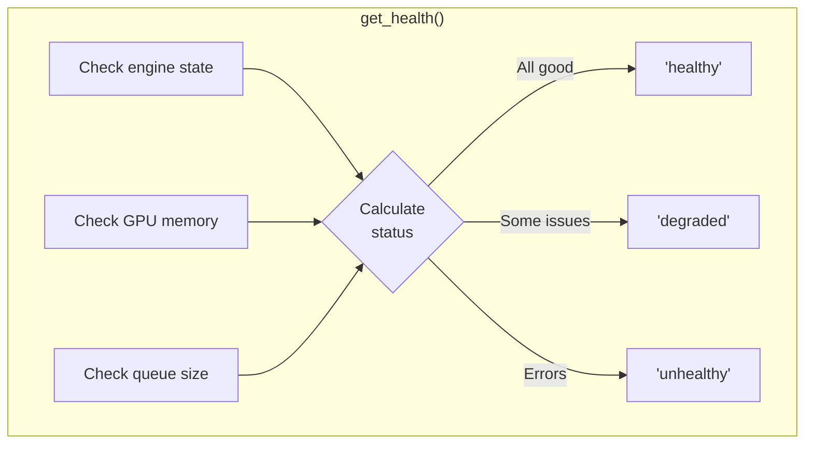

### HealthStatus Object

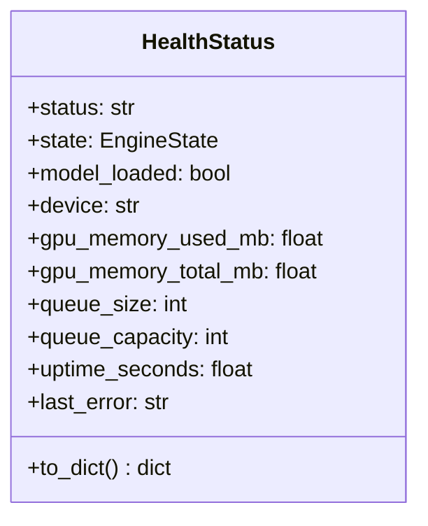

## Statistics

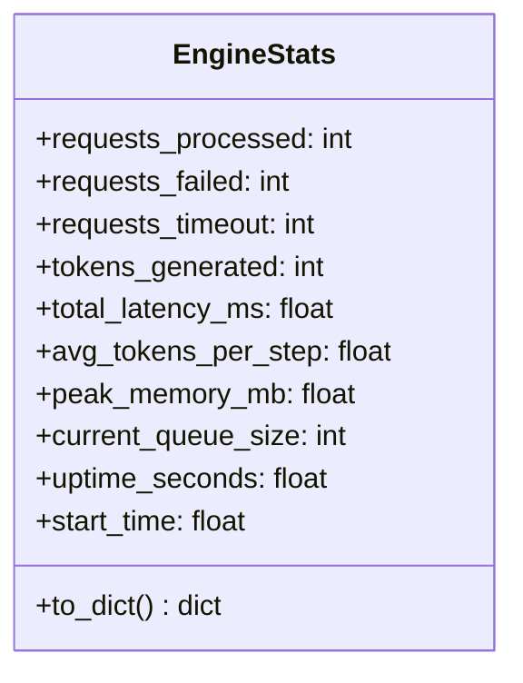

## Shutdown Flow

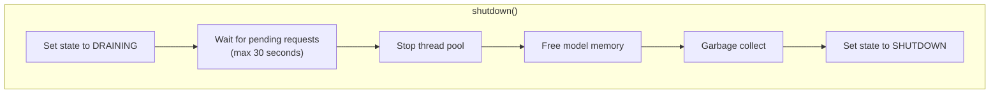

### Code

```python
async def shutdown(self, timeout: float = 30) -> None:
    # 1. Start draining
    self._set_state(EngineState.DRAINING)
    
    # 2. Wait for pending requests
    drain_start = time.time()
    while self._stats.current_queue_size > 0:
        if time.time() - drain_start > timeout:
            logger.warning("Shutdown timeout, forcing...")
            break
        await asyncio.sleep(0.1)
    
    # 3. Set final state
    self._set_state(EngineState.SHUTDOWN)
    
    # 4. Stop thread pool
    self._executor.shutdown(wait=False)
    
    # 5. Free model memory
    if self._model is not None:
        del self._model
        self._model = None
        
        if torch.cuda.is_available():
            torch.cuda.empty_cache()
    
    # 6. Force garbage collection
    gc.collect()
```

## Error Handling

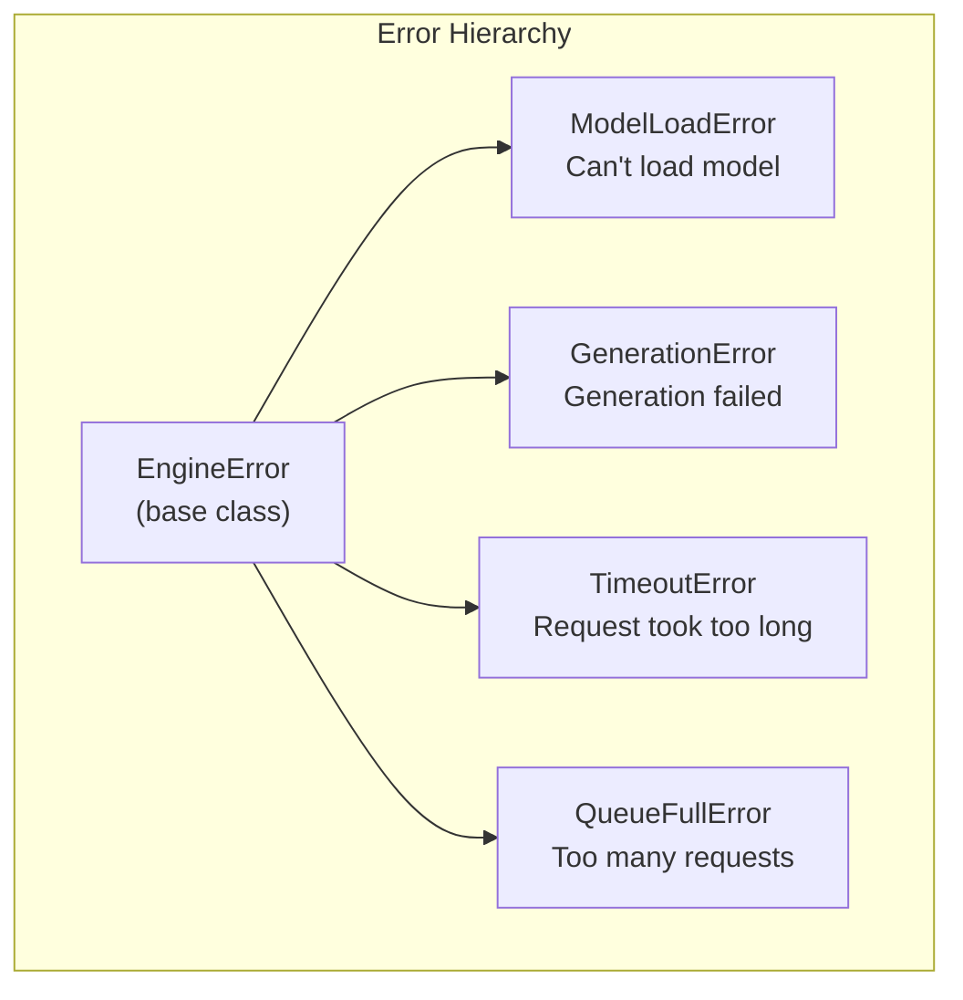

### Error Handling in generate()

```python
try:
    # ... generation code ...
except TimeoutError:
    self._stats.requests_timeout += 1
    raise
except Exception as e:
    self._stats.requests_failed += 1
    self._last_error = str(e)
    raise GenerationError(f"Generation failed: {e}")
finally:
    # Always update queue size
    self._stats.current_queue_size -= 1
```

## Memory Management

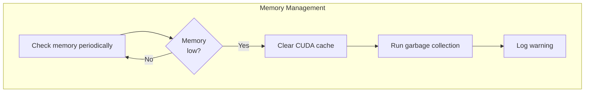

## Complete Request Lifecycle

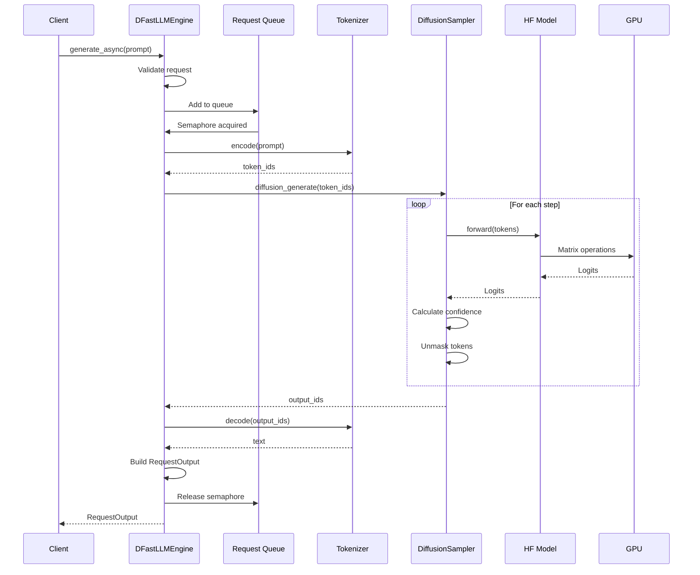

## Summary

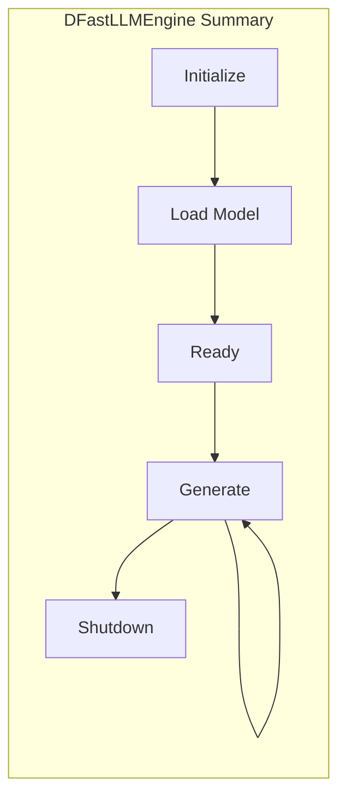

| Component | Purpose |
|-----------|---------|
| State Management | Track engine lifecycle |
| Model Loading | Load HuggingFace models |
| Request Queue | Handle concurrent requests |
| Generation | Produce text output |
| Health/Stats | Monitor engine status |
| Shutdown | Graceful cleanup |

## Next Steps

👉 [05-diffusion.md](05-diffusion.md) - How diffusion generation works

