# Diffusion Generation Algorithm

This document explains how diffusion language models generate text, step by step.

## The Big Idea

Traditional AI writes **one word at a time**:

```
"The" → "The cat" → "The cat sat" → "The cat sat on" → ...
```

Diffusion AI starts with **blanks** and fills them in:

```
"[?] [?] [?] [?]" → "The [?] sat [?]" → "The cat sat on"
```

## Visual Comparison


## The Algorithm

### Step-by-Step Overview


## Detailed Walkthrough

Let's generate "How are you doing" from prompt "Hello":

### Step 1: Initialize


**What happens:**
- Prompt is tokenized: `"Hello"` → `[15496]`
- Add MASK tokens: `[15496, 126336, 126336, 126336, 126336]`
- `126336` is the special MASK token ID

### Step 2: Forward Pass


**What the model outputs:**

For each position, the model predicts probabilities:

```
Position 1 (MASK): "How"=0.3, "What"=0.2, "Are"=0.1, ...
Position 2 (MASK): "are"=0.4, "is"=0.2, "do"=0.1, ...
Position 3 (MASK): "you"=0.5, "they"=0.2, "we"=0.1, ...
Position 4 (MASK): "doing"=0.3, "today"=0.2, "?"=0.15, ...
```

### Step 3: Calculate Confidence

```mermaid
flowchart LR
    subgraph Logits["Model Output (Logits)"]
        L1["Pos 1: [0.3, 0.2, 0.1, ...]"]
        L2["Pos 2: [0.4, 0.2, 0.1, ...]"]
        L3["Pos 3: [0.5, 0.2, 0.1, ...]"]
        L4["Pos 4: [0.3, 0.2, 0.15, ...]"]
    end
    
    subgraph Confidence["Confidence Scores"]
        C1["Pos 1: 0.30"]
        C2["Pos 2: 0.40"]
        C3["Pos 3: 0.50 ← Highest"]
        C4["Pos 4: 0.30"]
    end
    
    L1 --> C1
    L2 --> C2
    L3 --> C3
    L4 --> C4
```



**Confidence = maximum probability at each position**

### Step 4: Select and Unmask


### Step 5: Repeat


## The Code

### Main Function: diffusion_generate

```python
def diffusion_generate(
    model,           # The AI model
    prompt,          # Input token IDs [1, prompt_len]
    steps,           # Number of diffusion steps
    gen_length,      # How many tokens to generate
    block_length,    # Block size for semi-AR
    temperature,     # Randomness (0 = deterministic)
    mask_id,         # The MASK token ID
):
    # 1. Setup
    device = prompt.device
    batch_size = 1
    prompt_len = prompt.shape[1]
    total_len = prompt_len + gen_length
    
    # 2. Create initial sequence with MASKs
    x = torch.full((batch_size, total_len), mask_id, device=device)
    x[:, :prompt_len] = prompt  # Keep prompt unchanged
    
    # 3. Calculate how many tokens to unmask per step
    tokens_per_step = gen_length // steps
    
    # 4. Main diffusion loop
    for step in range(steps):
        # a. Forward pass
        with torch.no_grad():
            logits = model(x).logits  # [batch, seq_len, vocab_size]
        
        # b. Only look at MASK positions
        mask_positions = (x == mask_id)
        
        # c. Calculate confidence (max probability)
        probs = F.softmax(logits, dim=-1)
        confidence = probs.max(dim=-1).values  # [batch, seq_len]
        
        # d. Sample tokens using Gumbel trick
        gumbel = -torch.log(-torch.log(torch.rand_like(probs) + 1e-10) + 1e-10)
        sampled = (probs.log() + gumbel).argmax(dim=-1)
        
        # e. Select top-k confident MASK positions
        confidence[~mask_positions] = -float('inf')  # Ignore non-MASK
        num_to_unmask = min(tokens_per_step, mask_positions.sum().item())
        
        # Get indices of top-k confident positions
        _, top_indices = confidence.topk(num_to_unmask)
        
        # f. Unmask selected positions
        for idx in top_indices:
            x[0, idx] = sampled[0, idx]
    
    return x
```

### Key Components Explained

#### 1. Gumbel Sampling


**Why Gumbel sampling?**
- Adds controlled randomness
- Higher probability = more likely to be selected
- But low probability tokens can still win sometimes

```python
# Gumbel noise formula
gumbel = -torch.log(-torch.log(torch.rand(...) + 1e-10) + 1e-10)

# Add to log probabilities and take argmax
sampled = (probs.log() + gumbel).argmax(dim=-1)
```

#### 2. Confidence Calculation


```python
# Convert logits to probabilities
probs = F.softmax(logits, dim=-1)

# Confidence = highest probability
confidence = probs.max(dim=-1).values
```

#### 3. Remasking Strategy


**"low_confidence" strategy:**
- At each step, unmask the most confident predictions
- Leave uncertain positions for later refinement

## Block-wise Generation

For efficiency, dfastllm generates in blocks:


**Why blocks?**
- Attention complexity is O(n²)
- Smaller blocks = faster attention
- Each block can reference previous blocks

## Temperature Effect


| Temperature | Effect |
|-------------|--------|
| 0.0 | Deterministic, always picks highest probability |
| 0.5 | Low randomness |
| 1.0 | Normal sampling |
| 2.0 | High randomness, more creative |

## Example Trace

Let's trace through generating 4 tokens with 4 steps:

```mermaid
flowchart TB
    subgraph Trace["Complete Trace"]
        subgraph S0["Initial State"]
            I0["Prompt: 'Once'"]
            I1["Sequence: 'Once [M] [M] [M] [M]'"]
        end
        
        subgraph S1["Step 1"]
            S1A["Forward pass → logits"]
            S1B["Confidence: [0.3, 0.5, 0.2, 0.4]"]
            S1C["Best: position 2 (0.5)"]
            S1D["Sequence: 'Once [M] upon [M] [M]'"]
        end
        
        subgraph S2["Step 2"]
            S2A["Forward pass → logits"]
            S2B["Confidence: [0.4, -, 0.3, 0.6]"]
            S2C["Best: position 4 (0.6)"]
            S2D["Sequence: 'Once [M] upon a [M]'"]
        end
        
        subgraph S3["Step 3"]
            S3A["Forward pass → logits"]
            S3B["Confidence: [0.7, -, -, 0.4]"]
            S3C["Best: position 1 (0.7)"]
            S3D["Sequence: 'Once a upon a [M]'"]
        end
        
        subgraph S4["Step 4"]
            S4A["Forward pass → logits"]
            S4B["Confidence: [-, -, -, 0.8]"]
            S4C["Last mask"]
            S4D["Sequence: 'Once a upon a time'"]
        end
    end
    
    S0 --> S1 --> S2 --> S3 --> S4
```



## DiffusionSampler Class


## Early Stopping

dfastllm can stop early if all tokens are unmasked:


```python
# Early stopping check
if not (x == mask_id).any():
    break  # All tokens unmasked, done!
```

## Performance Optimizations


## Summary


| Step | Action |
|------|--------|
| 1 | Create sequence: prompt + MASK tokens |
| 2 | Run model to get predictions |
| 3 | Calculate confidence for each MASK |
| 4 | Unmask highest confidence positions |
| 5 | Repeat until all unmasked |

## Next Steps

👉 [06-apd.md](06-apd.md) - APD optimization for faster generation

