# APD: Adaptive Parallel Decoding

This document explains APD - an optimization that makes diffusion generation **2-4x faster**.

## What is APD?

**APD** = Adaptive Parallel Decoding

Standard diffusion unmasks a fixed number of tokens per step. APD is smarter:
- Unmask **more tokens** when confident
- Unmask **fewer tokens** when uncertain

```mermaid
flowchart LR
    subgraph Standard["Standard Diffusion"]
        S1["Always unmask K tokens per step"]
        S2["K is fixed (e.g., 1 or 2)"]
    end
    
    subgraph APD["APD"]
        A1["Unmask N tokens where N varies"]
        A2["High confidence → more tokens"]
        A3["Low confidence → fewer tokens"]
    end
    
    Standard --> SLOW["Slower"]
    APD --> FAST["2-4x Faster"]
```



## Visual Comparison

### Standard Diffusion (4 steps for 4 tokens)


### APD (2 steps for 4 tokens)


**Result: Same output, half the steps!**

## How APD Works


## The Confidence Threshold

APD uses a **threshold** to decide which tokens to accept:

```mermaid
flowchart TB
    subgraph Threshold["Threshold Decision"]
        CONF["Token confidence: 0.75"]
        THRESH["Threshold: 0.50"]
        
        COMPARE{"confidence ><br/>threshold?"}
        
        ACCEPT["✓ Accept and unmask"]
        REJECT["✗ Keep masked for later"]
    end
    
    CONF --> COMPARE
    THRESH --> COMPARE
    COMPARE -->|"0.75 > 0.50"| ACCEPT
    COMPARE -->|"No"| REJECT
```



### Adaptive Threshold

The threshold adapts based on results:


## APD Code Walkthrough

### APDDecoder Class


### Main Generate Function

```python
def generate(
    self,
    model,          # The AI model
    prompt,         # Input tokens
    gen_length,     # How many tokens to generate
    steps,          # Max number of steps
    mask_id,        # MASK token ID
    temperature,    # Sampling temperature
) -> torch.Tensor:
    
    # 1. Initialize
    x = self._initialize_sequence(prompt, gen_length, mask_id)
    threshold = self.config.acceptance_threshold
    
    # 2. Main loop
    for step in range(steps):
        # a. Get mask positions
        mask_positions = (x == mask_id)
        if not mask_positions.any():
            break  # Early stop: all done!
        
        # b. Forward pass
        logits = model(x).logits
        
        # c. Calculate confidence
        confidence = self._compute_confidence(logits)
        
        # d. Select tokens above threshold
        selected = self._select_parallel_tokens(
            confidence,
            threshold,
            self.config.max_parallel_tokens,
            mask_positions,
        )
        
        # e. Sample and unmask
        sampled = self._sample_tokens(logits, temperature)
        x[selected] = sampled[selected]
        
        # f. Update threshold adaptively
        accepted_ratio = selected.sum() / mask_positions.sum()
        threshold = self._update_threshold(accepted_ratio, threshold)
        
        # g. Track stats
        self._stats.update(selected.sum().item())
    
    return x
```

## Parallel Token Selection


### Code

```python
def _select_parallel_tokens(
    self,
    confidence: torch.Tensor,     # [seq_len]
    threshold: float,             # e.g., 0.5
    max_parallel: int,            # e.g., 8
    mask_positions: torch.Tensor, # Boolean mask
) -> torch.Tensor:
    
    # Only consider MASK positions
    masked_conf = confidence.clone()
    masked_conf[~mask_positions] = -float('inf')
    
    # Filter by threshold
    above_threshold = masked_conf >= threshold
    
    # Limit to max_parallel
    if above_threshold.sum() > max_parallel:
        # Take top-k by confidence
        _, indices = masked_conf.topk(max_parallel)
        selected = torch.zeros_like(mask_positions)
        selected[indices] = True
    else:
        selected = above_threshold
    
    return selected
```

## Threshold Adaptation


### Code

```python
def _update_threshold(
    self,
    accepted_ratio: float,
    current_threshold: float,
) -> float:
    target_ratio = 0.5  # Aim for 50% acceptance
    
    if accepted_ratio > target_ratio + 0.2:
        # Too many accepted, be stricter
        new_threshold = current_threshold + self.config.adaptation_rate
    elif accepted_ratio < target_ratio - 0.2:
        # Too few accepted, be lenient
        new_threshold = current_threshold - self.config.adaptation_rate
    else:
        new_threshold = current_threshold
    
    # Clamp to valid range
    return max(
        self.config.min_threshold,
        min(self.config.max_threshold, new_threshold)
    )
```

## APD Configuration


### CLI Usage

```bash
# Enable APD (default)
vdiff --model llada --enable-apd

# Disable APD
vdiff --model llada --disable-apd

# Custom APD settings
vdiff --model llada \
    --apd-max-parallel 16 \
    --apd-threshold 0.2
```

## Performance Comparison


### Actual Numbers

| Metric | Standard | APD | Improvement |
|--------|----------|-----|-------------|
| Steps for 64 tokens | 64 | ~20 | 3.2x fewer |
| Time per generation | 1000ms | ~300ms | 3.3x faster |
| Tokens per step | 1 | ~3.2 | 3.2x more |

## APD Statistics

Track performance with stats:


### Get Stats

```python
# In VDiffEngine
stats = engine.get_stats()

# APD-specific stats
apd_stats = stats.get("apd", {})
print(f"Avg tokens/step: {apd_stats['avg_tokens_per_step']}")
```

## When APD Helps Most


## Complete APD Flow


## Summary


| Concept | Description |
|---------|-------------|
| **Idea** | Unmask multiple tokens when confident |
| **Threshold** | Minimum confidence to accept |
| **Adaptive** | Threshold adjusts automatically |
| **Max Parallel** | Limit on simultaneous unmasks |
| **Result** | 2-4x faster generation |

## Next Steps

👉 [07-api-server.md](07-api-server.md) - How the API server works

