# API Server Deep Dive

This document explains how the FastAPI server works.

## What is the API Server?

The **API Server** is the part of vdiff that:
1. Listens for HTTP requests
2. Processes them
3. Returns responses


## Server Architecture


## Request Flow


## Middleware Explained

### 1. Request ID Middleware

Adds a unique ID to every request for tracking.


```python
class RequestIDMiddleware:
    async def dispatch(self, request, call_next):
        # Get or create request ID
        request_id = request.headers.get("X-Request-ID") or str(uuid.uuid4())
        
        # Store in request state
        request.state.request_id = request_id
        
        # Call next middleware
        response = await call_next(request)
        
        # Add to response headers
        response.headers["X-Request-ID"] = request_id
        
        return response
```

### 2. Logging Middleware

Logs every request and response.


```python
class LoggingMiddleware:
    async def dispatch(self, request, call_next):
        start_time = time.time()
        
        # Log request
        logger.info(f"Request: {request.method} {request.url.path}")
        
        # Process request
        response = await call_next(request)
        
        # Log response
        duration = (time.time() - start_time) * 1000
        logger.info(f"Response: {response.status_code} in {duration:.2f}ms")
        
        return response
```

### 3. Security Headers Middleware

Adds security headers to prevent attacks.


### 4. CORS Middleware

Controls which websites can call the API.


## Rate Limiting

Prevents too many requests from one client.


```python
class RateLimiter:
    def __init__(self, max_requests=100, window_seconds=60):
        self.max_requests = max_requests
        self.window_seconds = window_seconds
        self._requests = {}  # client_id -> [timestamps]
    
    async def is_allowed(self, client_id: str) -> bool:
        now = time.time()
        cutoff = now - self.window_seconds
        
        # Remove old requests
        requests = [t for t in self._requests.get(client_id, []) if t > cutoff]
        
        # Check limit
        if len(requests) >= self.max_requests:
            return False
        
        # Add current request
        requests.append(now)
        self._requests[client_id] = requests
        return True
```

## API Endpoints

### All Endpoints


### /health Endpoint


### /v1/completions Endpoint


### /v1/chat/completions Endpoint


## Streaming

For long generations, stream responses:


## Server State


## Error Handling

```mermaid
flowchart TB
    subgraph Errors["Error Handling"]
        subgraph ErrorTypes["Error Types"]
            E1["EngineError → 500"]
            E2["GenerationError → 500"]
            E3["TimeoutError → 504"]
            E4["QueueFullError → 503"]
            E5["ValidationError → 400"]
            E6["RateLimitError → 429"]
            E7["AuthError → 401/403"]
        end
        
        subgraph Response["Error Response"]
            ER["error: {<br/>  message: '...',<br/>  type: '...',<br/>  code: 500,<br/>  request_id: '...'<br/>}"]
        end
    end
    
    ErrorTypes --> Response
```



## Startup and Shutdown


## Configuration

### CLI Arguments


### Environment Variables


## Serving Components

### OpenAIServingCompletion


### OpenAIServingChat


## Message Formatting

Chat messages are formatted into a prompt:

```mermaid
flowchart TB
    subgraph Input["Input Messages"]
        M1["system: 'You are helpful'"]
        M2["user: 'Hello!'"]
        M3["assistant: 'Hi there!'"]
        M4["user: 'How are you?'"]
    end
    
    subgraph Formatted["Formatted Prompt"]
        F["System: You are helpful<br/><br/>User: Hello!<br/><br/>Assistant: Hi there!<br/><br/>User: How are you?<br/><br/>Assistant:"]
    end
    
    Input --> Formatted
```

## Summary

```mermaid
flowchart LR
    subgraph Summary["API Server Summary"]
        A["FastAPI app"]
        B["Middleware stack"]
        C["Route handlers"]
        D["Engine calls"]
        E["JSON responses"]
    end
    
    A --> B --> C --> D --> E
```

| Component | Purpose |
|-----------|---------|
| FastAPI | Web framework |
| Middleware | Request processing |
| Routes | Endpoint handlers |
| Serving | OpenAI formatting |
| State | Global engine reference |

## Next Steps

👉 [08-config.md](08-config.md) - Configuration options explained

