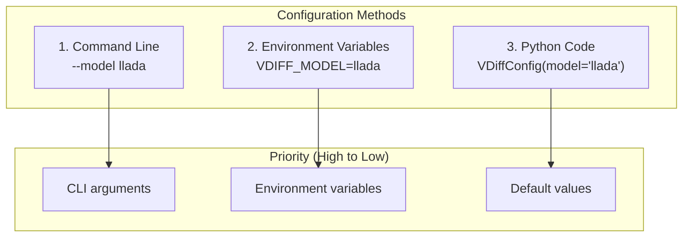
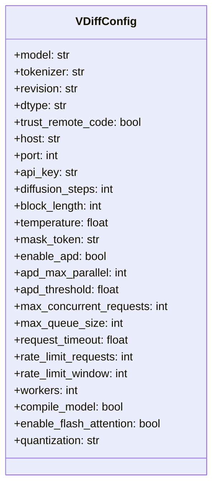
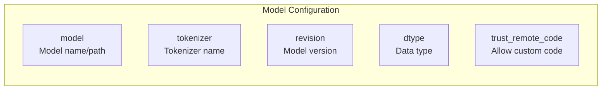
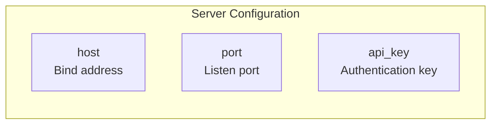
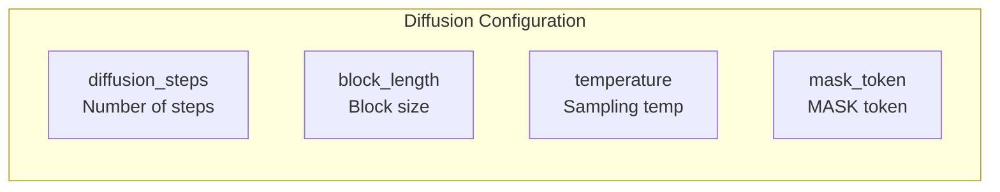
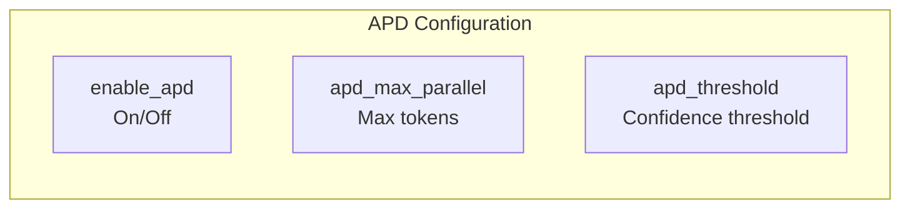
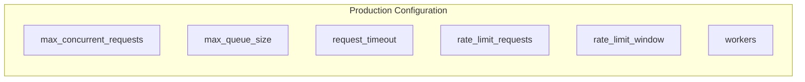
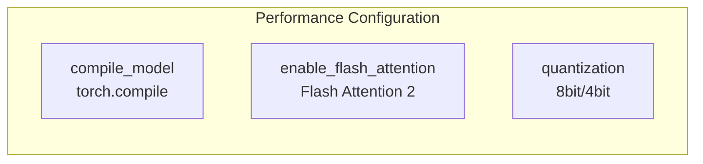
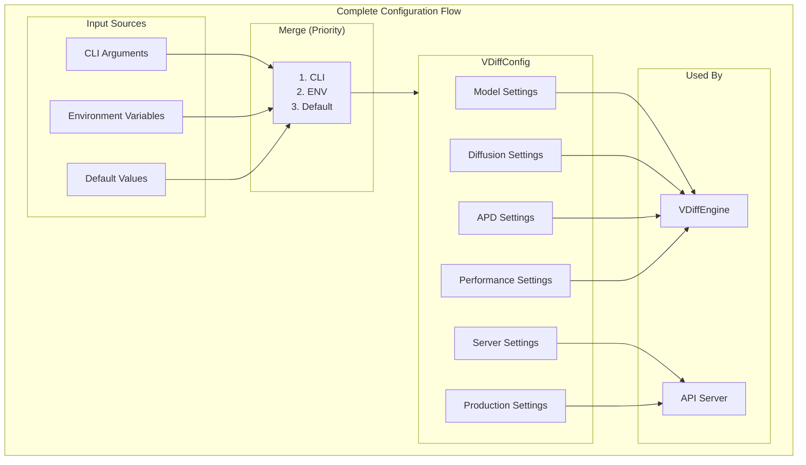
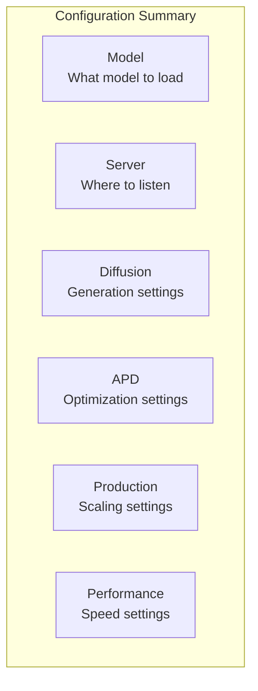

# Configuration Guide

This document explains every configuration option in vdiff.

## Configuration Overview

vdiff can be configured in **3 ways**:



## VDiffConfig Class

The main configuration class:



## Configuration Categories

### 1. Model Settings



| Option | CLI | Env Var | Default | Description |
|--------|-----|---------|---------|-------------|
| model | `--model` | `VDIFF_MODEL` | (required) | Model name from HuggingFace or local path |
| tokenizer | `--tokenizer` | `VDIFF_TOKENIZER` | (same as model) | Tokenizer to use |
| revision | `--revision` | `VDIFF_REVISION` | `"main"` | Git branch/tag/commit |
| dtype | `--dtype` | `VDIFF_DTYPE` | `"auto"` | `float16`, `float32`, `bfloat16`, `auto` |
| trust_remote_code | `--trust-remote-code` | `VDIFF_TRUST_REMOTE_CODE` | `false` | Allow model's custom code |

**Examples:**

```bash
# HuggingFace model
vdiff --model GSAI-ML/LLaDA-8B-Instruct --trust-remote-code

# Local model
vdiff --model /path/to/model

# Specific revision
vdiff --model meta-llama/Llama-2-7b-hf --revision v1.0
```

### 2. Server Settings



| Option | CLI | Env Var | Default | Description |
|--------|-----|---------|---------|-------------|
| host | `--host` | `VDIFF_HOST` | `"0.0.0.0"` | IP to bind to |
| port | `--port` | `VDIFF_PORT` | `8000` | Port number |
| api_key | `--api-key` | `VDIFF_API_KEY` | (none) | API key for auth |

**Examples:**

```bash
# Local development
vdiff --model llada --host 127.0.0.1 --port 3000

# Production with API key
vdiff --model llada --api-key "sk-your-secret-key"

# Using environment variable
export VDIFF_API_KEY="sk-secret"
vdiff --model llada
```

### 3. Diffusion Settings



| Option | CLI | Env Var | Default | Description |
|--------|-----|---------|---------|-------------|
| diffusion_steps | `--diffusion-steps` | `VDIFF_DIFFUSION_STEPS` | `64` | Number of diffusion iterations |
| block_length | `--block-length` | `VDIFF_BLOCK_LENGTH` | `32` | Block size for generation |
| temperature | `--temperature` | `VDIFF_TEMPERATURE` | `1.0` | Sampling temperature |
| mask_token | `--mask-token` | `VDIFF_MASK_TOKEN` | `"[MASK]"` | Token for masking |

**Examples:**

```bash
# Faster generation (fewer steps)
vdiff --model llada --diffusion-steps 32

# More deterministic output
vdiff --model llada --temperature 0.5

# More creative output
vdiff --model llada --temperature 1.5
```

### 4. APD Settings



| Option | CLI | Env Var | Default | Description |
|--------|-----|---------|---------|-------------|
| enable_apd | `--enable-apd`/`--disable-apd` | `VDIFF_ENABLE_APD` | `true` | Enable APD optimization |
| apd_max_parallel | `--apd-max-parallel` | `VDIFF_APD_MAX_PARALLEL` | `8` | Max tokens per step |
| apd_threshold | `--apd-threshold` | `VDIFF_APD_THRESHOLD` | `0.3` | Initial confidence threshold |

**Examples:**

```bash
# Enable APD (default)
vdiff --model llada --enable-apd

# Disable APD for debugging
vdiff --model llada --disable-apd

# Aggressive APD (more parallelism)
vdiff --model llada --apd-max-parallel 16 --apd-threshold 0.2

# Conservative APD (less parallelism, higher quality)
vdiff --model llada --apd-max-parallel 4 --apd-threshold 0.5
```

### 5. Production Settings



| Option | CLI | Env Var | Default | Description |
|--------|-----|---------|---------|-------------|
| max_concurrent_requests | `--max-concurrent-requests` | `VDIFF_MAX_CONCURRENT` | `4` | Max parallel requests |
| max_queue_size | `--max-queue-size` | `VDIFF_MAX_QUEUE_SIZE` | `256` | Max queued requests |
| request_timeout | `--request-timeout` | `VDIFF_REQUEST_TIMEOUT` | `60.0` | Request timeout (seconds) |
| rate_limit_requests | `--rate-limit-requests` | `VDIFF_RATE_LIMIT_REQUESTS` | `100` | Max requests per window |
| rate_limit_window | `--rate-limit-window` | `VDIFF_RATE_LIMIT_WINDOW` | `60` | Window size (seconds) |
| workers | `--workers` | `VDIFF_WORKERS` | `1` | Number of worker processes |

**Examples:**

```bash
# High-load production
vdiff --model llada \
    --max-concurrent-requests 8 \
    --max-queue-size 512 \
    --rate-limit-requests 1000 \
    --workers 4

# Development (lenient limits)
vdiff --model llada \
    --max-concurrent-requests 2 \
    --rate-limit-requests 0  # Disable rate limiting
```

### 6. Performance Settings



| Option | CLI | Env Var | Default | Description |
|--------|-----|---------|---------|-------------|
| compile_model | `--compile` | `VDIFF_COMPILE` | `false` | Enable torch.compile |
| enable_flash_attention | `--flash-attention` | `VDIFF_FLASH_ATTENTION` | `false` | Enable Flash Attention 2 |
| quantization | `--quantization` | `VDIFF_QUANTIZATION` | (none) | `8bit` or `4bit` |

**Examples:**

```bash
# Maximum performance (GPU)
vdiff --model llada \
    --compile \
    --flash-attention

# Low memory (8-bit quantization)
vdiff --model llada --quantization 8bit

# Minimal memory (4-bit quantization)
vdiff --model llada --quantization 4bit
```

## Configuration Diagram



## Python Usage

### Basic Configuration

```python
from vdiff import VDiffConfig

# Minimal config
config = VDiffConfig(model="GSAI-ML/LLaDA-8B-Instruct")

# With options
config = VDiffConfig(
    model="GSAI-ML/LLaDA-8B-Instruct",
    dtype="float16",
    trust_remote_code=True,
    diffusion_steps=32,
    enable_apd=True,
)
```

### Full Configuration

```python
config = VDiffConfig(
    # Model
    model="GSAI-ML/LLaDA-8B-Instruct",
    tokenizer=None,  # Use model's tokenizer
    revision="main",
    dtype="float16",
    trust_remote_code=True,
    
    # Server
    host="0.0.0.0",
    port=8000,
    api_key="sk-secret",
    
    # Diffusion
    diffusion_steps=64,
    block_length=32,
    temperature=1.0,
    mask_token="[MASK]",
    
    # APD
    enable_apd=True,
    apd_max_parallel=8,
    apd_threshold=0.3,
    
    # Production
    max_concurrent_requests=4,
    max_queue_size=256,
    request_timeout=60.0,
    rate_limit_requests=100,
    rate_limit_window=60,
    workers=1,
    
    # Performance
    compile_model=False,
    enable_flash_attention=False,
    quantization=None,
)
```

## Environment Variables Reference

```bash
# Model
export VDIFF_MODEL="GSAI-ML/LLaDA-8B-Instruct"
export VDIFF_TOKENIZER=""
export VDIFF_REVISION="main"
export VDIFF_DTYPE="float16"
export VDIFF_TRUST_REMOTE_CODE="true"

# Server
export VDIFF_HOST="0.0.0.0"
export VDIFF_PORT="8000"
export VDIFF_API_KEY="sk-secret"

# Diffusion
export VDIFF_DIFFUSION_STEPS="64"
export VDIFF_BLOCK_LENGTH="32"
export VDIFF_TEMPERATURE="1.0"
export VDIFF_MASK_TOKEN="[MASK]"

# APD
export VDIFF_ENABLE_APD="true"
export VDIFF_APD_MAX_PARALLEL="8"
export VDIFF_APD_THRESHOLD="0.3"

# Production
export VDIFF_MAX_CONCURRENT="4"
export VDIFF_MAX_QUEUE_SIZE="256"
export VDIFF_REQUEST_TIMEOUT="60.0"
export VDIFF_RATE_LIMIT_REQUESTS="100"
export VDIFF_RATE_LIMIT_WINDOW="60"
export VDIFF_WORKERS="1"

# Performance
export VDIFF_COMPILE="false"
export VDIFF_FLASH_ATTENTION="false"
export VDIFF_QUANTIZATION=""
```

## Common Configurations

### Development

```bash
vdiff \
    --model gpt2 \
    --host 127.0.0.1 \
    --port 8000 \
    --diffusion-steps 8 \
    --disable-apd
```

### Production (Small Model)

```bash
vdiff \
    --model GSAI-ML/LLaDA-8B-Instruct \
    --trust-remote-code \
    --dtype float16 \
    --enable-apd \
    --max-concurrent-requests 8 \
    --rate-limit-requests 1000 \
    --api-key "$VDIFF_API_KEY"
```

### Production (Large Model)

```bash
vdiff \
    --model GSAI-ML/LLaDA-70B-Instruct \
    --trust-remote-code \
    --quantization 8bit \
    --flash-attention \
    --compile \
    --enable-apd \
    --apd-max-parallel 4 \
    --max-concurrent-requests 2 \
    --api-key "$VDIFF_API_KEY"
```

### Memory Constrained

```bash
vdiff \
    --model llada \
    --quantization 4bit \
    --max-concurrent-requests 1 \
    --diffusion-steps 32
```

## Summary



## Next Steps

👉 [09-deployment.md](09-deployment.md) - How to deploy vdiff

