# Deployment Guide

This document explains how to deploy dfastllm in different environments.

## Deployment Options


## 1. Local Development

The simplest way to run dfastllm.

### Installation

```bash
# Clone repository
git clone https://github.com/your-org/dfastllm.git
cd dfastllm

# Create virtual environment
python -m venv .venv
source .venv/bin/activate  # Linux/Mac
# or: .venv\Scripts\activate  # Windows

# Install dependencies
pip install -r requirements.txt
pip install -e .
```

### Running


```bash
# Run server
dfastllm --model gpt2 --port 8000

# Or with more options
dfastllm \
    --model GSAI-ML/LLaDA-8B-Instruct \
    --trust-remote-code \
    --port 8000 \
    --diffusion-steps 32
```

### Testing

```bash
# Health check
curl http://localhost:8000/health

# Generate text
curl -X POST http://localhost:8000/v1/completions \
    -H "Content-Type: application/json" \
    -d '{"prompt": "Hello", "max_tokens": 50}'
```

## 2. Docker Deployment

### Build the Image


```bash
# GPU build (default)
docker build -t dfastllm:latest .

# CPU build
docker build --build-arg USE_CUDA=0 -t dfastllm:cpu .
```

### Run Container


```bash
# Run with GPU
docker run -d \
    --name dfastllm \
    --gpus all \
    -p 8000:8000 \
    -v ~/.cache/huggingface:/root/.cache/huggingface \
    -e VDIFF_MODEL=GSAI-ML/LLaDA-8B-Instruct \
    dfastllm:latest

# Run CPU only
docker run -d \
    --name dfastllm \
    -p 8000:8000 \
    -v ~/.cache/huggingface:/root/.cache/huggingface \
    -e VDIFF_MODEL=gpt2 \
    dfastllm:cpu
```

### Docker Compose


```bash
# Start all services
docker-compose up -d

# View logs
docker-compose logs -f dfastllm-server

# Stop
docker-compose down
```

## 3. Kubernetes Deployment

### Basic Deployment


### Deployment YAML

```yaml
# deployment.yaml
apiVersion: apps/v1
kind: Deployment
metadata:
  name: dfastllm
  labels:
    app: dfastllm
spec:
  replicas: 2
  selector:
    matchLabels:
      app: dfastllm
  template:
    metadata:
      labels:
        app: dfastllm
    spec:
      containers:
      - name: dfastllm
        image: dfastllm:latest
        ports:
        - containerPort: 8000
        env:
        - name: VDIFF_MODEL
          value: "GSAI-ML/LLaDA-8B-Instruct"
        - name: VDIFF_TRUST_REMOTE_CODE
          value: "true"
        resources:
          limits:
            nvidia.com/gpu: 1
            memory: "32Gi"
          requests:
            memory: "16Gi"
        readinessProbe:
          httpGet:
            path: /health/ready
            port: 8000
          initialDelaySeconds: 120
          periodSeconds: 10
        livenessProbe:
          httpGet:
            path: /health/live
            port: 8000
          initialDelaySeconds: 60
          periodSeconds: 30
        volumeMounts:
        - name: model-cache
          mountPath: /root/.cache/huggingface
      volumes:
      - name: model-cache
        persistentVolumeClaim:
          claimName: model-cache-pvc
---
apiVersion: v1
kind: Service
metadata:
  name: dfastllm
spec:
  selector:
    app: dfastllm
  ports:
  - port: 8000
    targetPort: 8000
  type: ClusterIP
```

### Apply to Cluster

```bash
# Create namespace
kubectl create namespace dfastllm

# Apply configuration
kubectl apply -f deployment.yaml -n dfastllm

# Check status
kubectl get pods -n dfastllm
kubectl logs -f deployment/dfastllm -n dfastllm
```

## 4. KServe Deployment

### Architecture


### Step 1: Create ServingRuntime

```yaml
# serving-runtime.yaml
apiVersion: serving.kserve.io/v1alpha1
kind: ServingRuntime
metadata:
  name: dfastllm-runtime
  labels:
    opendatahub.io/dashboard: "true"
spec:
  annotations:
    serving.kserve.io/display-name: "dfastllm - Diffusion LLM Serving"
  multiModel: false
  supportedModelFormats:
  - name: dfastllm
    version: "1"
    autoSelect: true
  containers:
  - name: kserve-container
    image: quay.io/your-org/dfastllm:latest
    command:
    - "dfastllm"
    args:
    - "--model"
    - "/mnt/models"
    - "--host"
    - "0.0.0.0"
    - "--port"
    - "8000"
    - "--trust-remote-code"
    - "--enable-apd"
    ports:
    - containerPort: 8000
      protocol: TCP
    env:
    - name: HF_HOME
      value: /tmp/huggingface
    resources:
      limits:
        cpu: "8"
        memory: 32Gi
        nvidia.com/gpu: "1"
      requests:
        cpu: "4"
        memory: 16Gi
```

### Step 2: Create InferenceService

```yaml
# inference-service.yaml
apiVersion: serving.kserve.io/v1beta1
kind: InferenceService
metadata:
  name: llada-8b
  annotations:
    serving.kserve.io/deploymentMode: RawDeployment
spec:
  predictor:
    model:
      runtime: dfastllm-runtime
      modelFormat:
        name: dfastllm
      storageUri: "pvc://model-storage/llada-8b"
    minReplicas: 1
    maxReplicas: 3
```

### Step 3: Deploy

```bash
# Create ServingRuntime
kubectl apply -f serving-runtime.yaml -n your-namespace

# Create InferenceService
kubectl apply -f inference-service.yaml -n your-namespace

# Check status
kubectl get inferenceservice llada-8b -n your-namespace

# Get endpoint URL
kubectl get inferenceservice llada-8b -n your-namespace -o jsonpath='{.status.url}'
```

### Using with KServe Dashboard


1. Apply the ServingRuntime: `kubectl apply -f deploy/kubernetes/kserve/serving-runtime.yaml`
2. Apply the InferenceService: `kubectl apply -f deploy/kubernetes/kserve/inference-service.yaml`
3. Get the service URL: `kubectl get inferenceservice -o jsonpath='{.items[0].status.url}'`
4. Start making API requests

## Model Storage Options


### Option 1: PVC (Recommended for Large Models)

```yaml
# Pre-download model to PVC
apiVersion: batch/v1
kind: Job
metadata:
  name: download-model
spec:
  template:
    spec:
      containers:
      - name: download
        image: python:3.11
        command:
        - python
        - -c
        - |
          from huggingface_hub import snapshot_download
          snapshot_download("GSAI-ML/LLaDA-8B-Instruct", local_dir="/models/llada-8b")
        volumeMounts:
        - name: models
          mountPath: /models
      volumes:
      - name: models
        persistentVolumeClaim:
          claimName: model-storage
      restartPolicy: Never
```

### Option 2: S3

```yaml
spec:
  predictor:
    model:
      storageUri: "s3://your-bucket/models/llada-8b"
```

### Option 3: HuggingFace Hub

```yaml
env:
- name: VDIFF_MODEL
  value: "GSAI-ML/LLaDA-8B-Instruct"
- name: HF_TOKEN
  valueFrom:
    secretKeyRef:
      name: huggingface-secret
      key: token
```

## Scaling

```mermaid
flowchart TB
    subgraph Scaling["Scaling Options"]
        subgraph Horizontal["Horizontal (More Pods)"]
            H1["Pod 1"]
            H2["Pod 2"]
            H3["Pod 3"]
        end
        
        subgraph Vertical["Vertical (More Resources)"]
            V1["1 GPU → 2 GPU"]
            V2["16GB RAM → 64GB RAM"]
        end
        
        subgraph Auto["Auto-Scaling"]
            HPA["HorizontalPodAutoscaler"]
        end
    end
```



### Horizontal Pod Autoscaler

```yaml
apiVersion: autoscaling/v2
kind: HorizontalPodAutoscaler
metadata:
  name: dfastllm-hpa
spec:
  scaleTargetRef:
    apiVersion: apps/v1
    kind: Deployment
    name: dfastllm
  minReplicas: 1
  maxReplicas: 10
  metrics:
  - type: Resource
    resource:
      name: cpu
      target:
        type: Utilization
        averageUtilization: 70
```

## Monitoring


### Prometheus ServiceMonitor

```yaml
apiVersion: monitoring.coreos.com/v1
kind: ServiceMonitor
metadata:
  name: dfastllm-monitor
spec:
  selector:
    matchLabels:
      app: dfastllm
  endpoints:
  - port: http
    path: /metrics
    interval: 30s
```

## Deployment Checklist

```mermaid
flowchart TB
    subgraph Checklist["Production Checklist"]
        C1["✓ API key configured"]
        C2["✓ Rate limiting enabled"]
        C3["✓ Health probes set"]
        C4["✓ Resource limits defined"]
        C5["✓ Model storage mounted"]
        C6["✓ Monitoring configured"]
        C7["✓ Logging enabled"]
        C8["✓ TLS/HTTPS configured"]
    end
```



## Summary

| Environment | Best For | Complexity |
|-------------|----------|------------|
| Local | Development | ⭐ |
| Docker | Single machine | ⭐⭐ |
| Kubernetes | Production, scaling | ⭐⭐⭐ |
| KServe | Enterprise ML | ⭐⭐⭐⭐ |

## Next Steps

👉 [10-code-walkthrough.md](10-code-walkthrough.md) - Line-by-line code explanations

