# Code Walkthrough

This document walks through the actual code, explaining each part.

## Complete Request Flow

Before diving into code, let's see the complete path a request takes:


## File: api_server.py

The entry point of the API server.

### Imports

```python
"""
api_server.py - Main FastAPI application
"""
import argparse        # Parse command line arguments
import asyncio         # Async/await support
import logging         # Logging
import os              # Environment variables
import time            # Time tracking
import uuid            # Generate unique IDs
from typing import Optional, List

from fastapi import FastAPI, Request, Response, Depends, HTTPException
from fastapi.middleware.cors import CORSMiddleware
from fastapi.responses import JSONResponse
import uvicorn         # ASGI server

from dfastllm.config import VDiffConfig
from dfastllm.engine import VDiffEngine, SamplingParams
from .protocol import CompletionRequest, CompletionResponse
from .serving_completion import OpenAIServingCompletion
from .serving_chat import OpenAIServingChat
```


### ServerState Class

```python
class ServerState:
    """
    Holds global server state.
    
    Why a class instead of global variables?
    - Organized access to shared state
    - Easy to test (mock the class)
    - Clear what state the server needs
    """
    def __init__(self):
        self.engine: Optional[VDiffEngine] = None
        self.config: Optional[VDiffConfig] = None
        self.completion_serving: Optional[OpenAIServingCompletion] = None
        self.chat_serving: Optional[OpenAIServingChat] = None
        self.start_time: float = time.time()
        self.request_count: int = 0
        self.active_requests: int = 0
        self.is_ready: bool = False
    
    @property
    def uptime_seconds(self) -> float:
        """How long the server has been running."""
        return time.time() - self.start_time

# Global instance - shared across all requests
server_state = ServerState()
```


### Middleware

```python
class RequestIDMiddleware:
    """
    Adds unique ID to every request.
    
    Why?
    - Track requests in logs
    - Debug issues across services
    - Return ID to client for support
    """
    def __init__(self, app):
        self.app = app
    
    async def __call__(self, scope, receive, send):
        if scope["type"] == "http":
            # Get existing ID or create new one
            request = Request(scope, receive)
            request_id = request.headers.get("X-Request-ID") or str(uuid.uuid4())
            
            # Store in scope for later access
            scope["state"]["request_id"] = request_id
            
            # Modify response to include ID
            async def send_wrapper(message):
                if message["type"] == "http.response.start":
                    headers = list(message.get("headers", []))
                    headers.append((b"x-request-id", request_id.encode()))
                    message["headers"] = headers
                await send(message)
            
            await self.app(scope, receive, send_wrapper)
        else:
            await self.app(scope, receive, send)
```


### Rate Limiter

```python
class RateLimiter:
    """
    Limits requests per client.
    
    Algorithm: Sliding window
    - Track timestamps of recent requests
    - If count exceeds limit, reject
    """
    def __init__(self, max_requests: int = 100, window_seconds: int = 60):
        self.max_requests = max_requests
        self.window_seconds = window_seconds
        self._requests: dict[str, list[float]] = {}  # client_id -> [timestamps]
    
    async def is_allowed(self, client_id: str) -> bool:
        now = time.time()
        cutoff = now - self.window_seconds
        
        # Get requests in window
        client_requests = self._requests.get(client_id, [])
        
        # Remove old requests
        client_requests = [t for t in client_requests if t > cutoff]
        
        # Check limit
        if len(client_requests) >= self.max_requests:
            return False
        
        # Record this request
        client_requests.append(now)
        self._requests[client_id] = client_requests
        return True
```



```mermaid
flowchart TB
    subgraph RateLimiter["Rate Limiter Algorithm"]
        NOW["Current time: t=100"]
        WINDOW["Window: 60 seconds<br/>Cutoff: t=40"]
        
        subgraph Requests["Requests from client"]
            R1["t=30 ❌ Too old"]
            R2["t=45 ✓ In window"]
            R3["t=60 ✓ In window"]
            R4["t=99 ✓ In window"]
        end
        
        COUNT["Count in window: 3"]
        LIMIT["Limit: 100"]
        CHECK{"3 < 100?"}
        ALLOW["✓ Allow"]
    end
    
    NOW --> WINDOW --> Requests --> COUNT --> CHECK
    CHECK -->|Yes| ALLOW
```

### Creating the FastAPI App

```python
def create_app() -> FastAPI:
    """
    Create and configure the FastAPI application.
    """
    app = FastAPI(
        title="vdiff API",
        description="Diffusion LLM Serving API",
        version="1.0.0",
        docs_url="/docs",      # Swagger UI
        redoc_url="/redoc",    # ReDoc UI
    )
    
    # Add middleware (order matters - first added = outermost)
    app.add_middleware(CORSMiddleware, allow_origins=["*"], ...)
    app.add_middleware(RequestIDMiddleware)
    
    # Register routes
    register_routes(app)
    
    return app
```


### Health Endpoint

```python
@app.get("/health")
async def health_check():
    """
    Returns detailed health status.
    
    Used by:
    - Monitoring systems
    - Load balancers
    - Kubernetes probes
    """
    if server_state.engine is None:
        return JSONResponse(
            status_code=503,  # Service Unavailable
            content={"status": "unhealthy", "reason": "Engine not initialized"}
        )
    
    # Get health from engine
    health = server_state.engine.get_health()
    
    # Determine HTTP status code
    status_code = 200 if health.status == "healthy" else 503
    
    return JSONResponse(
        status_code=status_code,
        content=health.to_dict()
    )
```


### Completions Endpoint

```python
@app.post("/v1/completions")
async def create_completion(
    request: CompletionRequest,
    raw_request: Request,
):
    """
    Create a text completion.
    
    This is the main generation endpoint.
    """
    # Track active requests
    server_state.active_requests += 1
    server_state.request_count += 1
    
    try:
        # Delegate to serving class
        response = await server_state.completion_serving.create_completion(
            request=request,
            raw_request=raw_request,
        )
        return response
    
    except Exception as e:
        # Handle errors
        logger.error(f"Completion error: {e}")
        raise HTTPException(status_code=500, detail=str(e))
    
    finally:
        # Always decrement counter
        server_state.active_requests -= 1
```


## File: serving_completion.py

Handles formatting of completion requests/responses.

```python
class OpenAIServingCompletion:
    """
    Formats requests/responses to match OpenAI API.
    
    Why a separate class?
    - Separation of concerns (API format vs generation)
    - Easy to test formatting independently
    - Can support multiple API formats
    """
    
    def __init__(
        self,
        engine: VDiffEngine,
        model_name: str,
    ):
        self.engine = engine
        self.model_name = model_name
    
    async def create_completion(
        self,
        request: CompletionRequest,
        raw_request: Request,
    ) -> CompletionResponse:
        """
        Process a completion request.
        """
        # 1. Convert API request to engine parameters
        sampling_params = SamplingParams(
            n=request.n,
            max_tokens=request.max_tokens or 16,
            temperature=request.temperature,
            top_p=request.top_p,
            stop=request.stop,
        )
        
        # 2. Get request ID
        request_id = getattr(raw_request.state, "request_id", None)
        
        # 3. Call engine to generate
        result = await self.engine.generate_async(
            prompt=request.prompt,
            sampling_params=sampling_params,
            request_id=request_id,
        )
        
        # 4. Format response
        choices = []
        for i, output in enumerate(result.outputs):
            choices.append({
                "index": i,
                "text": output.text,
                "finish_reason": output.finish_reason,
            })
        
        # 5. Build response object
        return CompletionResponse(
            id=f"cmpl-{request_id}",
            object="text_completion",
            created=int(time.time()),
            model=self.model_name,
            choices=choices,
            usage={
                "prompt_tokens": result.metrics.prompt_tokens,
                "completion_tokens": result.metrics.generated_tokens,
                "total_tokens": result.metrics.prompt_tokens + result.metrics.generated_tokens,
            },
        )
```


## File: vdiff_engine.py

The core engine that manages the model and generation.

### Class Definition

```python
class VDiffEngine:
    """
    Core inference engine for vdiff.
    
    Responsibilities:
    1. Load and manage the model
    2. Handle tokenization
    3. Coordinate generation
    4. Track statistics
    """
    
    def __init__(
        self,
        config: VDiffConfig,
        max_queue_size: Optional[int] = None,
        max_concurrent: Optional[int] = None,
    ):
        # Configuration
        self.config = config
        self._max_queue_size = max_queue_size or 256
        self._max_concurrent = max_concurrent or 4
        
        # State
        self._state = EngineState.UNINITIALIZED
        self._stats = EngineStats()
        
        # Model components (initialized later)
        self._model = None
        self._tokenizer = None
        self._diffusion_sampler = None
        self._apd_decoder = None
        
        # Device detection
        self._device = self._get_device()
        
        # Concurrency control
        self._executor = ThreadPoolExecutor(max_workers=self._max_concurrent)
        self._request_semaphore = asyncio.Semaphore(self._max_concurrent)
        
        # Load the model
        self._load_model()
```


### Device Detection

```python
def _get_device(self) -> str:
    """
    Detect best available device.
    
    Priority:
    1. CUDA (NVIDIA GPU) - Fastest
    2. MPS (Apple Silicon) - Fast on Mac
    3. CPU - Slowest but always available
    """
    if torch.cuda.is_available():
        device = "cuda"
        # Log GPU info for debugging
        gpu_name = torch.cuda.get_device_name(0)
        gpu_memory = torch.cuda.get_device_properties(0).total_memory / 1e9
        logger.info(f"Using CUDA: {gpu_name} ({gpu_memory:.1f}GB)")
    
    elif hasattr(torch.backends, "mps") and torch.backends.mps.is_available():
        device = "mps"
        logger.info("Using MPS (Apple Silicon)")
    
    else:
        device = "cpu"
        logger.info("Using CPU")
    
    return device
```


### Model Loading

```python
def _load_model(self) -> None:
    """
    Load the model and tokenizer.
    """
    self._set_state(EngineState.LOADING)
    
    try:
        # 1. Load tokenizer
        logger.info(f"Loading tokenizer for {self.config.model}")
        self._tokenizer = TokenizerWrapper(
            self.config.tokenizer or self.config.model,
            trust_remote_code=self.config.trust_remote_code,
        )
        
        # 2. Load model configuration
        logger.info(f"Loading model config for {self.config.model}")
        self._model_config = AutoConfig.from_pretrained(
            self.config.model,
            trust_remote_code=self.config.trust_remote_code,
        )
        
        # 3. Load PyTorch model
        logger.info(f"Loading model weights for {self.config.model}")
        self._load_torch_model()
        
        # 4. Check if diffusion model
        self._is_diffusion_model = self._detect_diffusion_model()
        
        # 5. Setup diffusion components
        if self._is_diffusion_model:
            self._setup_diffusion()
        
        # 6. Ready!
        self._set_state(EngineState.READY)
        logger.info("Engine ready!")
    
    except Exception as e:
        self._set_state(EngineState.ERROR)
        logger.error(f"Failed to load model: {e}")
        raise ModelLoadError(str(e))
```


### Diffusion Detection

```python
def _detect_diffusion_model(self) -> bool:
    """
    Detect if this is a diffusion language model.
    
    How to detect:
    1. Check model config for known diffusion attributes
    2. Check tokenizer for MASK token
    3. Check model class name
    """
    # Check for MASK token
    if hasattr(self._tokenizer, 'mask_token_id'):
        if self._tokenizer.mask_token_id is not None:
            logger.info("Detected diffusion model (has MASK token)")
            return True
    
    # Check model architecture
    model_type = getattr(self._model_config, 'model_type', '')
    diffusion_types = ['llada', 'dream', 'mdlm', 'diffusion']
    if any(dt in model_type.lower() for dt in diffusion_types):
        logger.info(f"Detected diffusion model (type: {model_type})")
        return True
    
    # Check config attributes
    if hasattr(self._model_config, 'diffusion_steps'):
        logger.info("Detected diffusion model (has diffusion_steps)")
        return True
    
    return False
```

### Generate Method

```python
def generate(
    self,
    prompt: str,
    sampling_params: SamplingParams,
    request_id: Optional[str] = None,
    timeout: Optional[float] = None,
) -> RequestOutput:
    """
    Generate text completion.
    
    This is the main entry point for text generation.
    """
    # 1. Validate state
    if self._state != EngineState.READY:
        raise EngineError(f"Engine not ready (state: {self._state})")
    
    # 2. Validate inputs
    if not prompt:
        raise ValueError("Prompt cannot be empty")
    if sampling_params.max_tokens < 1:
        raise ValueError("max_tokens must be >= 1")
    
    # 3. Generate request ID
    request_id = request_id or str(uuid.uuid4())
    
    # 4. Initialize metrics
    metrics = RequestMetrics(arrival_time=time.time())
    
    # 5. Tokenize
    input_ids = self._tokenizer.encode(prompt, return_tensors="pt")
    input_ids = input_ids.to(self._device)
    metrics.prompt_tokens = input_ids.shape[1]
    
    # 6. Generate
    if self._is_diffusion_model:
        output_ids = self._diffusion_generate(input_ids, sampling_params)
    else:
        output_ids = self._standard_generate(input_ids, sampling_params)
    
    # 7. Decode
    generated_text = self._tokenizer.decode(
        output_ids[0],
        skip_special_tokens=True,
    )
    
    # 8. Remove prompt from output
    if generated_text.startswith(prompt):
        generated_text = generated_text[len(prompt):].lstrip()
    
    # 9. Build output
    metrics.finished_time = time.time()
    metrics.generated_tokens = len(output_ids[0]) - input_ids.shape[1]
    
    output = RequestOutput(
        request_id=request_id,
        prompt=prompt,
        outputs=[
            CompletionOutput(
                index=0,
                text=generated_text,
                token_ids=output_ids[0].tolist(),
                finish_reason="stop",
            )
        ],
        finished=True,
        metrics=metrics,
    )
    
    # 10. Update stats
    self._stats.requests_processed += 1
    self._stats.tokens_generated += metrics.generated_tokens
    
    return output
```


### Diffusion Generation

```python
def _diffusion_generate(
    self,
    input_ids: torch.Tensor,
    sampling_params: SamplingParams,
) -> torch.Tensor:
    """
    Generate using diffusion algorithm.
    """
    gen_length = sampling_params.max_tokens
    
    # Use APD if enabled
    if self.config.enable_apd and self._apd_decoder is not None:
        return self._apd_decoder.generate(
            model=self._model,
            prompt=input_ids,
            gen_length=gen_length,
            steps=self.config.diffusion_steps,
            mask_id=self._mask_id,
            temperature=sampling_params.temperature,
        )
    
    # Standard diffusion
    return self._diffusion_sampler.generate(
        prompt=input_ids,
        gen_length=gen_length,
        steps=self.config.diffusion_steps,
        temperature=sampling_params.temperature,
    )
```

## File: diffusion_sampler.py

The core diffusion algorithm.

```python
class DiffusionSampler:
    """
    Implements the diffusion text generation algorithm.
    """
    
    def __init__(
        self,
        model: nn.Module,
        tokenizer: TokenizerWrapper,
        config: DiffusionSamplerConfig,
    ):
        self.model = model
        self.tokenizer = tokenizer
        self.config = config
        self.mask_id = config.mask_id
    
    def generate(
        self,
        prompt: torch.Tensor,
        gen_length: int,
        steps: int,
        temperature: float = 1.0,
    ) -> torch.Tensor:
        """
        Generate text using diffusion.
        
        Algorithm:
        1. Initialize with MASK tokens
        2. For each step:
           a. Forward pass to get predictions
           b. Calculate confidence for each MASK
           c. Select highest confidence positions
           d. Unmask selected positions
        3. Return final sequence
        """
        device = prompt.device
        batch_size = prompt.shape[0]
        prompt_len = prompt.shape[1]
        total_len = prompt_len + gen_length
        
        # Step 1: Initialize with MASKs
        x = torch.full(
            (batch_size, total_len),
            self.mask_id,
            device=device,
            dtype=torch.long,
        )
        x[:, :prompt_len] = prompt  # Copy prompt
        
        # Calculate tokens to unmask per step
        tokens_per_step = max(1, gen_length // steps)
        
        # Step 2: Diffusion loop
        for step in range(steps):
            # Find MASK positions
            mask_positions = (x == self.mask_id)
            if not mask_positions.any():
                break  # Early stop: all done
            
            # Forward pass
            with torch.no_grad():
                logits = self.model(x).logits
            
            # Apply temperature
            if temperature != 1.0:
                logits = logits / temperature
            
            # Calculate probabilities
            probs = F.softmax(logits, dim=-1)
            
            # Calculate confidence (max probability per position)
            confidence = probs.max(dim=-1).values
            
            # Only consider MASK positions
            confidence = confidence.masked_fill(~mask_positions, -float('inf'))
            
            # Sample tokens
            sampled = self._sample_tokens(probs)
            
            # Select top-k positions to unmask
            num_to_unmask = min(
                tokens_per_step,
                mask_positions.sum().item(),
            )
            
            _, top_indices = confidence.topk(num_to_unmask, dim=-1)
            
            # Unmask selected positions
            for i in range(batch_size):
                for idx in top_indices[i]:
                    if mask_positions[i, idx]:
                        x[i, idx] = sampled[i, idx]
        
        return x
    
    def _sample_tokens(self, probs: torch.Tensor) -> torch.Tensor:
        """
        Sample tokens using Gumbel-Max trick.
        
        Gumbel-Max provides:
        - Differentiable sampling
        - Efficient parallel sampling
        - Controlled randomness
        """
        # Generate Gumbel noise
        uniform = torch.rand_like(probs)
        gumbel = -torch.log(-torch.log(uniform + 1e-10) + 1e-10)
        
        # Add to log probabilities
        log_probs = probs.log()
        
        # Take argmax
        sampled = (log_probs + gumbel).argmax(dim=-1)
        
        return sampled
```



```mermaid
flowchart TB
    subgraph DiffusionGenerate["generate() in DiffusionSampler"]
        INIT["Initialize:<br/>prompt + [M][M][M]..."]
        
        subgraph Loop["For each step"]
            FIND["Find MASK positions"]
            FWD["Forward pass → logits"]
            PROB["Calculate probabilities"]
            CONF["Calculate confidence"]
            SAMPLE["Sample tokens (Gumbel)"]
            SELECT["Select top-k by confidence"]
            UNMASK["Unmask selected positions"]
        end
        
        CHECK{"More<br/>MASKs?"}
        RETURN["Return sequence"]
    end
    
    INIT --> Loop
    FIND --> FWD --> PROB --> CONF --> SAMPLE --> SELECT --> UNMASK
    UNMASK --> CHECK
    CHECK -->|Yes| FIND
    CHECK -->|No| RETURN
```

## File: protocol.py

Defines request and response types.

```python
from pydantic import BaseModel, Field
from typing import Optional, List, Union

class CompletionRequest(BaseModel):
    """
    OpenAI-compatible completion request.
    
    Pydantic provides:
    - Automatic validation
    - Default values
    - JSON serialization
    - Documentation
    """
    model: str = Field(default="default", description="Model to use")
    prompt: Union[str, List[str]] = Field(..., description="Input text")
    max_tokens: Optional[int] = Field(default=16, ge=1, le=4096)
    temperature: float = Field(default=1.0, ge=0.0, le=2.0)
    top_p: float = Field(default=1.0, ge=0.0, le=1.0)
    n: int = Field(default=1, ge=1, le=10)
    stream: bool = Field(default=False)
    stop: Optional[Union[str, List[str]]] = None


class CompletionChoice(BaseModel):
    """Single completion choice."""
    index: int
    text: str
    finish_reason: Optional[str] = None


class UsageInfo(BaseModel):
    """Token usage information."""
    prompt_tokens: int
    completion_tokens: int
    total_tokens: int


class CompletionResponse(BaseModel):
    """
    OpenAI-compatible completion response.
    """
    id: str
    object: str = "text_completion"
    created: int
    model: str
    choices: List[CompletionChoice]
    usage: UsageInfo
```


## Summary: Code Flow


## What You Learned

| Topic | File | Key Concept |
|-------|------|-------------|
| Request handling | api_server.py | FastAPI, middleware |
| Response formatting | serving_completion.py | OpenAI format |
| Model management | vdiff_engine.py | Loading, state |
| Text generation | diffusion_sampler.py | Diffusion algorithm |
| Data structures | protocol.py | Pydantic models |

---

**Congratulations!** You've completed the vdiff developer documentation. You now understand:

1. ✅ What vdiff does
2. ✅ How the system is architected
3. ✅ Where each file is located
4. ✅ How the engine works
5. ✅ How diffusion generates text
6. ✅ How APD speeds things up
7. ✅ How the API server handles requests
8. ✅ How to configure vdiff
9. ✅ How to deploy vdiff
10. ✅ How the code is structured

**Go build something amazing!** 🚀

