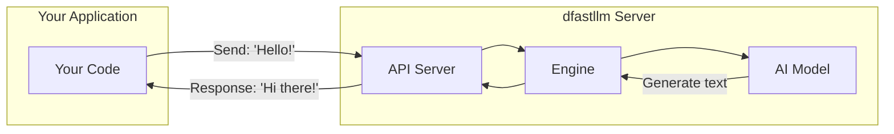
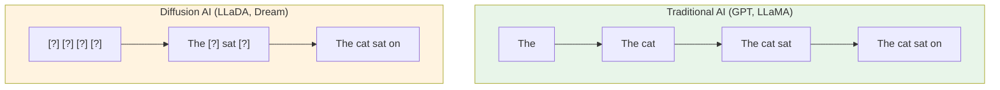
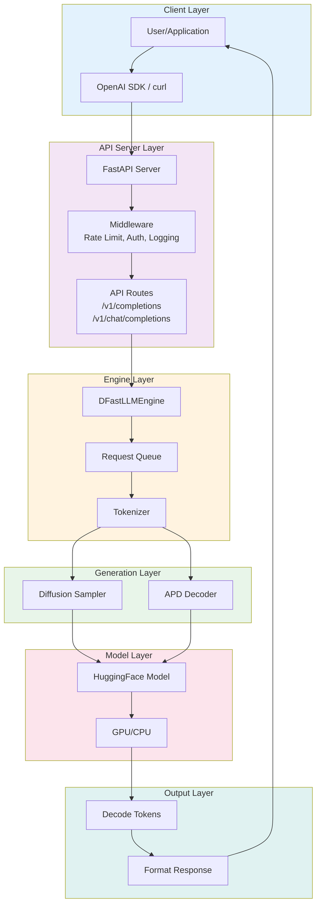

# dfastllm Developer Documentation

Welcome to the dfastllm developer documentation. This guide explains **everything** about the dfastllm codebase, from basic concepts to implementation details.

## What is dfastllm?

**dfastllm** is a server that runs AI language models (like ChatGPT) and lets other programs talk to them through a web API.



### What makes dfastllm special?

dfastllm is designed for **Diffusion Language Models** - a new type of AI that generates text differently than traditional models.



**Traditional AI**: Writes one word at a time, left to right.
**Diffusion AI**: Starts with blanks, fills in multiple words at once.

## Documentation Structure

```
docs/dev-doc/
├── index.md              ← You are here
├── 01-concepts.md        ← Basic concepts (start here if new)
├── 02-architecture.md    ← System overview
├── 03-project-structure.md ← File/folder organization
├── 04-engine.md          ← Core engine explained
├── 05-diffusion.md       ← Diffusion algorithm
├── 06-apd.md             ← APD optimization
├── 07-api-server.md      ← API endpoints
├── 08-config.md          ← Configuration
├── 09-deployment.md      ← How to deploy
└── 10-code-walkthrough.md ← Line-by-line code
```

## Quick Start Reading Guide

### If you're completely new:
1. Start with [01-concepts.md](01-concepts.md) - Understand what LLMs are
2. Then [02-architecture.md](02-architecture.md) - See the big picture
3. Then [03-project-structure.md](03-project-structure.md) - Know where things are

### If you want to understand the code:
1. [04-engine.md](04-engine.md) - The brain of dfastllm
2. [05-diffusion.md](05-diffusion.md) - How text is generated
3. [10-code-walkthrough.md](10-code-walkthrough.md) - Code explanations

### If you want to deploy:
1. [08-config.md](08-config.md) - Configuration options
2. [09-deployment.md](09-deployment.md) - Deployment guides

## The Complete Picture



## Key Terms Glossary

| Term | Meaning |
|------|---------|
| **LLM** | Large Language Model - An AI that understands and generates text |
| **Token** | A piece of text (word or part of word) that the AI processes |
| **Prompt** | The input text you give to the AI |
| **Completion** | The text the AI generates in response |
| **Diffusion** | A method of generating by starting with noise and refining |
| **Mask** | A placeholder token `[MASK]` that gets replaced with real words |
| **APD** | Adaptive Parallel Decoding - Generates multiple tokens at once |
| **Inference** | The process of running the AI model to generate output |
| **Endpoint** | A URL path like `/v1/completions` that accepts requests |
| **Engine** | The core component that manages model and generation |

## Next Steps

👉 **New to AI/ML?** Start with [01-concepts.md](01-concepts.md)

👉 **Know AI basics?** Jump to [02-architecture.md](02-architecture.md)

👉 **Want to dive into code?** Go to [10-code-walkthrough.md](10-code-walkthrough.md)

