# LLaDA Inference Pipeline - Complete Guide

This document provides a comprehensive guide to the LLaDA (Large Language Diffusion with mAsking) inference pipeline, covering architecture, token flow, optimization techniques, and implementation details.

Reference: [ML-GSAI/LLaDA](https://github.com/ML-GSAI/LLaDA)

---

## Table of Contents

1. [Architecture Overview](#architecture-overview)
2. [Inference Pipeline](#inference-pipeline)
3. [Token Flow Details](#token-flow-details)
4. [Model Forward Pass](#model-forward-pass)
5. [Sampling Strategies](#sampling-strategies)
6. [Confidence Calculation](#confidence-calculation)
7. [Performance Optimizations](#performance-optimizations)
8. [Memory Management](#memory-management)
9. [Batched Inference](#batched-inference)
10. [API Integration](#api-integration)

---

## 🎯 Complete Example: "how are u" → Response

This section walks through the ENTIRE inference pipeline with a real example.

### User Query

```
User sends: "how are u"
Expected response: "I'm doing well, thank you!"
```

---

### Phase 1: API Request


---

### Phase 2: Tokenization


**Detailed Breakdown:**

| Position | Token ID | Token Text | Notes |
|----------|----------|------------|-------|
| 0 | 5765 | "how" | Word |
| 1 | 527 | " are" | Space + word |
| 2 | 577 | " u" | Space + word |

```python
# Code
tokenizer = AutoTokenizer.from_pretrained("GSAI-ML/LLaDA-8B-Instruct")
prompt = "how are u"
prompt_ids = tokenizer.encode(prompt, return_tensors="pt")
# Result: tensor([[5765, 527, 577]])
prompt_length = 3
```

---

### Phase 3: Sequence Initialization

```mermaid
flowchart TB
    subgraph Prompt["Prompt Tokens (3)"]
        P["[5765, 527, 577]<br/>'how are u'"]
    end
    
    subgraph Masks["MASK Tokens (32)"]
        M["[M, M, M, M, M, M, M, M, ...]<br/>126336 × 32"]
    end
    
    subgraph Full["Full Sequence (35 tokens)"]
        F["[5765, 527, 577, M, M, M, M, M, M, M, M, M, M, M, M, M, M, M, M, M, M, M, M, M, M, M, M, M, M, M, M, M, M, M, M]"]
    end
    
    Prompt --> Full
    Masks --> Full
    
    style Prompt fill:#e8f5e9
    style Masks fill:#ffebee
    style Full fill:#fff3e0
```



**Memory Layout:**

```
Position:  0      1      2    │  3      4      5      6    ...   34
Token:   [5765] [527]  [577]  │ [M]    [M]    [M]    [M]   ...  [M]
Text:    "how"  " are" " u"   │ [MASK] [MASK] [MASK] [MASK]... [MASK]
         ├─── PROMPT ─────────┤ ├────────── GENERATE (32 tokens) ──────┤
         │   FIXED            │ │          WILL UNMASK                 │
```

```python
# Code
mask_id = 126336  # LLaDA's [MASK] token
gen_length = 32
total_length = prompt_length + gen_length  # 3 + 32 = 35

x = torch.full((1, total_length), mask_id, device="cuda")
x[:, :prompt_length] = prompt_ids
# x = [5765, 527, 577, 126336, 126336, ..., 126336]
```

---

### Phase 4: Prompt KV Cache (Computed Once)

```mermaid
flowchart TB
    subgraph Forward["Forward Pass (Prompt Only)"]
        direction TB
        P["Prompt: [5765, 527, 577]"]
        EMB["Token + Position Embeddings"]
        ATT["Self-Attention Layers × N"]
        KV["Extract K, V tensors"]
    end
    
    subgraph Cache["KV Cache Storage"]
        direction TB
        C1["Layer 0: K₀, V₀ for positions 0,1,2"]
        C2["Layer 1: K₁, V₁ for positions 0,1,2"]
        CN["Layer N: Kₙ, Vₙ for positions 0,1,2"]
    end
    
    Forward --> Cache
    
    style Cache fill:#e8f5e9
```



**What's Cached:**

| Layer | Key Shape | Value Shape | Positions |
|-------|-----------|-------------|-----------|
| 0 | (1, 32, 3, 128) | (1, 32, 3, 128) | 0, 1, 2 |
| 1 | (1, 32, 3, 128) | (1, 32, 3, 128) | 0, 1, 2 |
| ... | ... | ... | ... |
| 31 | (1, 32, 3, 128) | (1, 32, 3, 128) | 0, 1, 2 |

```python
# Code
with torch.no_grad():
    prompt_outputs = model(
        prompt_ids,
        use_cache=True,
        return_dict=True
    )
    prompt_kv_cache = prompt_outputs.past_key_values
    # Tuple of 32 layers, each with (K, V) tensors
    # K, V shape: (batch=1, heads=32, seq=3, head_dim=128)
```

**✅ This KV cache is reused for ALL diffusion steps!**

---

### Phase 5: Diffusion Loop (8 steps example)

**Schedule:** 32 tokens ÷ 8 steps = 4 tokens/step


---

#### Step 1: First Diffusion Step

```mermaid
flowchart TB
    subgraph Input1["Input (35 tokens)"]
        I1["[how][are][u][M][M][M][M][M][M][M][M][M][M][M][M][M][M][M][M][M][M][M][M][M][M][M][M][M][M][M][M][M][M][M][M]"]
    end
    
    subgraph Forward1["Forward Pass"]
        F1["🧠 Transformer<br/>Use cached prompt KV<br/>Compute KV for masked positions"]
    end
    
    subgraph Logits1["Output Logits"]
        L1["Shape: (1, 35, 128256)<br/>Predictions for ALL positions"]
    end
    
    Input1 --> Forward1 --> Logits1
```

```mermaid
flowchart TB
    subgraph Sample1["Gumbel Sampling"]
        S1["Add Gumbel noise to logits"]
        S2["argmax → predicted tokens"]
        S3["Predictions: [how][are][u][I]['][m][ doing][well][,][ thank][you][!][...padding...]"]
    end
    
    subgraph Conf1["Confidence Calculation"]
        C1["softmax(logits) → probabilities"]
        C2["max(probs) → confidence per position"]
        C3["Confidence: [-∞][-∞][-∞][0.92][0.78][0.85][0.71][0.89][0.45][0.88][0.76][0.91][...]"]
        C4["(prompt positions = -∞, not candidates)"]
    end
    
    Sample1 --> Conf1
```






**After Step 1:**

```
Position:  0     1     2    │  3    4    5    6    7      8    9       10   11
Token:   [how][are][ u]   │ [I]  [M]  [M]  [M] [well]  [M] [thank]  [M]  [!]
Status:   FIX  FIX  FIX   │ FIX MASK MASK MASK  FIX  MASK  FIX   MASK FIX
Cached:   ✓    ✓    ✓     │  ✓   ✗    ✗    ✗    ✓     ✗    ✓      ✗   ✓
```

---

#### Step 2: Second Diffusion Step

```mermaid
flowchart TB
    subgraph Input2["Input"]
        I2["[how][are][u][I][M][M][M][well][M][thank][M][!]..."]
    end
    
    subgraph Forward2["Forward Pass"]
        F2["🧠 Transformer<br/>Reuse KV for positions 0,1,2,3,7,9,11<br/>Compute KV for remaining masked"]
    end
    
    subgraph Process2["Sample + Confidence"]
        P2["New predictions with MORE context<br/>(unmasked tokens help prediction)"]
        C2["Confidence for remaining: 4(0.94), 5(0.87), 6(0.82), 8(0.79)..."]
    end
    
    subgraph Unmask2["Unmask Top 4"]
        U2["Unmask positions 4, 5, 6, 8"]
        U2b["[how][are][u][I]['][m][ doing][well][,][thank][M][!]"]
    end
    
    Input2 --> Forward2 --> Process2 --> Unmask2
    
    style Unmask2 fill:#c8e6c9
```



**After Step 2:**

```
Position:  0     1     2    │  3    4    5      6       7      8    9       10   11
Token:   [how][are][ u]   │ [I]  [']  [m]  [ doing] [well] [,] [thank]  [M]  [!]
Status:   FIX  FIX  FIX   │ FIX  FIX  FIX    FIX    FIX   FIX   FIX   MASK FIX
```

---

#### Steps 3-8: Continue Unmasking

```mermaid
flowchart LR
    subgraph Progress["Diffusion Progress"]
        S1["Step 1<br/>28 masked"]
        S2["Step 2<br/>24 masked"]
        S3["Step 3<br/>20 masked"]
        S4["Step 4<br/>16 masked"]
        S5["Step 5<br/>12 masked"]
        S6["Step 6<br/>8 masked"]
        S7["Step 7<br/>4 masked"]
        S8["Step 8<br/>0 masked ✅"]
    end
    
    S1 --> S2 --> S3 --> S4 --> S5 --> S6 --> S7 --> S8
    
    style S1 fill:#ffcdd2
    style S2 fill:#ffab91
    style S3 fill:#ffcc80
    style S4 fill:#fff59d
    style S5 fill:#c5e1a5
    style S6 fill:#a5d6a7
    style S7 fill:#81c784
    style S8 fill:#4caf50,color:#fff
```



**Final Sequence After Step 8:**

```
[how][are][u][I]['][m][ doing][ well][,][ thank][ you][!][<eos>][<pad>]...[<pad>]
  0    1    2   3   4   5     6       7    8      9     10   11    12     ...   34
```

---

### Phase 6: Output Decoding


```python
# Code
output_ids = x[0, prompt_length:]  # Skip prompt, take generated
output_text = tokenizer.decode(output_ids, skip_special_tokens=True)
# Result: "I'm doing well, thank you!"
```

---

### Phase 7: API Response


**Final Response:**

```json
{
  "id": "cmpl-abc123",
  "object": "text_completion",
  "created": 1702400000,
  "model": "GSAI-ML/LLaDA-8B-Instruct",
  "choices": [
    {
      "text": "I'm doing well, thank you!",
      "index": 0,
      "finish_reason": "stop"
    }
  ],
  "usage": {
    "prompt_tokens": 3,
    "completion_tokens": 10,
    "total_tokens": 13
  }
}
```

---

### Complete End-to-End Flow

```mermaid
flowchart TB
    subgraph E2E["End-to-End: 'how are u' → 'I'm doing well, thank you!'"]
        direction TB
        
        A["📝 User: 'how are u'"]
        B["🔤 Tokenize: [5765, 527, 577]"]
        C["🎭 Add Masks: [5765, 527, 577, M×32]"]
        D["💾 Cache Prompt KV"]
        
        subgraph Loop["🔄 Diffusion Loop (8 steps)"]
            L1["Forward Pass (use cached KV)"]
            L2["Gumbel Sampling"]
            L3["Confidence Scoring"]
            L4["Top-K Unmasking"]
            L5["Update KV Cache"]
            L1 --> L2 --> L3 --> L4 --> L5
            L5 -->|"more masks?"| L1
        end
        
        E["🔓 All Unmasked: [I, ', m, doing, well, ...]"]
        F["📤 Decode: 'I'm doing well, thank you!'"]
        G["✅ Return to User"]
        
        A --> B --> C --> D --> Loop --> E --> F --> G
    end
    
    style A fill:#e3f2fd
    style G fill:#4caf50,color:#fff
```



---

### Timing Breakdown (Example)


| Phase | Time (ms) | Notes |
|-------|-----------|-------|
| Tokenization | ~5 | CPU operation |
| Prompt KV Cache | ~20 | One-time GPU compute |
| Diffusion Steps (×8) | ~80 | Main inference time |
| Decoding | ~2 | CPU operation |
| **Total** | **~107ms** | For 32 tokens |

---

## Architecture Overview

### LLaDA vs Autoregressive Models


### Key Architectural Differences

| Aspect | Autoregressive | LLaDA (Diffusion) |
|--------|----------------|-------------------|
| **Attention** | Causal (triangular mask) | Bidirectional (full attention) |
| **Generation** | Sequential (1 token/step) | Parallel (k tokens/step) |
| **Context** | Left context only | Full sequence context |
| **Iterations** | N tokens = N forward passes | N tokens ≈ log(N) forward passes |
| **Parallelism** | Limited | Highly parallelizable |

---

## Inference Pipeline

### Complete Inference Flow

```mermaid
flowchart TB
    subgraph Input["1️⃣ Input Processing"]
        A1["Raw Text"] --> A2["Tokenizer.encode()"]
        A2 --> A3["Prompt Token IDs<br/>[t1, t2, ..., tn]"]
    end
    
    subgraph Init["2️⃣ Sequence Initialization"]
        B1["Prompt Tokens"] --> B2["Append MASK tokens"]
        B2 --> B3["Full Sequence<br/>[prompt | MASK×gen_len]"]
    end
    
    subgraph Diffusion["3️⃣ Diffusion Loop"]
        C1["Forward Pass"] --> C2["Logits Processing"]
        C2 --> C3["Gumbel Sampling"]
        C3 --> C4["Confidence Scoring"]
        C4 --> C5["Top-K Selection"]
        C5 --> C6["Token Unmasking"]
        C6 -->|"remaining masks?"| C1
    end
    
    subgraph Output["4️⃣ Output Generation"]
        D1["Final Token IDs"] --> D2["Tokenizer.decode()"]
        D2 --> D3["Generated Text"]
    end
    
    Input --> Init --> Diffusion --> Output
    
    style Input fill:#e8f5e9
    style Init fill:#fff3e0
    style Diffusion fill:#ffebee
    style Output fill:#e3f2fd
```



### Pipeline Timing Breakdown


---

## Token Flow Details

### Phase 1: Input Tokenization


**Implementation:**

```python
class DLLMEngine:
    def _prepare_input(self, prompt: str, gen_length: int) -> torch.Tensor:
        # Tokenize prompt
        prompt_ids = self.tokenizer.encode(prompt, return_tensors="pt")
        prompt_length = prompt_ids.shape[1]
        
        # Create full sequence with masks
        total_length = prompt_length + gen_length
        x = torch.full((1, total_length), self.mask_id, device=self.device)
        x[:, :prompt_length] = prompt_ids
        
        return x, prompt_length
```

### Phase 2: Sequence Initialization


**Memory Layout:**

```
Position:    0    1    2    3    4    5   │   6    7    8    ...   N
             ├──────── PROMPT ─────────────┤   ├──────── GENERATE ────┤
Token ID:  [1234][567][890][12][34][56]   │ [126336][126336]...
             ↑                              │    ↑
           FIXED (never changes)            │  MASKED (will unmask)
```

### Phase 3: Diffusion Loop (Core Inference)


### Detailed Step Visualization

```mermaid
flowchart LR
    subgraph S0["Initial"]
        T0["[M][M][M][M][M][M][M][M]<br/>8 masked"]
    end
    
    subgraph S1["Step 1"]
        T1["[The][M][M][on][M][M][M][M]<br/>6 masked, 2 revealed"]
    end
    
    subgraph S2["Step 2"]
        T2["[The][cat][sat][on][M][M][M][M]<br/>4 masked, 4 revealed"]
    end
    
    subgraph S3["Step 3"]
        T3["[The][cat][sat][on][the][mat][M][M]<br/>2 masked, 6 revealed"]
    end
    
    subgraph S4["Step 4"]
        T4["[The][cat][sat][on][the][mat][.][EOS]<br/>0 masked, 8 revealed ✅"]
    end
    
    S0 -->|"unmask 2"| S1 -->|"unmask 2"| S2 -->|"unmask 2"| S3 -->|"unmask 2"| S4
    
    style S0 fill:#ffcdd2
    style S1 fill:#ffe0b2
    style S2 fill:#fff9c4
    style S3 fill:#c8e6c9
    style S4 fill:#81c784
```

---

## Model Forward Pass

### Transformer Architecture

```mermaid
flowchart TB
    subgraph Input["Input Layer"]
        I1["Token Embeddings<br/>(vocab_size × hidden_dim)"]
        I2["Position Embeddings<br/>(max_len × hidden_dim)"]
        I3["x = tok_emb + pos_emb"]
        I1 --> I3
        I2 --> I3
    end
    
    subgraph Blocks["Transformer Blocks × N"]
        B1["Layer Norm"]
        B2["Self-Attention<br/>(Bidirectional)"]
        B3["Residual Add"]
        B4["Layer Norm"]
        B5["Feed Forward<br/>(MLP)"]
        B6["Residual Add"]
        
        I3 --> B1 --> B2 --> B3
        I3 --> B3
        B3 --> B4 --> B5 --> B6
        B3 --> B6
    end
    
    subgraph Output["Output Layer"]
        O1["Layer Norm"]
        O2["LM Head<br/>(hidden_dim × vocab_size)"]
        O3["Logits"]
        
        B6 --> O1 --> O2 --> O3
    end
```

### Attention Mechanism (Bidirectional)

```mermaid
flowchart LR
    subgraph Attention["Self-Attention"]
        direction TB
        Q["Query: W_q × x"]
        K["Key: W_k × x"]
        V["Value: W_v × x"]
        
        ATT["Attention = softmax(Q×K^T / √d)"]
        OUT["Output = Attention × V"]
        
        Q --> ATT
        K --> ATT
        ATT --> OUT
        V --> OUT
    end
```

**Key Difference from GPT:**
- GPT uses **causal mask** (lower triangular)
- LLaDA uses **no mask** (full bidirectional attention)

```python
# Autoregressive (GPT) - causal attention
attention_mask = torch.tril(torch.ones(seq_len, seq_len))

# Diffusion (LLaDA) - bidirectional attention
attention_mask = torch.ones(seq_len, seq_len)  # Full attention
```

### Forward Pass Implementation

```python
def forward_pass(self, x: torch.Tensor) -> torch.Tensor:
    """
    Single forward pass through LLaDA model.
    
    Args:
        x: Input token IDs, shape (batch, seq_len)
        
    Returns:
        logits: Prediction scores, shape (batch, seq_len, vocab_size)
    """
    with torch.no_grad():
        outputs = self.model(
            input_ids=x,
            attention_mask=torch.ones_like(x),  # Bidirectional
            use_cache=False,  # No KV cache in diffusion
        )
    return outputs.logits
```

---

## Sampling Strategies

### Gumbel-Max Trick

The Gumbel-max trick provides a differentiable way to sample from categorical distributions:

```mermaid
flowchart LR
    subgraph Gumbel["Gumbel Sampling"]
        L["logits<br/>(batch, seq, vocab)"]
        N["Gumbel noise<br/>-log(-log(U))"]
        G["logits + noise"]
        P["argmax(G)"]
        
        L --> G
        N --> G
        G --> P
    end
```

**Implementation:**

```python
def add_gumbel_noise(logits: torch.Tensor, temperature: float) -> torch.Tensor:
    """
    Apply Gumbel noise for stochastic sampling.
    
    Temperature controls randomness:
    - temp = 0: Greedy (deterministic)
    - temp = 1: Standard sampling
    - temp > 1: More random
    """
    if temperature == 0:
        return logits
    
    # Sample from Gumbel(0, 1)
    noise = torch.rand_like(logits)
    noise = noise.clamp(min=1e-10)  # Avoid log(0)
    gumbel = -torch.log(-torch.log(noise))
    
    # Scale by temperature
    return logits + temperature * gumbel


def sample_tokens(logits: torch.Tensor, temperature: float) -> torch.Tensor:
    """Sample tokens using Gumbel-softmax trick."""
    if temperature == 0:
        return torch.argmax(logits, dim=-1)
    
    # Alternative formulation from LLaDA paper
    noise = torch.rand_like(logits).clamp(min=1e-10)
    gumbel_noise = -torch.log(noise) ** temperature
    noisy_logits = logits.exp() / gumbel_noise
    
    return torch.argmax(noisy_logits, dim=-1)
```

### Temperature Effects

```mermaid
flowchart TB
    subgraph Temp["Temperature Impact"]
        T0["temp=0<br/>Greedy, deterministic"]
        T05["temp=0.5<br/>Low variance"]
        T1["temp=1.0<br/>Standard sampling"]
        T2["temp=2.0<br/>High variance, creative"]
    end
    
    style T0 fill:#e3f2fd
    style T05 fill:#bbdefb
    style T1 fill:#90caf9
    style T2 fill:#64b5f6
```

---

## Confidence Calculation

### Confidence Score Computation

```mermaid
flowchart TB
    subgraph Confidence["Confidence Pipeline"]
        L["logits<br/>(batch, seq, vocab)"]
        S["softmax(logits, dim=-1)"]
        M["max(probs, dim=-1)"]
        C["confidence scores<br/>(batch, seq)"]
        
        L --> S --> M --> C
    end
    
    subgraph Mask["Mask Non-Candidates"]
        C2["Set confidence = -inf<br/>for non-MASK positions"]
    end
    
    Confidence --> Mask
```

**Implementation:**

```python
def compute_confidence(
    logits: torch.Tensor,
    x: torch.Tensor,
    mask_id: int
) -> torch.Tensor:
    """
    Compute confidence scores for each position.
    
    Returns:
        confidence: Shape (batch, seq_len), -inf for non-masked positions
    """
    # Softmax to get probabilities
    probs = F.softmax(logits, dim=-1)  # (batch, seq, vocab)
    
    # Max probability as confidence
    confidence = probs.max(dim=-1).values  # (batch, seq)
    
    # Only consider masked positions
    is_masked = (x == mask_id)
    confidence = confidence.masked_fill(~is_masked, float('-inf'))
    
    return confidence
```

### Token Selection Algorithm

```mermaid
flowchart TB
    subgraph Select["Top-K Selection"]
        direction TB
        
        K["k = total_masked / remaining_steps"]
        TOP["top_k_indices = topk(confidence, k)"]
        UNM["x[top_k_indices] = predictions[top_k_indices]"]
        
        K --> TOP --> UNM
    end
```

**Implementation:**

```python
def select_and_unmask(
    x: torch.Tensor,
    predictions: torch.Tensor,
    confidence: torch.Tensor,
    num_to_unmask: int
) -> torch.Tensor:
    """
    Select top-k confident positions and unmask them.
    """
    batch_size = x.shape[0]
    
    for b in range(batch_size):
        # Get top-k indices for this batch
        _, indices = torch.topk(confidence[b], num_to_unmask)
        
        # Unmask selected positions
        x[b, indices] = predictions[b, indices]
    
    return x
```

---

## Performance Optimizations

### Optimization Strategies

```mermaid
flowchart TB
    subgraph Opts["Optimization Techniques"]
        direction TB
        
        O1["🔥 Flash Attention 2<br/>Memory-efficient attention"]
        O2["📦 KV Cache Reuse<br/>Cache unchanged positions"]
        O3["⚡ Batch Processing<br/>Process multiple requests"]
        O4["🎯 Early Stopping<br/>Stop when all unmasked"]
        O5["📊 Mixed Precision<br/>FP16/BF16 inference"]
        O6["🚀 APD<br/>Adaptive Parallel Decoding"]
    end
```

---

## APD: Adaptive Parallel Decoding

**APD (Adaptive Parallel Decoding)** is a breakthrough optimization for diffusion LLMs that significantly increases throughput while maintaining quality.

Reference: [APD Paper](https://arxiv.org/abs/2506.00413) | [GitHub](https://github.com/danielmisrael/apd)

### The Problem with Standard dLLM Decoding

```mermaid
flowchart TB
    subgraph Problem["Standard dLLM Limitations"]
        direction TB
        P1["Fixed number of tokens per step"]
        P2["No quality guarantee for parallel tokens"]
        P3["Speed vs Quality trade-off unclear"]
        P4["Inefficient KV cache utilization"]
    end
    
    style Problem fill:#ffebee
```

**Standard Approach:**
- Unmask **fixed** K tokens per step (e.g., always 4 tokens)
- No verification if parallel tokens are coherent
- May produce grammatically incorrect sequences

### APD Solution

```mermaid
flowchart TB
    subgraph APD["APD: Adaptive Parallel Decoding"]
        direction TB
        
        subgraph Core["Core Idea"]
            C1["dLLM generates candidate tokens in parallel"]
            C2["Small AR model verifies coherence"]
            C3["Adaptive: accept only high-quality tokens"]
        end
        
        subgraph Formula["Mathematical Formulation"]
            F1["P(tokens) = P_dLLM(marginal) × P_AR(joint)"]
            F2["Multiplicative mixture of probabilities"]
        end
        
        Core --> Formula
    end
    
    style APD fill:#e8f5e9
```

### How APD Works

```mermaid
flowchart TB
    subgraph Step["APD Decoding Step"]
        direction TB
        
        A["1️⃣ dLLM Forward Pass<br/>Get marginal probabilities for ALL masked positions"]
        B["2️⃣ Sample Candidates<br/>Sample N candidate tokens in parallel"]
        C["3️⃣ AR Verification<br/>Small AR model scores joint probability"]
        D["4️⃣ Adaptive Accept<br/>Accept tokens where P_joint > threshold"]
        E["5️⃣ Reject Low-Quality<br/>Keep rejected positions masked"]
        
        A --> B --> C --> D --> E
    end
```

### APD vs Standard Decoding

```mermaid
flowchart LR
    subgraph Standard["Standard dLLM"]
        S1["Step 1: Unmask 4 tokens"]
        S2["Step 2: Unmask 4 tokens"]
        S3["Step 3: Unmask 4 tokens"]
        S4["..."]
        S1 --> S2 --> S3 --> S4
    end
    
    subgraph APD["APD"]
        A1["Step 1: Try 8 tokens, accept 6"]
        A2["Step 2: Try 8 tokens, accept 7"]
        A3["Step 3: Try 6 tokens, accept 6 ✅"]
        A1 --> A2 --> A3
    end
    
    style Standard fill:#fff3e0
    style APD fill:#e8f5e9
```

### APD Architecture

```mermaid
flowchart TB
    subgraph Architecture["APD System Architecture"]
        direction TB
        
        subgraph Main["Main dLLM (e.g., LLaDA-8B)"]
            M1["Large diffusion model"]
            M2["Generates parallel candidates"]
            M3["Provides marginal P(token_i)"]
        end
        
        subgraph Aux["Auxiliary AR Model (e.g., 1B)"]
            A1["Small autoregressive model"]
            A2["Verifies sequence coherence"]
            A3["Provides joint P(token_1...token_n)"]
        end
        
        subgraph Combine["Probability Combination"]
            C1["P_final = P_dLLM^α × P_AR^β"]
            C2["α, β are tunable weights"]
        end
        
        Main --> Combine
        Aux --> Combine
    end
```

### APD Example: "how are u" → Response

```mermaid
flowchart TB
    subgraph APD_Example["APD in Action"]
        direction TB
        
        subgraph Step1["Step 1"]
            S1I["Input: [how][are][u][M][M][M][M][M][M][M][M][M]"]
            S1D["dLLM candidates: [I]['][m][ doing][ great][,][ thanks][!]"]
            S1A["AR verification: P([I]['][m][ doing]) = 0.92 ✅"]
            S1R["Accept 4 tokens, reject 0"]
            S1O["Output: [how][are][u][I]['][m][ doing][M][M][M][M][M]"]
        end
        
        subgraph Step2["Step 2"]
            S2I["Input: [how][are][u][I]['][m][ doing][M][M][M][M][M]"]
            S2D["dLLM candidates: [ great][,][ thanks][!][EOS]"]
            S2A["AR verification: P([ great][,]) = 0.89 ✅, P([ thanks]) = 0.45 ❌"]
            S2R["Accept 2 tokens, reject 1 (low joint prob)"]
            S2O["Output: [how][are][u][I]['][m][ doing][ great][,][M][M][M]"]
        end
        
        Step1 --> Step2
    end
```

### APD Implementation

```python
class APDDecoder:
    """Adaptive Parallel Decoding for dLLMs."""
    
    def __init__(
        self,
        dllm_model,           # Main diffusion LLM
        ar_model,             # Small auxiliary AR model
        alpha: float = 1.0,   # dLLM weight
        beta: float = 0.5,    # AR weight
        threshold: float = 0.3,  # Acceptance threshold
    ):
        self.dllm = dllm_model
        self.ar = ar_model
        self.alpha = alpha
        self.beta = beta
        self.threshold = threshold
    
    def decode_step(
        self,
        x: torch.Tensor,
        mask_id: int,
        max_parallel: int = 8,
    ) -> torch.Tensor:
        """Single APD decoding step."""
        
        # 1. Get dLLM marginal probabilities
        with torch.no_grad():
            dllm_logits = self.dllm(x).logits
            dllm_probs = F.softmax(dllm_logits, dim=-1)
        
        # 2. Sample candidate tokens from dLLM
        masked_positions = (x == mask_id).nonzero(as_tuple=True)[1]
        num_candidates = min(max_parallel, len(masked_positions))
        
        # Get top candidates by dLLM confidence
        dllm_confidence = dllm_probs.max(dim=-1).values
        dllm_confidence[x != mask_id] = float('-inf')
        _, top_positions = torch.topk(dllm_confidence[0], num_candidates)
        
        candidate_tokens = dllm_logits[0, top_positions].argmax(dim=-1)
        
        # 3. Verify with AR model (joint probability)
        x_candidate = x.clone()
        x_candidate[0, top_positions] = candidate_tokens
        
        with torch.no_grad():
            ar_logits = self.ar(x_candidate).logits
            ar_probs = F.softmax(ar_logits, dim=-1)
        
        # 4. Compute combined score
        combined_scores = []
        for i, pos in enumerate(top_positions):
            token = candidate_tokens[i]
            p_dllm = dllm_probs[0, pos, token].item()
            p_ar = ar_probs[0, pos - 1, token].item() if pos > 0 else 1.0
            
            # Multiplicative mixture
            combined = (p_dllm ** self.alpha) * (p_ar ** self.beta)
            combined_scores.append((pos.item(), token.item(), combined))
        
        # 5. Accept tokens above threshold
        for pos, token, score in combined_scores:
            if score > self.threshold:
                x[0, pos] = token
        
        return x
    
    def generate(
        self,
        prompt_ids: torch.Tensor,
        gen_length: int,
        max_steps: int = 32,
    ) -> torch.Tensor:
        """Full APD generation."""
        
        # Initialize
        x = self._init_sequence(prompt_ids, gen_length)
        
        for step in range(max_steps):
            x = self.decode_step(x, mask_id=126336)
            
            # Check if all unmasked
            if (x != 126336).all():
                break
        
        return x
```

### APD Hyperparameters

```mermaid
flowchart TB
    subgraph Params["APD Tunable Parameters"]
        direction TB
        
        subgraph Alpha["α (dLLM weight)"]
            A1["α = 1.0: Trust dLLM fully"]
            A2["α < 1.0: Reduce dLLM influence"]
        end
        
        subgraph Beta["β (AR weight)"]
            B1["β = 0.0: Ignore AR (pure dLLM)"]
            B2["β = 0.5: Balanced"]
            B3["β = 1.0: Heavy AR verification"]
        end
        
        subgraph Thresh["Threshold"]
            T1["Low (0.1): Accept more, faster"]
            T2["High (0.5): Reject more, higher quality"]
        end
    end
```

| Parameter | Low Value | High Value | Trade-off |
|-----------|-----------|------------|-----------|
| **α** | More AR influence | More dLLM influence | Speed vs parallel |
| **β** | Pure dLLM | Heavy verification | Speed vs quality |
| **threshold** | Accept more | Reject more | Throughput vs quality |
| **max_parallel** | Conservative | Aggressive | Memory vs speed |

### APD Performance Benefits

```mermaid
flowchart LR
    subgraph Benefits["APD Benefits"]
        B1["⚡ 2-4x Throughput<br/>More tokens per step"]
        B2["✅ Quality Preserved<br/>AR verification"]
        B3["💾 KV Cache Enabled<br/>Efficient memory use"]
        B4["🎛️ Tunable Trade-offs<br/>Speed vs quality control"]
    end
    
    style Benefits fill:#e8f5e9
```

### APD + KV Cache Integration

```mermaid
sequenceDiagram
    participant dLLM as dLLM (8B)
    participant AR as AR Model (1B)
    participant KV as KV Cache
    
    Note over dLLM,KV: Step 1
    dLLM->>dLLM: Forward pass (use KV cache)
    dLLM->>AR: Send candidate tokens
    AR->>AR: Verify joint probability
    AR-->>dLLM: Accept/reject decisions
    dLLM->>KV: Cache accepted positions
    
    Note over dLLM,KV: Step 2
    dLLM->>dLLM: Forward (reuse more cached KV)
    dLLM->>AR: Send new candidates
    AR-->>dLLM: Accept/reject
    dLLM->>KV: Cache more
```

### When to Use APD

| Scenario | Use APD? | Reason |
|----------|----------|--------|
| High throughput needed | ✅ Yes | 2-4x speedup |
| Quality critical | ✅ Yes | AR verification helps |
| Memory constrained | ⚠️ Maybe | Needs auxiliary model |
| Single request latency | ❌ No | AR overhead hurts |
| Very short outputs | ❌ No | Overhead > benefit |

---

### Flash Attention Integration

```python
# Enable Flash Attention 2 for faster inference
model = AutoModel.from_pretrained(
    model_name,
    torch_dtype=torch.bfloat16,
    attn_implementation="flash_attention_2",  # Enable Flash Attention
    device_map="auto",
)
```

### KV Cache in Diffusion Models

**Short Answer:** Yes, we CAN use KV cache in diffusion, but differently than autoregressive models.

#### Why KV Cache Works Differently

```mermaid
flowchart TB
    subgraph AR["Autoregressive (GPT) - Simple KV Cache"]
        direction LR
        AR1["Token 1"] --> AR2["Token 2"] --> AR3["Token 3"]
        AR_NOTE["✅ Tokens NEVER change<br/>✅ Cache ALL previous KV pairs<br/>✅ Only compute new token's KV"]
    end
    
    subgraph DIFF["Diffusion (LLaDA) - Complex KV Cache"]
        direction TB
        D1["[M][M][M][M] → [The][M][M][M]"]
        D2["Tokens CHANGE between steps"]
        D3["Need selective caching strategy"]
    end
    
    style AR fill:#e8f5e9
    style DIFF fill:#fff3e0
```

#### The Challenge

```mermaid
flowchart LR
    subgraph Problem["Why Naive KV Cache Fails"]
        direction TB
        P1["Step 1: All tokens are [MASK]<br/>KV computed for [M][M][M][M]"]
        P2["Step 2: Some unmasked<br/>[The][M][sat][M]"]
        P3["❌ Old KV for positions 0,2 is INVALID<br/>because tokens changed!"]
        
        P1 --> P2 --> P3
    end
    
    style Problem fill:#ffebee
```

#### Solution: Selective KV Caching

```mermaid
flowchart TB
    subgraph Strategy["KV Cache Strategies for Diffusion"]
        direction TB
        
        subgraph S1["1️⃣ Prompt KV Cache"]
            P1["Prompt tokens NEVER change"]
            P2["Cache prompt KV permanently"]
            P3["Reuse across ALL diffusion steps"]
        end
        
        subgraph S2["2️⃣ Unmasked Token Cache"]
            U1["Once unmasked, token is FIXED"]
            U2["Cache KV after unmasking"]
            U3["Only recompute MASKED positions"]
        end
        
        subgraph S3["3️⃣ Block-wise Cache (Semi-AR)"]
            B1["Complete block 1 fully"]
            B2["Cache block 1 KV"]
            B3["Use for block 2, 3, ..."]
        end
    end
    
    style S1 fill:#e8f5e9
    style S2 fill:#fff3e0
    style S3 fill:#e3f2fd
```

#### Detailed KV Cache Flow

```mermaid
sequenceDiagram
    participant P as Prompt Tokens
    participant M as Masked Tokens
    participant KV as KV Cache
    participant ATT as Attention
    
    Note over P,KV: Step 0: Initialize
    P->>KV: Compute & cache prompt KV
    
    Note over M,ATT: Step 1: First diffusion step
    M->>ATT: Compute masked token KV
    KV->>ATT: Provide cached prompt KV
    ATT->>ATT: Full attention
    ATT->>M: Unmask positions 0, 3
    M->>KV: Cache KV for positions 0, 3
    
    Note over M,ATT: Step 2: Next diffusion step
    M->>ATT: Compute ONLY remaining masked KV
    KV->>ATT: Provide prompt + unmasked KV
    ATT->>ATT: Full attention
    ATT->>M: Unmask positions 1, 2
    M->>KV: Cache KV for positions 1, 2
    
    Note over M,KV: Continue until all unmasked...
```

#### Implementation

```python
class DiffusionKVCache:
    """KV Cache optimized for diffusion models."""
    
    def __init__(self, num_layers: int, num_heads: int, head_dim: int):
        self.num_layers = num_layers
        self.cache = {}  # position -> (K, V) per layer
        self.fixed_positions = set()  # Positions that won't change
    
    def cache_prompt(self, prompt_kv: List[Tuple[Tensor, Tensor]], prompt_len: int):
        """Cache KV for prompt tokens (never change)."""
        for pos in range(prompt_len):
            self.fixed_positions.add(pos)
            for layer_idx, (k, v) in enumerate(prompt_kv):
                self.cache[(layer_idx, pos)] = (k[:, :, pos], v[:, :, pos])
    
    def cache_unmasked(self, position: int, kv: List[Tuple[Tensor, Tensor]]):
        """Cache KV for newly unmasked position."""
        self.fixed_positions.add(position)
        for layer_idx, (k, v) in enumerate(kv):
            self.cache[(layer_idx, position)] = (k[:, :, position], v[:, :, position])
    
    def get_cached_kv(self, layer_idx: int) -> Tuple[Tensor, Tensor]:
        """Get all cached KV for a layer."""
        positions = sorted([p for (l, p) in self.cache.keys() if l == layer_idx])
        if not positions:
            return None, None
        
        k_list = [self.cache[(layer_idx, p)][0] for p in positions]
        v_list = [self.cache[(layer_idx, p)][1] for p in positions]
        
        return torch.cat(k_list, dim=2), torch.cat(v_list, dim=2)
    
    def needs_recompute(self, position: int) -> bool:
        """Check if position needs KV recomputation."""
        return position not in self.fixed_positions


class LLaDAWithKVCache:
    """LLaDA inference with optimized KV caching."""
    
    def __init__(self, model):
        self.model = model
        self.kv_cache = None
    
    def generate(self, prompt_ids: Tensor, gen_length: int, num_steps: int):
        # Initialize cache
        self.kv_cache = DiffusionKVCache(
            num_layers=self.model.config.num_hidden_layers,
            num_heads=self.model.config.num_attention_heads,
            head_dim=self.model.config.hidden_size // self.model.config.num_attention_heads
        )
        
        prompt_len = prompt_ids.shape[1]
        x = self._init_sequence(prompt_ids, gen_length)
        
        # Cache prompt KV (computed once, reused always)
        with torch.no_grad():
            prompt_outputs = self.model(
                prompt_ids,
                use_cache=True,
                return_dict=True
            )
            self.kv_cache.cache_prompt(prompt_outputs.past_key_values, prompt_len)
        
        # Diffusion loop with selective KV recomputation
        for step in range(num_steps):
            x = self._diffusion_step_with_cache(x, prompt_len, step, num_steps)
        
        return x
    
    def _diffusion_step_with_cache(self, x, prompt_len, step, num_steps):
        """Single diffusion step with KV cache optimization."""
        
        # Identify which positions need recomputation
        masked_positions = (x == self.mask_id).nonzero(as_tuple=True)[1]
        
        # Forward pass with cached KV for fixed positions
        with torch.no_grad():
            # Get cached KV for prompt + already unmasked
            past_kv = self._build_past_kv()
            
            # Only compute attention for positions that changed
            outputs = self.model(
                x,
                past_key_values=past_kv,
                use_cache=True,
            )
            logits = outputs.logits
        
        # Sample and unmask
        predictions = self._sample(logits)
        confidence = self._compute_confidence(logits, x)
        
        k = self._tokens_to_unmask(step, num_steps)
        _, top_indices = torch.topk(confidence[0], k)
        
        # Update sequence
        x[0, top_indices] = predictions[0, top_indices]
        
        # Cache KV for newly unmasked positions
        for idx in top_indices.tolist():
            self.kv_cache.cache_unmasked(idx, outputs.past_key_values)
        
        return x
```

#### Performance Comparison

```mermaid
flowchart LR
    subgraph Perf["KV Cache Impact"]
        direction TB
        
        subgraph NoCache["Without KV Cache"]
            N1["Step 1: Compute ALL KV"]
            N2["Step 2: Compute ALL KV again"]
            N3["Step N: Compute ALL KV again"]
            N4["Total: N × full_compute"]
        end
        
        subgraph WithCache["With KV Cache"]
            W1["Step 1: Compute ALL, cache prompt"]
            W2["Step 2: Compute ONLY masked KV"]
            W3["Step N: Compute ONLY remaining masked"]
            W4["Total: prompt_once + decreasing_masked"]
        end
    end
    
    style NoCache fill:#ffebee
    style WithCache fill:#e8f5e9
```

#### When to Use KV Cache

| Scenario | Use KV Cache? | Reason |
|----------|---------------|--------|
| Long prompts | ✅ Yes | Prompt KV computed once |
| Many diffusion steps | ✅ Yes | Unmasked tokens accumulate |
| Short sequences | ⚠️ Maybe | Overhead may exceed benefit |
| Single step (greedy) | ❌ No | No reuse opportunity |

#### Memory Trade-off

```mermaid
flowchart TB
    subgraph Memory["Memory vs Speed Trade-off"]
        M1["🧠 More Memory<br/>Store KV for all cached positions"]
        M2["⚡ Faster Inference<br/>Skip recomputation"]
        M3["Balance: Cache prompt + recent unmasked"]
    end
```

**Rule of thumb:** Cache prompt KV always. Cache unmasked token KV if memory allows.

### Early Stopping

```python
def should_stop_early(x: torch.Tensor, mask_id: int) -> bool:
    """Check if all positions are unmasked."""
    return (x != mask_id).all()


def generate_with_early_stop(self, x: torch.Tensor, max_steps: int):
    for step in range(max_steps):
        # ... diffusion step ...
        
        if should_stop_early(x, self.mask_id):
            print(f"Early stop at step {step}")
            break
    
    return x
```

---

## Memory Management

### GPU Memory Layout

```mermaid
flowchart TB
    subgraph GPU["GPU Memory"]
        direction TB
        
        M1["Model Weights<br/>~16GB for 8B model"]
        M2["Activation Memory<br/>~2GB per batch"]
        M3["Sequence Tensors<br/>~100MB per batch"]
        M4["Attention Matrices<br/>~500MB (Flash Attention reduces)"]
    end
```

### Memory Optimization Techniques

```python
class MemoryEfficientInference:
    def __init__(self, model_name: str):
        # Load in 4-bit for memory efficiency
        self.model = AutoModel.from_pretrained(
            model_name,
            load_in_4bit=True,
            bnb_4bit_compute_dtype=torch.bfloat16,
            device_map="auto",
        )
    
    @torch.inference_mode()
    def generate(self, x: torch.Tensor) -> torch.Tensor:
        # Use inference mode for memory savings
        # No gradient computation or storage
        ...
```

### Batch Size vs Memory Trade-off

```mermaid
flowchart LR
    subgraph Trade["Memory Trade-offs"]
        B1["Batch=1<br/>Low memory<br/>Low throughput"]
        B4["Batch=4<br/>Medium memory<br/>Good throughput"]
        B16["Batch=16<br/>High memory<br/>Best throughput"]
    end
    
    B1 --> B4 --> B16
```

---

## Batched Inference

### Batch Processing Pipeline

```mermaid
flowchart TB
    subgraph Batch["Batched Inference"]
        direction TB
        
        R1["Request 1: 'Hello'"]
        R2["Request 2: 'What is'"]
        R3["Request 3: 'Explain'"]
        
        PAD["Pad to same length"]
        
        FWD["Single Forward Pass<br/>(batch=3)"]
        
        OUT["Separate outputs"]
        
        R1 --> PAD
        R2 --> PAD
        R3 --> PAD
        PAD --> FWD --> OUT
    end
```

### Dynamic Batching

```python
class BatchProcessor:
    def __init__(self, engine, max_batch_size: int = 8):
        self.engine = engine
        self.max_batch = max_batch_size
        self.pending = []
    
    def add_request(self, prompt: str, gen_length: int):
        self.pending.append((prompt, gen_length))
        
        if len(self.pending) >= self.max_batch:
            return self.process_batch()
        return None
    
    def process_batch(self):
        if not self.pending:
            return []
        
        # Tokenize all
        batch_tokens = [
            self.engine.tokenizer.encode(p) 
            for p, _ in self.pending
        ]
        
        # Pad to max length
        max_len = max(len(t) for t in batch_tokens)
        padded = torch.stack([
            F.pad(t, (0, max_len - len(t)), value=self.engine.pad_id)
            for t in batch_tokens
        ])
        
        # Generate
        outputs = self.engine.generate(padded, ...)
        
        self.pending = []
        return outputs
```

---

## API Integration

### Request Flow

```mermaid
sequenceDiagram
    participant C as Client
    participant API as FastAPI Server
    participant E as DLLMEngine
    participant M as Model
    participant GPU as GPU
    
    C->>API: POST /v1/completions
    Note over API: Validate request
    
    API->>E: generate(prompt, params)
    
    E->>E: Tokenize prompt
    E->>GPU: Allocate tensors
    
    loop Diffusion Steps
        E->>M: forward(x)
        M->>GPU: Compute attention
        GPU-->>M: logits
        M-->>E: logits
        E->>E: Sample + unmask
    end
    
    E->>E: Decode output
    E-->>API: RequestOutput
    
    API-->>C: CompletionResponse
```

### Streaming Response

```mermaid
sequenceDiagram
    participant C as Client
    participant API as API Server
    participant E as Engine
    
    C->>API: POST /v1/completions (stream=true)
    
    loop Each Diffusion Step
        E->>E: Unmask tokens
        API-->>C: SSE: partial tokens
    end
    
    API-->>C: SSE: [DONE]
```

**Implementation:**

```python
async def stream_generate(
    self,
    prompt: str,
    gen_length: int,
    num_steps: int
) -> AsyncIterator[str]:
    """Stream tokens as they are unmasked."""
    
    x, prompt_len = self._prepare_input(prompt, gen_length)
    prev_text = ""
    
    for step in range(num_steps):
        x = self._diffusion_step(x, step, num_steps)
        
        # Decode current state
        current_text = self.tokenizer.decode(
            x[0, prompt_len:],
            skip_special_tokens=True
        )
        
        # Yield new tokens
        if current_text != prev_text:
            new_tokens = current_text[len(prev_text):]
            yield new_tokens
            prev_text = current_text
```

---

## Complete Inference Code

```python
class LLaDAInference:
    """Complete LLaDA inference implementation."""
    
    def __init__(self, model_name: str, device: str = "cuda"):
        self.device = device
        self.tokenizer = AutoTokenizer.from_pretrained(model_name)
        self.model = AutoModel.from_pretrained(
            model_name,
            torch_dtype=torch.bfloat16,
            device_map="auto",
            trust_remote_code=True,
        )
        self.mask_id = 126336  # LLaDA mask token
    
    @torch.inference_mode()
    def generate(
        self,
        prompt: str,
        gen_length: int = 128,
        num_steps: int = 128,
        temperature: float = 0.0,
    ) -> str:
        # 1. Tokenize
        prompt_ids = self.tokenizer.encode(prompt, return_tensors="pt")
        prompt_ids = prompt_ids.to(self.device)
        prompt_len = prompt_ids.shape[1]
        
        # 2. Initialize with masks
        total_len = prompt_len + gen_length
        x = torch.full((1, total_len), self.mask_id, device=self.device)
        x[:, :prompt_len] = prompt_ids
        
        # 3. Compute tokens per step
        tokens_per_step = self._get_transfer_schedule(gen_length, num_steps)
        
        # 4. Diffusion loop
        for step in range(num_steps):
            # Forward pass
            logits = self.model(x).logits
            
            # Sample with Gumbel noise
            if temperature > 0:
                noise = torch.rand_like(logits).clamp(min=1e-10)
                gumbel = -torch.log(noise) ** temperature
                logits = logits.exp() / gumbel
            
            predictions = logits.argmax(dim=-1)
            
            # Compute confidence
            probs = F.softmax(logits, dim=-1)
            confidence = probs.max(dim=-1).values
            
            # Mask non-candidates
            is_masked = (x == self.mask_id)
            confidence = confidence.masked_fill(~is_masked, float('-inf'))
            
            # Select top-k
            k = tokens_per_step[step]
            if k > 0:
                _, indices = torch.topk(confidence[0], k)
                x[0, indices] = predictions[0, indices]
            
            # Early stop check
            if not is_masked.any():
                break
        
        # 5. Decode output
        output_ids = x[0, prompt_len:]
        output_text = self.tokenizer.decode(output_ids, skip_special_tokens=True)
        
        return output_text
    
    def _get_transfer_schedule(self, total: int, steps: int) -> List[int]:
        """Linear schedule: unmask equal tokens per step."""
        base = total // steps
        remainder = total % steps
        schedule = [base] * steps
        for i in range(remainder):
            schedule[i] += 1
        return schedule
```

---

## Summary

| Component | Description | Key Points |
|-----------|-------------|------------|
| **Tokenization** | Convert text → IDs | Use model's tokenizer |
| **Initialization** | Create masked sequence | `[prompt \| MASK×n]` |
| **Forward Pass** | Model prediction | Bidirectional attention |
| **Sampling** | Token selection | Gumbel-max trick |
| **Confidence** | Score ranking | `max(softmax(logits))` |
| **Selection** | Top-k unmask | `k = remaining / steps` |
| **Decoding** | IDs → text | Skip special tokens |

### Key Insights

1. **Bidirectional Context**: Unlike GPT, LLaDA sees ALL positions during inference
2. **Parallel Decoding**: Multiple tokens can be generated per step
3. **Confidence-Based**: High-confidence tokens are revealed first
4. **Iterative Refinement**: Each step improves predictions using new context
5. **Temperature Control**: Balances quality vs diversity

---

## References

- [LLaDA Paper](https://arxiv.org/abs/2502.09992)
- [ML-GSAI/LLaDA GitHub](https://github.com/ML-GSAI/LLaDA)
- [Gumbel-Softmax Trick](https://arxiv.org/abs/1611.01144)
